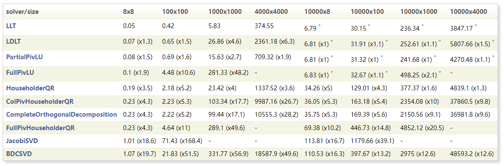
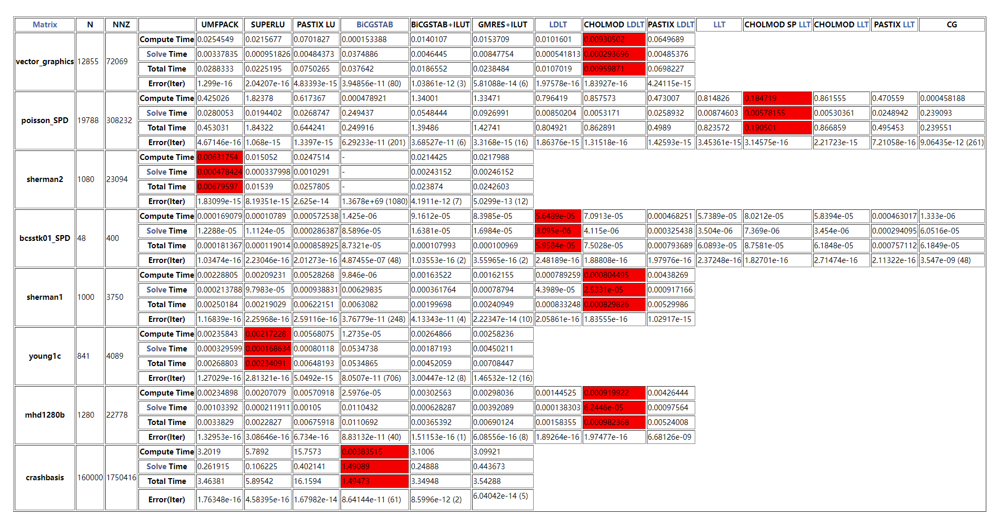

# 一、概述

[英文原文](http://eigen.tuxfamily.org/dox/index.html)

这是Eigen3的API文档，你可以[下载](http://eigen.tuxfamily.org/dox/eigen-doc.tgz)它以便于离线阅读。

## 入门

对于第一次接触Eigen，学习Eigen最好的方法就是阅读该章节，这可以让你学会如何使用Eigen编写你的代码。

然后，快速参考页面以非常简洁的格式提供了API的相当完整的描述，这对于回忆特定特性的语法或快速浏览API非常有用。它们目前涵盖了以下两个特性集，将来还会有更多：

- 稠密矩阵和数组操作
- 稀疏线性代数

如果你会使用MATLAB，[这里](http://eigen.tuxfamily.org/dox/AsciiQuickReference.txt)有一个Eigen与MATLAB操作对照文档。

## 章节

章节是按照不同特性领域来划分的，他们由两个部分组成：用户手册页面、参考页面，前者综合性的描述了不同的特性，后者可以通过相关Eigen模块和类访问 API 文档。

## 扩展/自定义Eigen

在扩展/自定义Eigen部分，你可以找到有关扩展 Eigen 的功能和支持自定义标量类型的讨论和示例。

## 常见话题

你可以看到诸如预处理指令、控制断言、多线程、MKL使用和Eigen的内部见解等。

最后，使用搜索引擎可以让你快速的找到相关的类或者函数。


# 二、入门

[英文原文(Getting started)](http://eigen.tuxfamily.org/dox/GettingStarted.html)

这是一个非常简短的Eigen入门文章。该文章有两层目的。对于想要尽快开始编码的人来说，该文章是对[Eigen](http://eigen.tuxfamily.org/dox/namespaceEigen.html)库的最简单介绍。你可以把该文章作为教程的第一部分，这更加详细的解释了Eigen库。看完这个教程后可以继续阅读 [The Matrix class](http://eigen.tuxfamily.org/dox/group__TutorialMatrixClass.html) 教程。

## 如何安装Eigen

为了使用Eigen，你仅仅需要下载和解压Eigen的源码（有关下载说明，请参阅[wiki ](http://eigen.tuxfamily.org/index.php?title=Main_Page#Download)）。在Eigen的子目录中有头文件，这是你唯一需要的文件。这些文件在所有平台下都是通用的，无需使用Cmake或者安装什么。

>Eigen源码下载链接：[https://gitlab.com/libeigen/eigen/-/releases](https://gitlab.com/libeigen/eigen/-/releases)，选择你需要的版本下载。
>
>解压后，将其中的Eigen文件夹放到你的头文件目录，即可在你的工程中使用Eigen。

## 第一个简单的程序

这是一个非常简单的程序。

```cpp
// 代码索引 2-1-1-1
#include <iostream>
#include <Eigen/Dense>
 
using Eigen::MatrixXd;
 
int main()
{
  MatrixXd m(2,2);
  m(0,0) = 3;
  m(1,0) = 2.5;
  m(0,1) = -1;
  m(1,1) = m(1,0) + m(0,1);
  std::cout << m << std::endl;
}
```

在告诉您如何编译之后，我们将解释该程序。

## 编译和运行第一个程序

不需要链接任何库。编译上述程序时唯一需要记住的是编译器必须能够找到[Eigen](http://eigen.tuxfamily.org/dox/namespaceEigen.html)头文件。放置[Eigen](http://eigen.tuxfamily.org/dox/namespaceEigen.html)源代码的路径必须在 `include` 路径中。使用GCC编译器时，需要用```-I```选项达到这一目的，因此可以使用如下命令编译程序：

```shell
g++ -I /path/to/eigen/ my_program.cpp -o my_program
```

在linux或者Mac OS X中，你也可以使用符号链接或者复制Eigen文件夹到```/usr/local/include/```。这样，你就可以使用下列命令来编译程序：

```shell
g++ my_program.cpp -o my_program
```

当你运行该程序时，将产生以下输出：

```
  3  -1
2.5 1.5
```

## 第一个程序的解释

```cpp
// 代码索引 2-1-1-1
#include <iostream>
#include <Eigen/Dense>

using Eigen::MatrixXd;

int main()
{
  MatrixXd m(2,2);
  m(0,0) = 3;
  m(1,0) = 2.5;
  m(0,1) = -1;
  m(1,1) = m(1,0) + m(0,1);
  std::cout << m << std::endl;
}
```

Eigen头文件定义了很多类型，但对于简单的应用程序，仅使用类型`MatrixXd`可能就足够了。它代表任意大小的矩阵，其中`X`代表任意大小，`d`代表元素的类型是`double`。有关可用于表示矩阵的不同类型的概述，请参阅[快速参考指南](http://eigen.tuxfamily.org/dox/group__QuickRefPage.html#QuickRef_Types)。

头文件`Eigen/Dense`定义了关于`MatrixXd`类型及相关类型的成员函数（另请参阅[头文件表](http://eigen.tuxfamily.org/dox/group__QuickRefPage.html#QuickRef_Headers)）。头文件中定义的所有的类和函数都在`Eigen`命名空间中。

上述`main`函数的第一行声明了一个`MatrixXd`类型的矩阵`m`，然后指定了该矩阵的大小为`2*2`，但没有初始化该矩阵。语句`m(0,0) = 3`代表将该`2*2`矩阵的左上角元素设置为`3`。你可以使用圆括号去访问矩阵中对应的元素，如`m(0,0)`。按照计算机科学中的惯例，第一个元素的索引为 0。

下面的三行代码设置其它三个元素。最后一行代码把矩阵`m`输送给标准的输出流。

## 示例2：矩阵和向量

这是另一个例子，它结合了矩阵和向量。包括以下两个版本的程序，输出一样：

版本一：

```cpp
// 代码索引 2-1-2-1
#include <iostream>
#include <Eigen/Dense>
 
using Eigen::MatrixXd;
using Eigen::VectorXd;
 
int main()
{
  MatrixXd m = MatrixXd::Random(3,3);
  m = (m + MatrixXd::Constant(3,3,1.2)) * 50;
  std::cout << "m =" << std::endl << m << std::endl;
  VectorXd v(3);
  v << 1, 2, 3;
  std::cout << "m * v =" << std::endl << m * v << std::endl;
}
```

版本二：

```cpp
// 代码索引 2-1-3-1
#include <iostream>
#include <Eigen/Dense>

using Eigen::Matrix3d;
using Eigen::Vector3d;

int main()
{
  Matrix3d m = Matrix3d::Random();
  m = (m + Matrix3d::Constant(1.2)) * 50;
  std::cout << "m =" << std::endl << m << std::endl;
  Vector3d v(1,2,3);

  std::cout << "m * v =" << std::endl << m * v << std::endl;
}
```

输出：

```
m =
  94 89.8 43.5
49.4  101 86.8
88.3 29.8 37.8
m * v =
404
512
261
```

> 注意，这里的浮点型数字，官网只截取了前面几位，而且做了四舍五入。

## 解释第二个例子

版本一首先使用`Random()`函数初始化了一个`3*3`的矩阵，其中每一个元素的值都在`-1`和`1`之间。下一行使用了一个线性变换，这让所有的值都在`10`到`110`之间。函数`MatrixXd::Constant(3,3,1.2)`返回一个所有元素都是`1.2`的`3*3`矩阵。其余部分是标准计算。

`main`函数的下一行引入了一个新类型`VectorXd`。它代表一个任意大小的列向量。向量`v`大小为`3`并且未初始化。倒数第二行使用了逗号初始化器，解释见[高级初始化](http://eigen.tuxfamily.org/dox/group__TutorialAdvancedInitialization.html)，此处将向量`v`初始化为：
$$
v=\begin{bmatrix} 1 \\ 2 \\ 3 \end{bmatrix}.
$$
最后一行让矩阵`m`和向量`v`相乘然后输出结果。


现在来解释版本二。

版本一中的`MatrixXd`表示任意大小的矩阵，版本二中的`Matrix3d`表示固定大小的矩阵（此处为 3*3）。因为类型已经固定了矩阵的大小，所以没有必要在构造函数中指定大小，只需要对其初始化即可。

同理，`VectorXd`代表任意大小的列向量，`Vector3d`代表固定大小的列向量（此处为 3）。同样因为类型已经固定了向量的大小，所以没有必要在构造函数中指定大小，只需要对其初始化即可。

使用固定大小的矩阵和向量有两个优点。编译器会编译出更好（更快）的代码，因为它知道矩阵和向量的大小。在类型中指定大小还允许在编译时进行更严格的检查。例如，如果你尝试将一个 `Matrix4d`（4*4 矩阵）与 一个 `Vector3d`（大小为 3 的向量）相乘，编译器会报错。然而，使用太多类型会增加编译时间和可执行文件的大小。矩阵的大小在编译时也可能是未知的。经验法则是对大小为 `4*4 `或更小的矩阵使用固定大小的类型，其他使用任意大小的类型`MatrixXd`。


# 三、稠密矩阵与数组操作

## 3.1 Matrix类

[英文原文(The Matrix class)](http://eigen.tuxfamily.org/dox/group__TutorialMatrixClass.html)

在Eigen中，所有矩阵和向量都是[Matrix](http://eigen.tuxfamily.org/dox/classEigen_1_1Matrix.html)模板类的对象。向量只是行数或者列数为`1`的特殊矩阵。

```cpp
template<typename Scalar_, int Rows_, int Cols_, int Options_, int MaxRows_, int MaxCols_>
class Eigen::Matrix< Scalar_, Rows_, Cols_, Options_, MaxRows_, MaxCols_ >
```

### Matrix前三个模板参数

Matrix类有`6`个模板参数，但现在了解前3个参数就足够了，剩下的3个参数有默认值，以后再讨论他们。

Matrix类3个强制模板参数是：

```cpp
Matrix<typename Scalar, int RowsAtCompileTime, int ColsAtCompileTime>
```

- `Scalar`是标量的类型，例如系数的类型。如果你想要一个`float`类型的矩阵，那么你可以在这里填写`float`。有关所有支持的标量类型以及如何添加新类型，请参阅[标量类型](http://eigen.tuxfamily.org/dox/TopicScalarTypes.html)。
- `RowsAtCompileTime`和`ColsAtCompileTime`是矩阵的行数和列数，这是在编译时就知道的。如果在编译时不知道矩阵大小，请参阅下文“动态的特殊值”一节。

我们提供了很多常用的类型。例如，`Matrix4f`是`4*4`的`float`矩阵，这在Eigen中定义为：

```cpp
typedef Matrix<float, 4, 4> Matrix4f;
```

下文会讨论这些常用类型的定义。

### 向量

如上所述，在Eigen中，向量是一种特殊的矩阵，把只有`1`列的矩阵叫做`列向量`，通常把列向量称为`向量`。行数为`1`的矩阵叫做`行向量`。

例如，`Vector3f`是有3个`float`元素的列向量。在Eigen中这样定义：

```cpp
typedef Matrix<float, 3, 1> Vector3f;
```

也提供了行向量的类型定义，如下表示有2个`int`元素的行向量：

```cpp
typedef Matrix<int, 1, 2> RowVector2i;
```

### 动态的特殊值

当然，Eigen不局限于处理编译时维度已知的矩阵。模板参数`RowsAtCompileTime`和`ColsAtCompileTime`可以是一个动态值，这表明在编译时矩阵大小是未知的，必须当作运行时的变量进行处理。在Eigen的术语中，这叫做动态大小；在编译期间就知道大小叫做固定大小。例如，`MatrixXd`是`double`类型的动态大小矩阵，定义如下：

```cpp
typedef Matrix<double, Dynamic, Dynamic> MatrixXd;
```

类似的，定义`int`类型的动态大小向量`VectorXi`如下：

```cpp
typedef Matrix<int, Dynamic, 1> VectorXi;
```

也可以定义一个固定行数和一个动态列数的矩阵，如下：

```cpp
Matrix<float, 3, Dynamic>
```

### 构造函数

默认的构造函数始终可用，它不执行任何动态内存分配，也不初始化矩阵元素。例如：

```cpp
Matrix3f a;
MatrixXf b;
```

- `a`是一个`3*3`的矩阵，实际上是一个`float[9]`的数组，而且没有初始化。
    - `b`是一个动态大小的矩阵，它的初始大小是0*0，而且没有开辟内存。


也有指定大小的构造函数。对于矩阵来说，第一个参数总是行，第二个参数是列，对于向量来说，只需要传入向量的大小即可。构造函数按照给定的大小开辟内存，但不会初始化内存。

```cpp
MatrixXf a(10,15);
VectorXf b(30);
```

- `a`是一个动态大小为`10*15`的矩阵，开辟了内存但是没有初始化。
- `b`是一个动态大小为`30`的向量，同样开辟了内存但是没有初始化。

为了提供动态大小和固定大小矩阵统一的API，可以向固定大小矩阵的构造函数传递大小，虽然这是无效的，但是合法的：

```cpp
Matrix3f a(3,3);
```

这并没有任何操作。

> `Matrix3f` 的定义是 `typedef Matrix<float, 3, 3> Matrix3f;` ，如果传入构造函数的大小不符合该定义就会报错，如`Matrix3f a(2, 3);`

矩阵和向量也可以从列表初始化。在C++11之前，此功能仅限于固定大小且不超过 `4` 的向量，如：

```cpp
Vector2d a(5.0, 6.0);
Vector3d b(5.0, 6.0, 7.0);
Vector4d c(5.0, 6.0, 7.0, 8.0);
```

如果使用C++11编译，则可以通过列表来初始化任意固定大小的列或行向量，如：

```cpp
Vector2i a(1, 2);                      // 包含 {1, 2} 的列向量
Matrix<int, 5, 1> b {1, 2, 3, 4, 5};   // 包含 {1, 2, 3, 4, 5} 的行向量
Matrix<int, 1, 5> c = {1, 2, 3, 4, 5}; // 包含 {1, 2, 3, 4, 5} 的列向量
```

初始化固定大小或者运行时大小固定的矩阵和向量时，必须将元素按照行进行分组，编译器会使用该分组一行一行的初始化矩阵，如下：

```cpp
MatrixXi a {      // 构造一个 2*2 的矩阵
      {1, 2},     // 第一行
      {3, 4}      // 第二行
};
Matrix<double, 2, 3> b { // 构造一个 2*3 的矩阵
      {2, 3, 4},
      {5, 6, 7},
};
```

对于列或者行向量，允许隐式的转置。这意味着可以使用一个行分组对一个列向量初始化。

```cpp
VectorXd a {{1.5, 2.5, 3.5}};             // 包含3个元素的列向量，行向量隐式转换成列向量
RowVectorXd b {{1.0, 2.0, 3.0, 4.0}};     // 包含4个元素的行向量，本来就是行向量
```

### 访问元素

在Eigen中主要的元素访问与修改方法是重载括号运算符。对于矩阵，行索引总是优先传递的。对于向量，只需要传递一个索引，索引从0开始。如下：

```cpp
// 代码索引 3-1-1-1
#include <iostream>
#include <Eigen/Dense>
 
int main()
{
  Eigen::MatrixXd m(2,2);
  m(0,0) = 3;
  m(1,0) = 2.5;
  m(0,1) = -1;
  m(1,1) = m(1,0) + m(0,1);
  std::cout << "Here is the matrix m:\n" << m << std::endl;
  Eigen::VectorXd v(2);
  v(0) = 4;
  v(1) = v(0) - 1;
  std::cout << "Here is the vector v:\n" << v << std::endl;
}
```

输出：

```
Here is the matrix m:
  3  -1
2.5 1.5
Here is the vector v:
4
3
```

请注意 `m(index)` 不只用于向量，也可用于普通矩阵，这意味在元素数组中访问是基于索引的。但是，索引取决于矩阵的存储顺序。在Eigen中，矩阵默认列优先进行存储，也可以更改为行优先，详情查阅 [存储顺序](http://eigen.tuxfamily.org/dox/group__TopicStorageOrders.html)。

运算符`[]`同样也被重载用于基于索引的向量访问，但C++不允许运算符`[]`传入多个参数。所以Eigen限制了运算符`[]`只能用于`vector`，因为C++语言的笨拙，会把 `matrix[i,j]` 编译成 `matrix[j]`。

### 逗号初始化

可以使用所谓的`逗号初始化`语法初始化矩阵和向量。如下：

```cpp
// 代码索引 3-1-1-1
Matrix3f m;
m << 1, 2, 3,
     4, 5, 6,
     7, 8, 9;
std::cout << m;
```

输出：

```c++
1 2 3
4 5 6
7 8 9
```

### 重置大小

矩阵的当前大小可以通过 [rows()](https://eigen.tuxfamily.org/dox/structEigen_1_1EigenBase.html#ac22eb0695d00edd7d4a3b2d0a98b81c2)、[cols()](https://eigen.tuxfamily.org/dox/structEigen_1_1EigenBase.html#a2d768a9877f5f69f49432d447b552bfe) 和 [size()](https://eigen.tuxfamily.org/dox/structEigen_1_1EigenBase.html#ae106171b6fefd3f7af108a8283de36c9) 来检索。这些方法分别返回行数、列数和元素个数。调整动态大小矩阵的大小可以使用 [resize()](https://eigen.tuxfamily.org/dox/classEigen_1_1PlainObjectBase.html#a9fd0703bd7bfe89d6dc80e2ce87c312a) 方法。

```cpp
// 代码索引 3-1-2-1
#include <iostream>
#include <Eigen/Dense>
 
int main()
{
  Eigen::MatrixXd m(2,5);
  m.resize(4,3);
  std::cout << "The matrix m is of size "
            << m.rows() << "x" << m.cols() << std::endl;
  std::cout << "It has " << m.size() << " coefficients" << std::endl;
  Eigen::VectorXd v(2);
  v.resize(5);
  std::cout << "The vector v is of size " << v.size() << std::endl;
  std::cout << "As a matrix, v is of size "
            << v.rows() << "x" << v.cols() << std::endl;
}
```

输出：

```
The matrix m is of size 4x3
It has 12 coefficients
The vector v is of size 5
As a matrix, v is of size 5x1
```

如果矩阵的大小没有改变，那么 `resize()` 方法是空操作。否则，该方法会破坏当前的矩阵，矩阵的元素可能会改变。如果你不想改变矩阵的系数，可以使用resize()的变体 [conservativeResize()](http://eigen.tuxfamily.org/dox/classEigen_1_1PlainObjectBase.html#a712c25be1652e5a64a00f28c8ed11462)。

> 这里进一步解释一下，如果矩阵的大小没有改变， `resize()` 不执行内存分配并且保持矩阵元素值不变，如果矩阵的大小改变了（行数、列数、元素数至少任意一个改变），数据被重新分配并丢失矩阵所有值且初始化为0；
>
> `conservativeResize()` 函数，当新矩阵尺寸小于原矩阵，以(0,0)元素为基准原点截取原矩阵作为新矩阵；当新矩阵尺寸大于原矩阵，多出的元素用0补齐。如下：
>
> ```cpp
> #include <iostream>
> #include <Eigen/Dense>
> 
> int main()
> {
>     Eigen::MatrixXd m{{1,2,3,4},{5,6,7,8},{9,10,11,12},{13,14,15,16}};
>     std::cout << "Before resize, the matrix m is: \n" << m << std::endl;
>     m.resize(3, 4);
>     std::cout << "After resize, the matrix m is: \n" << m << std::endl;
>     
>     Eigen::MatrixXd n{{1, 2, 3, 4}, {5, 6, 7, 8}, {9, 10, 11, 12}, {13, 14, 15, 16}};
>     std::cout << "Before conservativeResize, the matrix n is: \n" << n << std::endl;
>     n.conservativeResize(5, 3);
>     std::cout << "After conservativeResize, the matrix n is: \n" << n << std::endl;
> }
> ```
>
> 输出：
>
> ```
> Before resize, the matrix m is: 
>  1  2  3  4
>  5  6  7  8
>  9 10 11 12
> 13 14 15 16
> After resize, the matrix m is: 
> 0 0 0 0
> 0 0 0 0
> 0 0 0 0
> Before conservativeResize, the matrix n is: 
>  1  2  3  4
>  5  6  7  8
>  9 10 11 12
> 13 14 15 16
> After conservativeResize, the matrix n is: 
>  1  2  3
>  5  6  7
>  9 10 11
> 13 14 15
>  0  0  0
> ```

为了 API 统一，所有这些方法在固定大小的矩阵上仍然可用。当然，实际上无法调整固定大小的矩阵。尝试将固定大小更改为实际不同的值将触发断言失败，但代码在语法上是合法的，如下：

```cpp
#include <iostream>
#include <Eigen/Dense>
 
int main()
{
  Eigen::Matrix4d m;
  m.resize(4,4); // no operation
  std::cout << "The matrix m is of size "
            << m.rows() << "x" << m.cols() << std::endl;
}
```

输出：

```
The matrix m is of size 4x4
```

### 赋值和重置大小

赋值是使用操作符 `=` 将一个矩阵复制到另一个矩阵的操作。Eigen会自动调整 `=` 左边的矩阵大小以便与和 `=` 右边的矩阵大小相匹配，例如：

```cpp
MatrixXf a(2,2);
std::cout << "a is of size " << a.rows() << "x" << a.cols() << std::endl;
MatrixXf b(3,3);
a = b;
std::cout << "a is now of size " << a.rows() << "x" << a.cols() << std::endl;
```

输出：

```
a is of size 2x2
a is now of size 3x3
```

当然，如果 `=` 左边的矩阵大小是固定大小，重置大小是不被允许的。

如果不想这种自动调整大小的操作发生，可以禁用它，详情参考[this page](http://eigen.tuxfamily.org/dox/TopicResizing.html)。

### 固定大小与动态大小

什么时候应该使用固定大小（例如`Matrix4f`），什么时候应该使用动态大小（例如`MatrixXf`）？

简单的答案是：尽可能对非常小的矩阵使用固定大小，对较大的矩阵必须使用动态尺寸。对于小矩阵，尤其是小于（大约）`16` 的矩阵，使用固定尺寸对性能非常有利，因为它允许[Eigen](https://eigen.tuxfamily.org/dox/namespaceEigen.html)避免动态内存分配和展开循环。在内部，固定大小的Eigen矩阵是一个普通数组，例如：

`Matrix4f mymatrix` 

等价于

`float mymatrix[16]`，

所以这没有没有运行成本。而动态矩阵需要在堆中分配空间，例如：

`MatrixXf mymatrix(rows,columns)` 

等价于

`float *mymatrix = new float[rows*columns]` ,

除此之外，`MatrixXf` 对象还存储了其行数和列数。

使用固定大小的限制就是要求在编译的时候就知道大小，而且对于大矩阵，例如大于`32`的矩阵，使用固定大小的矩阵带来的优势可以忽略不计。更糟糕的是，试图在函数内部使用固定大小的矩阵创建一个非常大的矩阵可能会导致栈溢出，因为[Eigen](https://eigen.tuxfamily.org/dox/namespaceEigen.html)会尝试将数组自动分配为局部变量，而这通常是在栈上完成的。最后，根据情况，当使用动态大小时， [Eigen](https://eigen.tuxfamily.org/dox/namespaceEigen.html)也可以更积极地尝试向量化（使用 SIMD 指令），请参阅[矢量化](https://eigen.tuxfamily.org/dox/TopicVectorization.html)。

### 可选模板参数

在开始的时候，我们提及`Matrix`类有6个模板参数，但是，目前只讨论了前三个，剩下的三个参数是可供选择的。下面是完整的模板参数：

```cpp
Matrix<typename Scalar,
       int RowsAtCompileTime,
       int ColsAtCompileTime,
       int Options = 0,
       int MaxRowsAtCompileTime = RowsAtCompileTime,
       int MaxColsAtCompileTime = ColsAtCompileTime>
```

- `Options `是一个位域。这里以`RowMajor`为例，它指定了矩阵按照行优先进行存储。默认情况下，存储顺序是按照列存储的。例如 `Matrix<float, 3, 3, RowMajor>` 是指一个行优先的`3*3`矩阵。

    > `Options` 是一个枚举，具体见 [Eigen::StorageOptions](https://eigen.tuxfamily.org/dox/group__enums.html#gaacded1a18ae58b0f554751f6cdf9eb13) 。
- `MaxRowsAtCompileTime` 和 `MaxColsAtCompileTime` 是矩阵大小的上界，这让即使在编译时不知道矩阵的确切大小，但已知固定的上限，可以避免动态内存分配。例如，```Matrix<float, Dynamic, Dynamic, 0, 3, 4>``` 会在编译时使用一个大小为`12`的`float`类型的数组，而不需要动态分配内存。

### 其他常用Matrix类型

[Eigen](https://eigen.tuxfamily.org/dox/namespaceEigen.html) 定义了以下 [Matrix](https://eigen.tuxfamily.org/dox/classEigen_1_1Matrix.html) 类型：

|           类型           |  类型别名   |                   示例                    |
| :----------------------: | :---------: | :---------------------------------------: |
|    Matrix<type, N, N>    |  MatrixNt   | MatrixXi -> Matrix<int, Dynamic, Dynamic> |
| Matrix<type, Dynamic, N> |  MatrixXNt  |   MatrixX3i -> Matrix<int, Dynamic, 3>    |
| Matrix<type, N, Dynamic> |  MatrixNXt  |    Matrix4Xd -> Matrix<d, 4, Dynamic>     |
|    Matrix<type, N, 1>    |  VectorNt   |      Vector2f -> Matrix<float, 2, 1>      |
|    Matrix<type, 1, N>    | RowVectorNt |    RowVector3d -> Matrix<double, 1, 3>    |

- `N`可以是`2`, `3`, `4` 或`X`(意思是`Dynamic`) 中的任何一个。
- `t`可以是`i(int)`、`f(float)`、`d(double)`、`cf(complex<float>)` 或`cd(complex<double>)` 中的任何一个。虽然这里只定义了五种类型，但并不意味只支持这五种。例如，还支持所有标准整数类型，请参阅[标量类型](https://eigen.tuxfamily.org/dox/TopicScalarTypes.html)。


## 3.2 矩阵与向量运算

[英文原文(Matrix and vector arithmetic)](http://eigen.tuxfamily.org/dox/group__TutorialMatrixArithmetic.html)

本文章旨在提供有关如何使用 [Eigen](http://eigen.tuxfamily.org/dox/namespaceEigen.html) 在矩阵、向量和标量之间执行算术操作的概述和一些详细信息。

### 介绍

[Eigen](http://eigen.tuxfamily.org/dox/namespaceEigen.html) 通过重载常见的 C++ 算术运算符（如 `+`、`-`、`*`）或通过特殊方法（如 `dot()`、`cross()` 等）提供矩阵/向量算术运算。对于 [Matrix](http://eigen.tuxfamily.org/dox/classEigen_1_1Matrix.html) 类（矩阵和向量），重载运算符仅支持线性代数运算。例如，`matrix1 * matrix2` 代表矩阵乘法，`vector + scalar` 向量与标量的加法是不合法的。如果想执行各种数组运算，而不是线性代数，请参阅 [数组类与元素操作](http://eigen.tuxfamily.org/dox/group__TutorialArrayClass.html)。

### 加法与减法

操作符左右两侧的矩阵必须有相同的行数和列数，且它们的元素必须是同种类型，因为Eigen不支持自动类型转换。目前支持的运算符示例如下：

|            | 运算符 | 示例 |
| :--------: | :----: | :--: |
| 二元运算符 |   +    | a+b  |
| 二元运算符 |   -    | a-b  |
| 一元运算符 |   -    |  -a  |
| 复合运算符 |   +=   | a+=b |
| 复合运算符 |   -=   | a-=b |

代码示例：

```cpp
// 代码索引 3-2-1-1
#include <iostream>
#include <Eigen/Dense>
 
int main()
{
  Eigen::Matrix2d a;
  a << 1, 2,
       3, 4;
  Eigen::MatrixXd b(2,2);
  b << 2, 3,
       1, 4;
  std::cout << "a + b =\n" << a + b << std::endl;
  std::cout << "a - b =\n" << a - b << std::endl;
  std::cout << "Doing a += b;" << std::endl;
  a += b;
  std::cout << "Now a =\n" << a << std::endl;
  Eigen::Vector3d v(1,2,3);
  Eigen::Vector3d w(1,0,0);
  std::cout << "-v + w - v =\n" << -v + w - v << std::endl;
}
```

输出：

```
a + b =
3 5
4 8
a - b =
-1 -1
 2  0
Doing a += b;
Now a =
3 5
4 8
-v + w - v =
-1
-4
-6
```

### 标量的标量乘法与除法

标量的乘法和除法也非常简单。目前支持的运算符示例如下：

|            | 运算符 |                示例                |
| :--------: | :----: | :--------------------------------: |
| 二元运算符 |   *    |  matrix * scalar<br>(矩阵 * 标量)  |
| 二元运算符 |   *    |  scalar * matrix<br>(标量 * 矩阵)  |
| 二元运算符 |   /    |  matrix / scalar<br>(矩阵 / 标量)  |
| 复合运算符 |   *=   | matrix *= scalar<br>(矩阵 *= 标量) |
| 复合运算符 |   /=   | matrix /= scalar<br>(矩阵 /= 标量) |

代码示例：

```cpp
// 代码索引 3-2-2-1
#include <iostream>
#include <Eigen/Dense>
 
int main()
{
  Eigen::Matrix2d a;
  a << 1, 2,
       3, 4;
  Eigen::Vector3d v(1,2,3);
  std::cout << "a * 2.5 =\n" << a * 2.5 << std::endl;
  std::cout << "0.1 * v =\n" << 0.1 * v << std::endl;
  std::cout << "Doing v *= 2;" << std::endl;
  v *= 2;
  std::cout << "Now v =\n" << v << std::endl;
}
```

输出：

```
a * 2.5 =
2.5   5
7.5  10
0.1 * v =
0.1
0.2
0.3
Doing v *= 2;
Now v =
2
4
6
```

### 表达式模板

这是一个比较高级的话题，但在这里提出是比较有用的。在Eigen中，诸如`+`之类的算术运算符，他们自己不执行任何操作，只是返回一个表达式对象，该对象描述了将要执行的计算操作。实际的计算发生在后面整个表达式被求值的时侯，比如使用`=`运算符时。虽然这听起来很繁琐，但任何现代优化编译器都能优化掉这种抽象，从而得到完美优化代码。例如：

```cpp
VectorXf a(50), b(50), c(50), d(50);
...
a = 3*b + 4*c + 5*d;
```

Eigen会把上述表达式编译成一个循环，这个数组只遍历一次。数组循环如下所示：

```cpp
for(int i = 0; i < 50; ++i)
  a[i] = 3*b[i] + 4*c[i] + 5*d[i];
```

因此，你不要害怕使用相对较大的运算表达式，这只会给Eigen更多机会进行优化。

### 转置与共轭

矩阵或向量 $a$ 的转置($a^T$)、共轭($\overline{a}$)和伴随($a^*$ ，如共轭转置)可以分别通过函数`transpose()`、 `conjugate()`、`adjoint()`求得。

示例如下：

```cpp
// 代码索引 3-2-3-1
MatrixXcf a = MatrixXcf::Random(2,2);
cout << "Here is the matrix a\n" << a << endl;

cout << "Here is the matrix a^T\n" << a.transpose() << endl;
 
cout << "Here is the conjugate of a\n" << a.conjugate() << endl;
 
cout << "Here is the matrix a^*\n" << a.adjoint() << endl;
```

输出如下：

```
Here is the matrix a
 (-0.211,0.68) (-0.605,0.823)
 (0.597,0.566)  (0.536,-0.33)
Here is the matrix a^T
 (-0.211,0.68)  (0.597,0.566)
(-0.605,0.823)  (0.536,-0.33)
Here is the conjugate of a
 (-0.211,-0.68) (-0.605,-0.823)
 (0.597,-0.566)    (0.536,0.33)
Here is the matrix a^*
 (-0.211,-0.68)  (0.597,-0.566)
(-0.605,-0.823)    (0.536,0.33)
```

对于实数矩阵，共轭函数`conjugate()`是空操作，所以共轭转置函数`adjoint()`相当于转置`transpose()`。

作为基本的操作运算，`transpose()`和`adjoint()`函数只返回一个代理对象而没有做任何操作。如果执行`b = a.transpose()`，真正的转置计算是在写入`b`的时候发生的。然而，这有一个复杂的问题，如果执行`a = a.transpose()`，Eigen在转置计算完全完成之前就开始写入a，所以指令`a = a.transpose()`不会得到预期的结果。

示例如下：

```cpp
// 代码索引 3-2-3-2
Matrix2i a; a << 1, 2, 3, 4;
cout << "Here is the matrix a:\n" << a << endl;
 
a = a.transpose(); // !!! do NOT do this !!!
cout << "and the result of the aliasing effect:\n" << a << endl;
```

输出为：

```
Here is the matrix a:
1 2
3 4
and the result of the aliasing effect:
1 2
2 4
```

上述的问题就是所谓的混叠问题，在`debug`模式下，当`assertion`打开，这个问题可以自动检测到。（g++编译默认是debug模式，关闭需要使用`-DNDEBUG`选项）。

对于就地转置，可以使用`transposeInPlace()`函数：

示例如下：

```cpp
// 代码索引 3-2-3-3
MatrixXf a(2,3); a << 1, 2, 3, 4, 5, 6;
cout << "Here is the initial matrix a:\n" << a << endl;

a.transposeInPlace();
cout << "and after being transposed:\n" << a << endl;
```

输出为：

```
Here is the initial matrix a:
1 2 3
4 5 6
and after being transposed:
1 4
2 5
3 6
```

同样，对于复杂矩阵的就地共轭也有`adjointInPlace()`函数。

### (矩阵与矩阵)和(矩阵与向量)的乘积

矩阵与矩阵间的乘积是通过运算符`*`来完成的。由于向量是特殊的矩阵，所以向量和矩阵的乘积实际上只是矩阵与矩阵乘积的特例，向量与向量的外积也是如此。所有的情况都会被处理成两类：

|            | 运算符 |      示例       |
| :--------: | :----: | :-------------: |
| 二元运算符 |   *    |      a * b      |
| 混合运算符 |   \*=   | a*=b<br>(即a=a\*b) |

示例如下：

```cpp
// 代码索引 3-2-4-1
#include <iostream>
#include <Eigen/Dense>
 
int main()
{
  Eigen::Matrix2d mat;
  mat << 1, 2,
         3, 4;
  Eigen::Vector2d u(-1,1), v(2,0);
  std::cout << "Here is mat*mat:\n" << mat*mat << std::endl;
  std::cout << "Here is mat*u:\n" << mat*u << std::endl;
  std::cout << "Here is u^T*mat:\n" << u.transpose()*mat << std::endl;
  std::cout << "Here is u^T*v:\n" << u.transpose()*v << std::endl;
  std::cout << "Here is u*v^T:\n" << u*v.transpose() << std::endl;
  std::cout << "Let's multiply mat by itself" << std::endl;
  mat = mat*mat;
  std::cout << "Now mat is mat:\n" << mat << std::endl;
}
```

输出为：

```
Here is mat*mat:
 7 10
15 22
Here is mat*u:
1
1
Here is u^T*mat:
2 2
Here is u^T*v:
-2
Here is u*v^T:
-2 -0
 2  0
Let's multiply mat by itself
Now mat is mat:
 7 10
15 22
```

注意：如果你阅读过上面的关于表达式模板的段落并且担心 `m = m * m` 会引发混淆问题，这里请放心，Eigen把矩阵乘法作为一个特殊的例子，并在此引入了一个临时变量，所以它会编译为：

```cpp
tmp = m*m;
m = tmp;
```

如果你知道你的矩阵乘法可以安全的计算并且没有混淆问题，那么你可以使用`noalias()`函数来避免编译临时变量，例如：

```cpp
c.noalias() += a * b;
```

更多细节请参考 [aliasing](http://eigen.tuxfamily.org/dox/group__TopicAliasing.html)

注意：对于担心性能的 BLAS 用户，表达式如：`c.noalias() -= 2 * a.adjoint() * b;`可以完全的优化并触发一个类似矩阵乘法的函数调用。

### 点积和叉积

对于点积和叉积，需要使用 [dot()](http://eigen.tuxfamily.org/dox/classEigen_1_1MatrixBase.html#adfd32bf5fcf6ee603c924dde9bf7bc39) 和 [cross() ](http://eigen.tuxfamily.org/dox/group__Geometry__Module.html#ga0024b44eca99cb7135887c2aaf319d28)方法。当然，点积也可以像 `u.adjoint()*v` 一样得到一个1x1的矩阵。

示例如下：

```cpp
// 代码索引 3-2-5-1
#include <iostream>
#include <Eigen/Dense>
 
int main()
{
  Eigen::Vector3d v(1,2,3);
  Eigen::Vector3d w(0,1,2);
 
  std::cout << "Dot product: " << v.dot(w) << std::endl;
  double dp = v.adjoint()*w; // automatic conversion of the inner product to a scalar
  std::cout << "Dot product via a matrix product: " << dp << std::endl;
  std::cout << "Cross product:\n" << v.cross(w) << std::endl;
}
```

输出为：

```
Dot product: 8
Dot product via a matrix product: 8
Cross product:
 1
-2
 1
```

注意，叉积仅适用于大小为 `3` 的向量。点积适用于任何大小的向量。使用复数时，Eigen的点积在第一个变量中是共轭线性的，在第二个变量中是线性的。


### 基本算术的简化运算

Eigen还提供了一些简单操作来将给定的矩阵或向量计算为标量，例如求和（[sum()](http://eigen.tuxfamily.org/dox/classEigen_1_1DenseBase.html#addd7080d5c202795820e361768d0140c)）、乘积 ( [prod()](http://eigen.tuxfamily.org/dox/classEigen_1_1DenseBase.html#af119d9a4efe5a15cd83c1ccdf01b3a4f) ) 、最大值 ( [maxCoeff()](http://eigen.tuxfamily.org/dox/classEigen_1_1DenseBase.html#a7e6987d106f1cca3ac6ab36d288cc8e1) ) 和最小值 ( [minCoeff()](http://eigen.tuxfamily.org/dox/classEigen_1_1DenseBase.html#a0739f9c868c331031c7810e21838dcb2) ) 。

示例如下：

```cpp
// 代码索引 3-2-6-1
#include <iostream>
#include <Eigen/Dense>
 
using namespace std;
int main()
{
  Eigen::Matrix2d mat;
  mat << 1, 2,
         3, 4;
  cout << "Here is mat.sum():       " << mat.sum()       << endl;
  cout << "Here is mat.prod():      " << mat.prod()      << endl;
  cout << "Here is mat.mean():      " << mat.mean()      << endl;
  cout << "Here is mat.minCoeff():  " << mat.minCoeff()  << endl;
  cout << "Here is mat.maxCoeff():  " << mat.maxCoeff()  << endl;
  cout << "Here is mat.trace():     " << mat.trace()     << endl;
}
```

输出为：

```
Here is mat.sum():       10
Here is mat.prod():      24
Here is mat.mean():      2.5
Here is mat.minCoeff():  1
Here is mat.maxCoeff():  4
Here is mat.trace():     5
```

矩阵的迹（对角线系数的总和）可以通过函数[trace()](http://eigen.tuxfamily.org/dox/classEigen_1_1MatrixBase.html#a544b609f65eb2bd3e368b3fc2d79479e)计算，也可以使用更高效的方法`a.diagonal().sum()`。

也存在`minCoeff`和`maxCoeff`函数的变体，通过参数返回相应系数的坐标：

```cpp
// 代码索引 3-2-6-2
Matrix3f m = Matrix3f::Random();
std::ptrdiff_t i, j;
float minOfM = m.minCoeff(&i,&j);
cout << "Here is the matrix m:\n" << m << endl;
cout << "Its minimum coefficient (" << minOfM 
    << ") is at position (" << i << "," << j << ")\n\n";

RowVector4i v = RowVector4i::Random();
int maxOfV = v.maxCoeff(&i);
cout << "Here is the vector v: " << v << endl;
cout << "Its maximum coefficient (" << maxOfV 
    << ") is at position " << i << endl;
```

输出为：

```
Here is the matrix m:
  0.68  0.597  -0.33
-0.211  0.823  0.536
 0.566 -0.605 -0.444
Its minimum coefficient (-0.605) is at position (2,1)

Here is the vector v:  1  0  3 -3
Its maximum coefficient (3) is at position 2
```

> 这里的输出，自己测试和我官网给出的有出入：
>
> 1. 浮点型数字，官网截取了前面几位，而且做了四舍五入（前文已提到过）
> 2. 整型数字，和官网完全不一样（暂未发现原因，如你知道欢迎留言）
>
> 关于这里的`Random()`函数，源码中有解释：
>
> > Numbers are uniformly spread through their whole definition range for integer types, and in the [-1:1] range for floating point scalar types.
>
> 对于整型，在整个定义范围内均匀分布；对于浮点型，分布在[-1,1]的范围内。所以，从代码来看，官网的结果 `Here is the vector v:  1  0  3 -3` 是不符合的。
>
> ！！！注意，以上两个问题，整篇都有，下文不再赘述！！！

### 操作的有效性

Eigen会检查操作的有效性，如果有错误，它会在编译的时候产生错误提示。这些错误提示可能又长又难看，但Eigen会把重要的信息写成大写，以使其更加显眼，例如：

```cpp
Matrix3f m;
Vector4f v;
v = m*v;      // Compile-time error: YOU_MIXED_MATRICES_OF_DIFFERENT_SIZES
```

当然，在很多情况下，如检查动态矩阵的大小时，无法在编译时进行检查，Eigen会使用运行时的断言。这意味如果程序在debug模式下运行，遇到非法操作时会终止运行并打印出错误信息。如果关闭断言，程序可能会崩溃。

```cpp
MatrixXf m(3,3);
VectorXf v(4);
v = m * v; // Run-time assertion failure here: "invalid matrix product"
```


## 3.3 Array类与元素操作

[英文原文(The Array class and coefficient-wise operations)](http://eigen.tuxfamily.org/dox/group__TutorialArrayClass.html)

本页旨在提供有关如何使用[Eigen](http://eigen.tuxfamily.org/dox/namespaceEigen.html)的[Array](http://eigen.tuxfamily.org/dox/classEigen_1_1Array.html)类的概述和说明。

### 什么是Array类？

与`Matrix`类用于线性代数计算不同的是，`Array`类提供了通用目的数组。此外，[Array](http://eigen.tuxfamily.org/dox/classEigen_1_1Array.html)类提供了一种执行按系数运算的简单方法，这可能没有线性代数意义，例如对每一个元素都加一个常数或按系数将两个数组相乘。

### Array类型

`Array`是一个类模板，采用与`Matrix`相同的模板参数。与`Matrix`一样，前三个模板参数是必需的：

```cpp
Array<typename Scalar, int RowsAtCompileTime, int ColsAtCompileTime>
```

最后三个模板参数是可选的。由于这与`Matrix`完全相同，因此不再在此解释，仅参考[Matrix 类](http://eigen.tuxfamily.org/dox/group__TutorialMatrixClass.html)。

Eigen还提供了一些常见的类型定义，其方式类似于`Matrix`类型定义，但有一些细微差别，因为`Array`一词用于一维和二维数组。使用`ArrayNt`代表一维N个大小的标量，其中 N 和 t 是大小和标量类型，详见[矩阵与向量运算](# 3.1.2 矩阵与向量运算)。对于二维数组类型，使用 `ArrayNNt `表示。示例如下：

|             类型              | 类型定义 |
| :---------------------------: | :------: |
|    Array<float,Dynamic,1>     | ArrayXf  |
|       Array<float,3,1>        | Array3f  |
| Array<double,Dynamic,Dynamic> | ArrayXXd |
|       Array<double,3,3>       | Array33d |


### 访问Array中的值

就像矩阵一样，使用括号运算符可以访问数组中的值。另外，`<<`运算符可用于初始化数组（使用逗号初始化）或打印它们。

例如：

```cpp
// 代码索引 3-3-1-1
#include <Eigen/Dense>
#include <iostream>
 
int main()
{
  Eigen::ArrayXXf  m(2,2);
  
  // assign some values coefficient by coefficient
  m(0,0) = 1.0; m(0,1) = 2.0;
  m(1,0) = 3.0; m(1,1) = m(0,1) + m(1,0);
  
  // print values to standard output
  std::cout << m << std::endl << std::endl;
 
  // using the comma-initializer is also allowed
  m << 1.0,2.0,
       3.0,4.0;
     
  // print values to standard output
  std::cout << m << std::endl;
}
```

输出如下：

```
1 2
3 5

1 2
3 4
```

有关逗号初始化的更多信息，请参阅[高级初始化](http://eigen.tuxfamily.org/dox/group__TutorialAdvancedInitialization.html)。


### 加法与减法

两个数组的加减法与矩阵相同。如果两个数组的大小相同，并且加法或减法是按系数进行的，则该操作有效。

`Array` 还支持 `array + scalar` 的表达形式，这实现了对数组的每个系数都加一个常数。并且这是在`Matrix`类中不能直接使用的功能。

示例如下：

```cpp
// 代码索引 3-3-2-1
#include <Eigen/Dense>
#include <iostream>
 
int main()
{
  Eigen::ArrayXXf a(3,3);
  Eigen::ArrayXXf b(3,3);
  a << 1,2,3,
       4,5,6,
       7,8,9;
  b << 1,2,3,
       1,2,3,
       1,2,3;
       
  // Adding two arrays
  std::cout << "a + b = " << std::endl << a + b << std::endl << std::endl;
 
  // Subtracting a scalar from an array
  std::cout << "a - 2 = " << std::endl << a - 2 << std::endl;
}
```

输出如下：

```
a + b = 
 2  4  6
 5  7  9
 8 10 12

a - 2 = 
-1  0  1
 2  3  4
 5  6  7
```


### Array乘法

当然你可以将一个数组乘以一个标量，这与矩阵相同。数组与矩阵不同的地方在于自身相乘，矩阵将乘法解释为矩阵乘积，而数组将乘法解释为系数乘积。因此，两个数组相乘时它们必须具有相同的维度。

示例如下：

```cpp
// 代码索引 3-3-3-1
#include <Eigen/Dense>
#include <iostream>
 
int main()
{
  Eigen::ArrayXXf a(2,2);
  Eigen::ArrayXXf b(2,2);
  a << 1,2,
       3,4;
  b << 5,6,
       7,8;
  std::cout << "a * b = " << std::endl << a * b << std::endl;
}
```

输出如下：

```
a * b = 
 5 12
21 32
```


### 其他按元素操作的运算

除了上述的加法、减法和乘法运算符之外，`Array` 类还定义了其他按系数计算的运算。例如，`abs()` 方法对每个元素取绝对值，而`sqrt()`计算每个系数的平方根。如果你有两个相同大小的数组，你可以调用`min(.)`来构造一个数组，其元素是两个给定数组对应元素的最小值。这些操作在以下示例中进行了说明：

```cpp
// 代码索引 3-3-4-1
#include <Eigen/Dense>
#include <iostream>
 
int main()
{
  Eigen::ArrayXf a = Eigen::ArrayXf::Random(5);
  a *= 2;
  std::cout << "a =" << std::endl
            << a << std::endl;
  std::cout << "a.abs() =" << std::endl
            << a.abs() << std::endl;
  std::cout << "a.abs().sqrt() =" << std::endl
            << a.abs().sqrt() << std::endl;
  std::cout << "a.min(a.abs().sqrt()) =" << std::endl
            << a.min(a.abs().sqrt()) << std::endl;
}
```

输出如下：

```
a =
  1.36
-0.422
  1.13
  1.19
  1.65
a.abs() =
 1.36
0.422
 1.13
 1.19
 1.65
a.abs().sqrt() =
1.17
0.65
1.06
1.09
1.28
a.min(a.abs().sqrt()) =
  1.17
-0.422
  1.06
  1.09
  1.28
```


### array和matrix表达式之间的转换

什么时候应该使用`Matrix` 类的对象，什么时候应该使用 `Array` 类的对象呢？

首先， `Matrix` 类和`Array`类的方法不通用。如果需要进行线性代数运算，例如矩阵乘法，那么应该使用 `Matrix` 类；如果需要做元素运算，那么应该使用`Array`类。然而，有时并没有那么简单，而是需要同时使用`Matrix` 类和`Array`类。这种情况下，需要将`Matrix` 转换为`Array`或相反。这样就可以使用所有操作，而不管对象声明为`Matrix` 还是`Array`。

`Matrix` 类有一个 [.array()](http://eigen.tuxfamily.org/dox/classEigen_1_1MatrixBase.html#a354c33eec32ceb4193d002f4d41c0497) 方法可以将`Matrix` 转换为`Array`。同样，`Array`有一个 [.matrix()](http://eigen.tuxfamily.org/dox/classEigen_1_1ArrayBase.html#af01e9ea8087e390af8af453bbe4c276c) 方法。由于Eigen表达式的抽象，这些转换发生在编译的时候，所以不需要任何运行时间成本。`.array()`和`.matrix()`既可以作为左值，也可以作为右值。

Eigen 禁止在表达式中混合使用`Matrix` 和`Array`。例如，不能将`Matrix` 和`Array`直接相加；运算符的操作对象要么都是`Matrix`，要么都是`Array`，但转换后是可以的。此规则的例外是赋值运算符，允许将`Matrix` 赋值给`Array`，或将将 `Array` 赋值给`Matrix`。

以下示例展示了如何通过使用`.array()`方法对 `Matrix` 对象使用`Array`的方法。例如，语句 `result = m.array() * n.array()` 将两个矩阵`m`和`n`都转换为数组，并使它们按系数相乘，再将结果分配给矩阵变量（这是合法的，因为Eigen允许将数组表达式赋值给矩阵变量）。

事实上，这种用例非常普遍，以至于Eigen为矩阵提供了一个 [const .cwiseProduct(.)](http://eigen.tuxfamily.org/dox/group__TutorialArrayClass.html) 方法来满足按元素相乘的需求。

示例如下：

```cpp
// 代码索引 3-3-5-1
#include <Eigen/Dense>
#include <iostream>
 
using Eigen::MatrixXf;
 
int main()
{
  MatrixXf m(2,2);
  MatrixXf n(2,2);
  MatrixXf result(2,2);
 
  m << 1,2,
       3,4;
  n << 5,6,
       7,8;
 
  result = m * n;
  std::cout << "-- Matrix m*n: --\n" << result << "\n\n";
  result = m.array() * n.array();
  std::cout << "-- Array m*n: --\n" << result << "\n\n";
  result = m.cwiseProduct(n);
  std::cout << "-- With cwiseProduct: --\n" << result << "\n\n";
  result = m.array() + 4;
  std::cout << "-- Array m + 4: --\n" << result << "\n\n";
}
```

输出如下：

```
-- Matrix m*n: --
19 22
43 50

-- Array m*n: --
 5 12
21 32

-- With cwiseProduct: --
 5 12
21 32

-- Array m + 4: --
5 6
7 8
```


同样，如果`array1`和`array2`是数组，则表达式`array1.matrix() * array2.matrix()`可以计算他们的矩阵乘积。

接下来是一个更复杂一点的示例，表达式`(m.array() + 4).matrix() * m`对每一个元素都加`4`，然后计算表达式结果与矩阵`m`的矩阵乘积。类似的，表达式`(m.array() * n.array()).matrix() * m`按元素计算矩阵`m`和`n`的乘积，然后计算其结果与`m`的矩阵乘法。

示例如下：

```cpp
// 代码索引 3-3-6-1
#include <Eigen/Dense>
#include <iostream>
 
using Eigen::MatrixXf;
 
int main()
{
  MatrixXf m(2,2);
  MatrixXf n(2,2);
  MatrixXf result(2,2);
 
  m << 1,2,
       3,4;
  n << 5,6,
       7,8;
  
  result = (m.array() + 4).matrix() * m;
  std::cout << "-- Combination 1: --\n" << result << "\n\n";
  result = (m.array() * n.array()).matrix() * m;
  std::cout << "-- Combination 2: --\n" << result << "\n\n";
}
```

输出如下：

```
-- Combination 1: --
23 34
31 46

-- Combination 2: --
 41  58
117 170
```


## 3.4 块操作

[英文原文(Block operations)](http://eigen.tuxfamily.org/dox/group__TutorialBlockOperations.html)

本文介绍了块操作。块是`matrix`或`array`的部分矩形元素。块表达式既可以用作右值也可以用作左值。与Eigen表达式一样，如果让编译器进行优化，则块操作的运行时间成本为零。


### 使用块操作

在Eigen中最常见的块操作是`.block()` ，这有两个版本，语法如下：

|块操作| 构建一个动态大小的块表达式         | 构建一个固定大小的块表达式 |
| :--------------------------------- | :------------------------- | : |
| 大小为 `(p,q)`, 起始于 `(i,j)`的块 | matrix.block(i,j,p,q);     | matrix.block<p,q>(i,j); |

Eigen的索引是以0开始的。

这两个版本都可以用在固定大小和动态大小的`matrices`和`array`上。两种表达式在语义上是一致的，唯一的区别是，固定大小的版本会在块比较小的时候快一点，但要求块大小在编译的时候就知道。

以下程序使用动态大小和固定大小版本打印matrix中的几个块：

```cpp
// 代码索引 3-4-1-1
#include <Eigen/Dense>
#include <iostream>
 
using namespace std;
 
int main()
{
  Eigen::MatrixXf m(4,4);
  m <<  1, 2, 3, 4,
        5, 6, 7, 8,
        9,10,11,12,
       13,14,15,16;
  cout << "Block in the middle" << endl;
  cout << m.block<2,2>(1,1) << endl << endl;
  for (int i = 1; i <= 3; ++i)
  {
    cout << "Block of size " << i << "x" << i << endl;
    cout << m.block(0,0,i,i) << endl << endl;
  }
}
```

输出如下：

```
Block in the middle
 6  7
10 11

Block of size 1x1
1

Block of size 2x2
1 2
5 6

Block of size 3x3
 1  2  3
 5  6  7
 9 10 11
```

在上述的例子中`.block()`函数被用作右值，即它只被读取。但块也可以用作*左值*，这意味着可以给块赋值。

以下示例中进行了说明。此示例还演示了数组中的块，其工作方式与上面演示的矩阵中的块完全相同。

 ```cpp
// 代码索引 3-4-1-2
#include <Eigen/Dense>
#include <iostream>
 
int main()
{
  Eigen::Array22f m;
  m << 1,2,
       3,4;
  Eigen::Array44f a = Eigen::Array44f::Constant(0.6);
  std::cout << "Here is the array a:\n" << a << "\n\n";
  a.block<2,2>(1,1) = m;
  std::cout << "Here is now a with m copied into its central 2x2 block:\n" << a << "\n\n";
  a.block(0,0,2,3) = a.block(2,1,2,3);
  std::cout << "Here is now a with bottom-right 2x3 block copied into top-left 2x3 block:\n" << a << "\n\n";
}
 ```

输出如下：

```
Here is the array a:
0.6 0.6 0.6 0.6
0.6 0.6 0.6 0.6
0.6 0.6 0.6 0.6
0.6 0.6 0.6 0.6

Here is now a with m copied into its central 2x2 block:
0.6 0.6 0.6 0.6
0.6   1   2 0.6
0.6   3   4 0.6
0.6 0.6 0.6 0.6

Here is now a with bottom-right 2x3 block copied into top-left 2x3 block:
  3   4 0.6 0.6
0.6 0.6 0.6 0.6
0.6   3   4 0.6
0.6 0.6 0.6 0.6
```

虽然 `.block()` 方法可用于任何块操作，但还有其他方法用于特殊情况，可以提供更好的性能。在性能表现上，最重要的是能在编译时给Eigen尽可能多的信息。例如，所使用的块是矩阵的一整列，那么使用`.col()`函数可以让Eigen知道这只是一列，从而给更多的优化机会。

以下部分描述了这些特殊方法。


### 列和行

单独的列和行是特殊的块，Eigen提供了更便捷的方法`.col()`和`.row()`处理这些块。

| 块操作  | 方法           |
| :------ | :------------- |
| 第 i 行 | matrix.row(i); |
| 第 i 列 | matrix.col(j); |

`row()`和`col()`的参数是需要访问的行和列的索引，在Eigen中是从0开始的。

示例如下：

```cpp
// 代码索引 3-4-2-1
#include <Eigen/Dense>
#include <iostream>
 
using namespace std;
 
int main()
{
  Eigen::MatrixXf m(3,3);
  m << 1,2,3,
       4,5,6,
       7,8,9;
  cout << "Here is the matrix m:" << endl << m << endl;
  cout << "2nd Row: " << m.row(1) << endl;
  m.col(2) += 3 * m.col(0);
  cout << "After adding 3 times the first column into the third column, the matrix m is:\n";
  cout << m << endl;
}
```

输出如下：

```
Here is the matrix m:
1 2 3
4 5 6
7 8 9
2nd Row: 4 5 6
After adding 3 times the first column into the third column, the matrix m is:
 1  2  6
 4  5 18
 7  8 30
```

如该示例所示块表达式可以像任何其他表达式一样用于算术。


### 关于角的操作

Eigen还对位于矩阵或数组的角或边的块提供了特殊方法，例如：`.topLeftCorner()` 可以用于引用一个矩阵左上角的块。

下表列出了各种各样的可能：

| 块操作                       | 构建一个动态大小的块表达式     | 构建一个固定大小的块表达式       |
| :--------------------------- | :----------------------------- | :------------------------------- |
| 左上角的一个大小为p*q的块    | matrix.topLeftCorner(p,q);     | matrix.topLeftCorner<p,q>();     |
| 左下角的一个大小为p*q的块    | matrix.bottomLeftCorner(p,q);  | matrix.bottomLeftCorner<p,q>();  |
| 右上角的一个大小为p*q的块    | matrix.topRightCorner(p,q);    | matrix.topRightCorner<p,q>();    |
| 右下角的一个大小为p*q的块    | matrix.bottomRightCorner(p,q); | matrix.bottomRightCorner<p,q>(); |
| 包含前 q 行的块              | matrix.topRows(q);             | matrix.topRows<q>();             |
| 包含后 q 行的块              | matrix.bottomRows(q);          | matrix.bottomRows<q>();          |
| 包含前 p 列的块              | matrix.leftCols(p);            | matrix.leftCols<p>();            |
| 包含后 p 列的块              | matrix.rightCols(q);           | matrix.rightCols<q>();           |
| 包含从第 i 列开始的 q 列的块 | matrix.middleCols(i,q);        | matrix.middleCols<q>(i);         |
| 包含从第 i 行开始的 q 行的块 | matrix.middleRows(i,q);        | matrix.middleRows<q>(i);         |

下面是一个简单的例子，描述了上面介绍的操作的使用：

```cpp
// 代码索引 3-4-3-1
#include <Eigen/Dense>
#include <iostream>
 
using namespace std;
 
int main()
{
  Eigen::Matrix4f m;
  m << 1, 2, 3, 4,
       5, 6, 7, 8,
       9, 10,11,12,
       13,14,15,16;
  cout << "m.leftCols(2) =" << endl << m.leftCols(2) << endl << endl;
  cout << "m.bottomRows<2>() =" << endl << m.bottomRows<2>() << endl << endl;
  m.topLeftCorner(1,3) = m.bottomRightCorner(3,1).transpose();
  cout << "After assignment, m = " << endl << m << endl;
}
```

输出如下：

```
m.leftCols(2) =
 1  2
 5  6
 9 10
13 14

m.bottomRows<2>() =
 9 10 11 12
13 14 15 16

After assignment, m = 
 8 12 16  4
 5  6  7  8
 9 10 11 12
13 14 15 16
```


### 向量的块操作

Eigen提供了一组专门为向量和一维数组的特殊情况设计的块操作：

| 块操作                               | 构建一个动态大小的块表达式 | 构建一个固定大小的块表达式 |
| :----------------------------------- | :------------------------- | :------------------------- |
| 包含前`n`个元素的块                  | vector.head(n);            | vector.head<n>();          |
| 包含后`n`个元素的块                  | vector.tail(n);            | vector.tail<n>();          |
| 包含从第 i 个元素开始的 n 个元素的块 | vector.segment(i,n);       | vector.segment<n>(i);      |

示例如下：

```cpp
// 代码索引 3-4-4-1
#include <Eigen/Dense>
#include <iostream>
 
using namespace std;
 
int main()
{
  Eigen::ArrayXf v(6);
  v << 1, 2, 3, 4, 5, 6;
  cout << "v.head(3) =" << endl << v.head(3) << endl << endl;
  cout << "v.tail<3>() = " << endl << v.tail<3>() << endl << endl;
  v.segment(1,4) *= 2;
  cout << "after 'v.segment(1,4) *= 2', v =" << endl << v << endl;
}
```

输出如下：

```
v.head(3) =
1
2
3

v.tail<3>() = 
4
5
6

after 'v.segment(1,4) *= 2', v =
 1
 4
 6
 8
10
 6
```


## 3.5 切片和索引

[英文原文(Slicing and Indexing)](http://eigen.tuxfamily.org/dox/group__TutorialSlicingIndexing.html)

本文介绍了如何使用操作运算符`operator()`索引行和列的子集。该 API 在 Eigen 3.4 中引入。它支持 [block API](http://eigen.tuxfamily.org/dox/group__TutorialBlockOperations.html) 提供的所有功能。特别是，它支持切片，即获取一组行、列或元素，以及等间隔的从矩阵或者数组中提取元素。

### 概述

所有上述操作都是通过`DenseBase::operator()(const RowIndices&, const ColIndices&)`来完成的，每一个参数可以是：

- 索引单行或列的整数，包括符号索引
- 符号`Eigen::all`表示按递增顺序排列的所有行或列
- 由 `Eigen::seq`,` Eigen::seqN`或者` Eigen::placeholders::lastN` 函数构造的[算数序列](http://eigen.tuxfamily.org/dox/classEigen_1_1ArithmeticSequence.html)
- 任意一维整数向量、数组，形式如Eigen `向量`、`数组`、`表达式`、`std::vector`、`std::array` 、 C的数组`int[N]`

更一般的，该函数可以接受任何有下列两个成员函数接口的对象

```cpp
<integral type> operator[](<integral type>) const;
<integral type> size() const;
```

其中`<integral type>` 代表任何可以与`Eigen::index`兼容的整数，如`std::ptrdiff_t`


### 基本的切片

通过`Eigen::seq`或`Eigen::seqN`函数，取矩阵或向量中均匀间隔的一组行、列或元素，其中`seq`代表等差数列，用法如下：

| 方法                                                         | 描述                                        | 示例                                                         |
| :----------------------------------------------------------- | :------------------------------------------ | :----------------------------------------------------------- |
| [seq](http://eigen.tuxfamily.org/dox/namespaceEigen.html#a0c04400203ca9b414e13c9c721399969)(firstIdx,lastIdx) | 返回从`firstIdx` 到 `lastIdx`的整数序列     | [seq](http://eigen.tuxfamily.org/dox/namespaceEigen.html#a0c04400203ca9b414e13c9c721399969)(2,5) <=> {2,3,4,5} |
| [seq](http://eigen.tuxfamily.org/dox/namespaceEigen.html#a0c04400203ca9b414e13c9c721399969)(firstIdx,lastIdx,incr) | 同上，但是索引步长为incr                    | [seq](http://eigen.tuxfamily.org/dox/namespaceEigen.html#a0c04400203ca9b414e13c9c721399969)(2,8,2) <=> {2,4,6,8} |
| [seqN](http://eigen.tuxfamily.org/dox/namespaceEigen.html#a3a3c346d2a61d1e8e86e6fb4cf57fbda)(firstIdx,size) | 从`firstIdx`开始，索引步长1，总的个数为size | [seqN](http://eigen.tuxfamily.org/dox/namespaceEigen.html#a3a3c346d2a61d1e8e86e6fb4cf57fbda)(2,5) <=> {2,3,4,5,6} |
| [seqN](http://eigen.tuxfamily.org/dox/namespaceEigen.html#a3a3c346d2a61d1e8e86e6fb4cf57fbda)(firstIdx,size,incr) | 同上，索引步长为incr                        | [seqN](http://eigen.tuxfamily.org/dox/namespaceEigen.html#a3a3c346d2a61d1e8e86e6fb4cf57fbda)(2,3,3) <=> {2,5,8} |

一旦等差数列通过`operator()`传递给它，`firstIdx`和`lastIdx`参数也可以用`Eigen::last`符号来定义，该符号表示矩阵/向量的最后一行、最后一列或最后一个元素的索引，使用如下：

| 目的                                          | 代码                                                         | 等价的块操作                     |
| :-------------------------------------------- | :----------------------------------------------------------- | :------------------------------- |
| 包含从第i行到最后一行，从第0列开始，共n列的块 | A([seq](http://eigen.tuxfamily.org/dox/namespaceEigen.html#a0c04400203ca9b414e13c9c721399969)(i,[last](http://eigen.tuxfamily.org/dox/group__Core__Module.html#ga66661a473fe06e47e3fd5c591b6ffe8d)), [seqN](http://eigen.tuxfamily.org/dox/namespaceEigen.html#a3a3c346d2a61d1e8e86e6fb4cf57fbda)(0,n)) | A.bottomLeftCorner(A.rows()-i,n) |
| 包含从第i行到第m行，从第j列开始，共n列的块    | A([seqN](http://eigen.tuxfamily.org/dox/namespaceEigen.html#a3a3c346d2a61d1e8e86e6fb4cf57fbda)(i,m), [seqN](http://eigen.tuxfamily.org/dox/namespaceEigen.html#a3a3c346d2a61d1e8e86e6fb4cf57fbda)(j,n)) | A.block(i,j,m,n)                 |
| 包含从第i0行到第i1行，从第j0列到第j1列的块    | A([seq](http://eigen.tuxfamily.org/dox/namespaceEigen.html#a0c04400203ca9b414e13c9c721399969)(i0,i1), [seq](http://eigen.tuxfamily.org/dox/namespaceEigen.html#a0c04400203ca9b414e13c9c721399969)(j0,j1) | A.block(i0,j0,i1-i0+1,j1-j0+1)   |
| A的偶数列                                     | A([all](http://eigen.tuxfamily.org/dox/group__Core__Module.html#ga4abe6022fbef6cda264ef2947a2be1a9), [seq](http://eigen.tuxfamily.org/dox/namespaceEigen.html#a0c04400203ca9b414e13c9c721399969)(0,[last](http://eigen.tuxfamily.org/dox/group__Core__Module.html#ga66661a473fe06e47e3fd5c591b6ffe8d),2)) |                                  |
| A的前n个奇数行                                | A([seqN](http://eigen.tuxfamily.org/dox/namespaceEigen.html#a3a3c346d2a61d1e8e86e6fb4cf57fbda)(1,n,2), [all](http://eigen.tuxfamily.org/dox/group__Core__Module.html#ga4abe6022fbef6cda264ef2947a2be1a9)) |                                  |
| 倒数第二列                                    | A([all](http://eigen.tuxfamily.org/dox/group__Core__Module.html#ga4abe6022fbef6cda264ef2947a2be1a9), [last](http://eigen.tuxfamily.org/dox/group__Core__Module.html#ga66661a473fe06e47e3fd5c591b6ffe8d)-1) | A.col(A.cols()-2)                |
| A的中间一行                                   | A([last](http://eigen.tuxfamily.org/dox/group__Core__Module.html#ga66661a473fe06e47e3fd5c591b6ffe8d)/2,[all](http://eigen.tuxfamily.org/dox/group__Core__Module.html#ga4abe6022fbef6cda264ef2947a2be1a9)) | A.row((A.rows()-1)/2)            |
| 向量v从第i个元素到最后一个元素                | v([seq](http://eigen.tuxfamily.org/dox/namespaceEigen.html#a0c04400203ca9b414e13c9c721399969)(i,[last](http://eigen.tuxfamily.org/dox/group__Core__Module.html#ga66661a473fe06e47e3fd5c591b6ffe8d))) | v.tail(v.size()-i)               |
| 向量v的最后n个元素                            | v([seq](http://eigen.tuxfamily.org/dox/namespaceEigen.html#a0c04400203ca9b414e13c9c721399969)([last](http://eigen.tuxfamily.org/dox/group__Core__Module.html#ga66661a473fe06e47e3fd5c591b6ffe8d)+1-n,[last](http://eigen.tuxfamily.org/dox/group__Core__Module.html#ga66661a473fe06e47e3fd5c591b6ffe8d))) | v.tail(n)                        |

示例如下：

```cpp
// 代码索引 3-5-1-1
MatrixXi A = MatrixXi::Random(7, 6);
cout << "Initial matrix A:\n"
     << A << "\n\n";

// 包含从第i行到最后一行，从第0列开始，共n列的块(i: 2, n: 3)
cout << "A(seq(i,Eigen::last), seqN(0,n)): (i: 2, n: 3)\n"
     << A(seq(2, Eigen::last), seqN(0, 3)) << "\n\n";

// 包含从第i行到第m行，从第j列开始，共n列的块(i: 1, m: 2, j: 2, n: 4)
cout << "A(seq(i,m), seqN(j,n)): (i: 1, m: 2, j: 2, n: 4)\n"
     << A(seqN(1, 2), seqN(2, 4)) << "\n\n";

// 包含从第i0行到第i1行，从第j0列到第j1列的块(i0: 1, i1: 2, j0: 2, j1: 4)
cout << "A(seq(i0,i1), seq(j0,j1)): (i0: 1, i1: 2, j0: 2, j1: 4)\n"
     << A(seq(1, 2), seq(2, 4)) << "\n\n";

// A的偶数列
cout << "A的偶数列: \n"
     << A(Eigen::all, seq(0, Eigen::last, 2)) << "\n\n";

// A的前n个奇数行 (n: 3)
cout << "A的前n个奇数行: (n: 3)\n"
     << A(seqN(1, 3, 2), Eigen::all) << "\n\n";

// A的倒数第二列
cout << "A的倒数第二列: \n"
     << A(Eigen::all, Eigen::last-1) << "\n\n";

// A的中间一行
cout << "A的中间一行: \n"
     << A(Eigen::last/2, Eigen::all) << "\n\n";


Eigen::VectorXi v{{4,2,5,8,3}};
cout << "Initial vector v:\n"
     << v << "\n\n";

// 向量v从第i个元素到最后一个元素 (i: 2)
cout << "向量v从第i个元素到最后一个元素: (i: 2)\n"
     << v(seq(2, Eigen::last)) << "\n\n";

// 向量v最后n个元素
cout << "向量v最后n个元素: (n: 3)\n"
     << v(seq(Eigen::last-3+1, Eigen::last)) << "\n\n";
```

输出如下：

```
Initial matrix A:
  730547559   576018668   971155939  -552146456  1071432243    52156343
 -226810938  -477225175   893772102  -779039257  -605038689   -13780431
  607950953   115899597   291438716   653214605    27772105  1015276632
  640895091   -48539462   466641602  -737276042   728237978  -445566813
  884005969   276748203  -769652652  -212720294   241892198   582736218
 -649503489  -290373134   229713912  -795018962  -438018766    57434405
 -353856438    28778235 -1038736613  -840076701   295391245   579635549

A(seq(i,Eigen::last), seqN(0,n)): (i: 2, n: 3)
  607950953   115899597   291438716
  640895091   -48539462   466641602
  884005969   276748203  -769652652
 -649503489  -290373134   229713912
 -353856438    28778235 -1038736613

A(seq(i,m), seqN(j,n)): (i: 1, m: 2, j: 2, n: 4)
 893772102 -779039257 -605038689  -13780431
 291438716  653214605   27772105 1015276632

A(seq(i0,i1), seq(j0,j1)): (i0: 1, i1: 2, j0: 2, j1: 4)
 893772102 -779039257 -605038689
 291438716  653214605   27772105

A的偶数列: 
  730547559   971155939  1071432243
 -226810938   893772102  -605038689
  607950953   291438716    27772105
  640895091   466641602   728237978
  884005969  -769652652   241892198
 -649503489   229713912  -438018766
 -353856438 -1038736613   295391245

A的前n个奇数行: (n: 3)
-226810938 -477225175  893772102 -779039257 -605038689  -13780431
 640895091  -48539462  466641602 -737276042  728237978 -445566813
-649503489 -290373134  229713912 -795018962 -438018766   57434405

A的倒数第二列: 
1071432243
-605038689
  27772105
 728237978
 241892198
-438018766
 295391245

A的中间一行: 
 640895091  -48539462  466641602 -737276042  728237978 -445566813

Initial vector v:
4
2
5
8
3

向量v从第i个元素到最后一个元素: (i: 2)
5
8
3

向量v最后n个元素: (n: 3)
5
8
3
```


正如在上一个示例中看到的，引用最后n个元素(或行/列)编写起来有点麻烦。使用非默认增量时，这将变得更加棘手和容易出错。因此，Eigen提供了`Eigen::placeholders::lastN(size)`和`Eigen::placeholders::lastN(size,incr)`函数来完成最后几个元素的提取，用法如下：

> Eigen官方建议使用`Eigen::lastN(size)`和`Eigen::lastN(size,incr)`代替`Eigen::placeholders::lastN(size)`和`Eigen::placeholders::lastN(size,incr)`

| 目的                | 代码                                                         | 等价的块操作             |
| :------------------ | :----------------------------------------------------------- | :----------------------- |
| 向量v的最后n个元素  | v(lastN(n))                                                  | v.tail(n)                |
| A右下角m行n列的块   | A(lastN(m), lastN(n))                                        | A.bottomRightCorner(m,n) |
| A的最后n列，步长为m | A([all](http://eigen.tuxfamily.org/dox/group__Core__Module.html#ga4abe6022fbef6cda264ef2947a2be1a9), lastN(n,m)) |                          |

示例如下：

```cpp
// 代码索引 3-5-1-2
Eigen::VectorXi v{{4,2,5,8,3}};
cout << "Initial vector v:\n"
     << v << "\n\n";
     
// Eigen提供最后几个元素的提取函数
// 向量v最后n个元素
cout << "向量v最后n个元素: (n: 3)\n"
     << v(Eigen::lastN(3)) << "\n\n";
     
MatrixXi A = MatrixXi::Random(7, 6);
cout << "Initial matrix A:\n"
     << A << "\n\n";
     
// A右下角m行n列的块
cout << "A右下角m行n列的块: (m: 3, n: 2)\n"
     << A(Eigen::lastN(3), Eigen::lastN(2)) << "\n\n";

// A的最后n列，步长为m
cout << "A的最后n列, 步长为m: (n: 3, m: 2)\n"
     << A(Eigen::all, Eigen::lastN(3, 2)) << "\n\n";
```

输出如下：

```
Initial vector v:
4
2
5
8
3

向量v最后n个元素: (n: 3)
5
8
3

Initial matrix A:
  730547559   576018668   971155939  -552146456  1071432243    52156343
 -226810938  -477225175   893772102  -779039257  -605038689   -13780431
  607950953   115899597   291438716   653214605    27772105  1015276632
  640895091   -48539462   466641602  -737276042   728237978  -445566813
  884005969   276748203  -769652652  -212720294   241892198   582736218
 -649503489  -290373134   229713912  -795018962  -438018766    57434405
 -353856438    28778235 -1038736613  -840076701   295391245   579635549

A右下角m行n列的块: (m: 3, n: 2)
 241892198  582736218
-438018766   57434405
 295391245  579635549

A的最后n列, 步长为m: (n: 3, m: 2)
 576018668 -552146456   52156343
-477225175 -779039257  -13780431
 115899597  653214605 1015276632
 -48539462 -737276042 -445566813
 276748203 -212720294  582736218
-290373134 -795018962   57434405
  28778235 -840076701  579635549
```

### 编译时的大小和步长

在性能方面，Eigen和编译器可以利用编译时的大小和步长。为此，可以使用`Eigen::fix<val>`在编译时强制指定大小。而且，它可以和`Eigen::last`符号一起使用：

```cpp
v(seq(last-fix<7>, last-fix<2>))
```

在这个示例中，Eigen在编译时就知道返回的表达式有6个元素。它等价于:

```cpp
v(seqN(last-7, fix<6>))
```

我们可以访问A的偶数列，如：

```cpp
A(all, seq(0,last,fix<2>))
```

### 倒序

也可以把步长设置为负数，按降序枚举行/列索引，例如，从第 20 列开始到第 10 列结束， 步长为`-2`：

```cpp
A(all, seq(20, 10, fix<-2>))
```

从最后一行开始，取n行：

```cpp
A(seqN(last, n, fix<-1>), all)
```

也可以使用`ArithmeticSequence::reverse() `方法来反转序列，前面的例子也可以写成：

```cpp
A(lastN(n).reverse(), all)
```

### 索引序列

`operator()`输入的也可以是`ArrayXi`, `std::vector<int>`, `std::array<int,N>`等，如：

示例：

```cpp
// 代码索引 3-5-2-1
std::vector<int> ind{4,2,5,5,3};
MatrixXi A = MatrixXi::Random(4,6);
cout << "Initial matrix A:\n" << A << "\n\n";
// 建议使用Eigen::all替换Eigen::placeholders::all，下同
cout << "A(all,ind):\n" << A(Eigen::placeholders::all,ind) << "\n\n";
```

输出如下：

```
Initial matrix A:
  7   9  -5  -3   3 -10
 -2  -6   1   0   5  -5
  6  -3   0   9  -8  -8
  6   6   3   9   2   6

A(all,ind):
  3  -5 -10 -10  -3
  5   1  -5  -5   0
 -8   0  -8  -8   9
  2   3   6   6   9
```

也可以直接传递一个静态数组：


```cpp
// 代码索引 3-5-2-2
MatrixXi A = MatrixXi::Random(4,6);
cout << "Initial matrix A:\n" << A << "\n\n";
cout << "A(all,{4,2,5,5,3}):\n" << A(Eigen::placeholders::all,{4,2,5,5,3}) << "\n\n";
```

输出：

```
Initial matrix A:
  7   9  -5  -3   3 -10
 -2  -6   1   0   5  -5
  6  -3   0   9  -8  -8
  6   6   3   9   2   6

A(all,{4,2,5,5,3}):
  3  -5 -10 -10  -3
  5   1  -5  -5   0
 -8   0  -8  -8   9
  2   3   6   6   9
```

也可以传递一个表达式：

```cpp
// 代码索引 3-5-2-3
ArrayXi ind(5); ind<<4,2,5,5,3;
MatrixXi A = MatrixXi::Random(4,6);
cout << "Initial matrix A:\n" << A << "\n\n";
cout << "A(all,ind-1):\n" << A(Eigen::placeholders::all,ind-1) << "\n\n";
```

输出：

```
Initial matrix A:
  7   9  -5  -3   3 -10
 -2  -6   1   0   5  -5
  6  -3   0   9  -8  -8
  6   6   3   9   2   6

A(all,ind-1):
-3  9  3  3 -5
 0 -6  5  5  1
 9 -3 -8 -8  0
 9  6  2  2  3
```

当传递一个具有编译时大小的对象（如`Array4i`、`std::array<int, N>`或静态数组）时，返回的表达式也会显示编译时维度。

### 自定义索引列表

更一般的，`operator()`可以接受任何类型的对象：

```cpp
Index s = ind.size(); or Index s = size(ind);
Index i;
i = ind[i];
```

这意味着可以构建自己的序列生成器并将其传递给operator()。下面是一个通过重复填充额外的第一行和列来扩大给定矩阵的示例：

```cpp
// 代码索引 3-5-3-1
struct pad {
  Index size() const { return out_size; }
  Index operator[] (Index i) const { return std::max<Index>(0,i-(out_size-in_size)); }
  Index in_size, out_size;
};
 
Matrix3i A;
A.reshaped() = VectorXi::LinSpaced(9,1,9);
cout << "Initial matrix A:\n" << A << "\n\n";
MatrixXi B(5,5);
B = A(pad{3,5}, pad{3,5});
cout << "A(pad{3,N}, pad{3,N}):\n" << B << "\n\n";
```

输出：

```
Initial matrix A:
1 4 7
2 5 8
3 6 9

A(pad{3,N}, pad{3,N}):
1 1 1 4 7
1 1 1 4 7
1 1 1 4 7
2 2 2 5 8
3 3 3 6 9
```


## 3.6 高级初始化

[英文原文(Advanced initialization)](http://eigen.tuxfamily.org/dox/group__TutorialAdvancedInitialization.html)

本文介绍了几种用于初始化矩阵的高级方法。提供了有关之前介绍的逗号初始化程序的更多详细信息。还解释了如何获得特殊矩阵，例如单位矩阵和零矩阵。


### 逗号初始化

Eigen提供了一个逗号初始化语法，这让用户可以很容易的设置矩阵、向量、数组的系数。仅仅需要简单的列出系数，从左上角开始，从左到右，从上到下依次列出系数。初始化对象的大小需要提前指定，如果给的系数太多或太少，Eigen会报错，如下：

```cpp
// 代码索引 3-6-1-1
Matrix3f m;
m << 1, 2, 3,
     4, 5, 6,
     7, 8, 9;
std::cout << m;
```

输出：

```
1 2 3
4 5 6
7 8 9
```

此外，初始化列表的元素本身可以是向量或者矩阵。逗号就是把向量和矩阵连接起来。例如，下面是在指定向量大小后，连接两个向量（注意，必须先设置大小，然后才能使用逗号初始化）。

```cpp
// 代码索引 3-6-1-2
RowVectorXd vec1(3);
vec1 << 1, 2, 3;
std::cout << "vec1 = " << vec1 << std::endl;
 
RowVectorXd vec2(4);
vec2 << 1, 4, 9, 16;
std::cout << "vec2 = " << vec2 << std::endl;
 
RowVectorXd joined(7);
joined << vec1, vec2;
std::cout << "joined = " << joined << std::endl;
```

输出：

```
vec1 = 1 2 3
vec2 =  1  4  9 16
joined =  1  2  3  1  4  9 16
```

也可以使用同样的技术来初始化具有块结构的矩阵。

```cpp
// 代码索引 3-6-1-3
MatrixXf matA(2, 2);
matA << 1, 2, 3, 4;
MatrixXf matB(4, 4);
matB << matA, matA/10, matA/10, matA;
std::cout << matB << std::endl;
```

输出：

```
  1   2 0.1 0.2
  3   4 0.3 0.4
0.1 0.2   1   2
0.3 0.4   3   4
```

逗号初始化同样也可以填充块表达式如`m.row(i)`，下面使用一个更加复杂的方式来实现第一个示例：

```cpp
// 代码索引 3-6-1-4
Matrix3f m;
m.row(0) << 1, 2, 3;
m.block(1,0,2,2) << 4, 5, 7, 8;
m.col(2).tail(2) << 6, 9;                   
std::cout << m;
```

输出：

```
1 2 3
4 5 6
7 8 9
```


### 特殊矩阵和数组

`matrix`和`array`类有如`Zero()`之类的静态方法，可用于将所有系数初始化为零。

共有三种重载，第一个重载不需要任何参数，仅可以用在固定大小的对象。如果想要一个动态大小的对象，需要指定大小。因此，第二个重载需要一个参数用来初始化一维动态对象。第三个重载，需要两个参数用来初始化二维对象的大小。所有的重载解释如下：

```cpp
// 代码索引 3-6-2-1
std::cout << "A fixed-size array:\n";
Array33f a1 = Array33f::Zero();
std::cout << a1 << "\n\n";
 
 
std::cout << "A one-dimensional dynamic-size array:\n";
ArrayXf a2 = ArrayXf::Zero(3);
std::cout << a2 << "\n\n";
 
 
std::cout << "A two-dimensional dynamic-size array:\n";
ArrayXXf a3 = ArrayXXf::Zero(3, 4);
std::cout << a3 << "\n";
```

输出：

```
A fixed-size array:
0 0 0
0 0 0
0 0 0

A one-dimensional dynamic-size array:
0
0
0

A two-dimensional dynamic-size array:
0 0 0 0
0 0 0 0
0 0 0 0
```

类似的，静态方法`Constant(value)`把所有系数都初始化为`value`。如果对象的大小需要指定，除了`value`参数还需要额外的参数，如 `MatrixXd::Constant(rows, cols, value)`。

方法`Random()`用随机的数字填充矩阵或阵列。

使用`Identity()`获取单位矩阵，这只能用于`matrix`而不能用于`vector`，因为单位矩阵的概念是线性代数中的。

方法`LinSpaced(size,low,high)`只对向量和一维数组有效，它产生一个指定大小在`low`和`high`的等差数列。下面的例子解释`LinSpaced()`，打印一个表格，包含角度和弧度的对应值，以及他们的`sin`和`cos`值。

```cpp
// 代码索引 3-6-2-2
ArrayXXf table(10, 4);
table.col(0) = ArrayXf::LinSpaced(10, 0, 90);
table.col(1) = M_PI / 180 * table.col(0);
table.col(2) = table.col(1).sin();
table.col(3) = table.col(1).cos();
std::cout << "  Degrees   Radians      Sine    Cosine\n";
std::cout << table << std::endl;
```

输出：

```
Degrees   Radians      Sine    Cosine
        0         0         0         1
       10     0.175     0.174     0.985
       20     0.349     0.342      0.94
       30     0.524       0.5     0.866
       40     0.698     0.643     0.766
       50     0.873     0.766     0.643
       60      1.05     0.866       0.5
       70      1.22      0.94     0.342
       80       1.4     0.985     0.174
       90      1.57         1 -4.37e-08
```

此示例表明可以将像 `LinSpaced()` 这样的对象分配给变量（或表达式）。Eigen定义了诸如 [setZero()](http://eigen.tuxfamily.org/dox/classEigen_1_1DenseBase.html#af230a143de50695d2d1fae93db7e4dcb)、[MatrixBase::setIdentity()](http://eigen.tuxfamily.org/dox/classEigen_1_1MatrixBase.html#a18e969adfdf2db4ac44c47fbdc854683) 和 [DenseBase::setLinSpaced()](http://eigen.tuxfamily.org/dox/classEigen_1_1DenseBase.html#a5d1ce9e801fa502e02b9b8cd9141ad0a) 之类的函数来执行此操作。下面的例子对比了三种方法来构造矩阵：
$$
\begin{bmatrix} O & I \\ I & O \end{bmatrix}
$$

```cpp
// 代码索引 3-6-2-3
const int size = 6;
MatrixXd mat1(size, size);
mat1.topLeftCorner(size/2, size/2)     = MatrixXd::Zero(size/2, size/2);
mat1.topRightCorner(size/2, size/2)    = MatrixXd::Identity(size/2, size/2);
mat1.bottomLeftCorner(size/2, size/2)  = MatrixXd::Identity(size/2, size/2);
mat1.bottomRightCorner(size/2, size/2) = MatrixXd::Zero(size/2, size/2);
std::cout << mat1 << std::endl << std::endl;
 
MatrixXd mat2(size, size);
mat2.topLeftCorner(size/2, size/2).setZero();
mat2.topRightCorner(size/2, size/2).setIdentity();
mat2.bottomLeftCorner(size/2, size/2).setIdentity();
mat2.bottomRightCorner(size/2, size/2).setZero();
std::cout << mat2 << std::endl << std::endl;
 
MatrixXd mat3(size, size);
mat3 << MatrixXd::Zero(size/2, size/2), MatrixXd::Identity(size/2, size/2),
        MatrixXd::Identity(size/2, size/2), MatrixXd::Zero(size/2, size/2);
std::cout << mat3 << std::endl;
```

输出：

```
0 0 0 1 0 0
0 0 0 0 1 0
0 0 0 0 0 1
1 0 0 0 0 0
0 1 0 0 0 0
0 0 1 0 0 0

0 0 0 1 0 0
0 0 0 0 1 0
0 0 0 0 0 1
1 0 0 0 0 0
0 1 0 0 0 0
0 0 1 0 0 0

0 0 0 1 0 0
0 0 0 0 1 0
0 0 0 0 0 1
1 0 0 0 0 0
0 1 0 0 0 0
0 0 1 0 0 0
```

可以在 [快速参考指南](http://eigen.tuxfamily.org/dox/group__QuickRefPage.html) 中找到所有预定义矩阵、向量和数组对象的摘要。

### 用作临时对象

如上所示，`Zero()`和`Constant()` 等静态方法可以在声明时或在赋值符右侧初始化变量。可以认为这些方法返回一个矩阵或数组，实际上，它们返回所谓的表达式对象，该对象在需要的时候才被计算，所以这样的语法不会产生任何额外开销。

这些表达式也可以用作临时对象。如下是 [入门](# 入门) 章节的第二个示例，其说明了这个特性：

```cpp
// 代码索引 3-6-3-1
#include <iostream>
#include <Eigen/Dense>
 
using Eigen::MatrixXd;
using Eigen::VectorXd;
 
int main()
{
  MatrixXd m = MatrixXd::Random(3,3);
  m = (m + MatrixXd::Constant(3,3,1.2)) * 50;
  std::cout << "m =" << std::endl << m << std::endl;
  VectorXd v(3);
  v << 1, 2, 3;
  std::cout << "m * v =" << std::endl << m * v << std::endl;
}
```

输出：

```
m =
  94 89.8 43.5
49.4  101 86.8
88.3 29.8 37.8
m * v =
404
512
261
```

表达式 `m + MatrixXf::Constant(3,3,1.2)` 构造了一个 `3*3` 的矩阵，其元素全为`1.2+m`。

逗号初始化也可以构造临时对象，下面的例子构造了一个`2*3`的随机矩阵，然后与矩阵 $\begin{bmatrix} 0 & 1 \\ 1 & 0 \\ \end{bmatrix}$ 相乘。

```cpp
// 代码索引 3-6-3-2
MatrixXf mat = MatrixXf::Random(2, 3);
std::cout << mat << std::endl << std::endl;
mat = (MatrixXf(2,2) << 0, 1, 1, 0).finished() * mat;
std::cout << mat << std::endl;
```

输出：

```
 0.68  0.566  0.823
-0.211  0.597 -0.605

-0.211  0.597 -0.605
  0.68  0.566  0.823
```

在完成临时子矩阵的逗号初始化之后，这里需要使用`finished()`方法来获得实际的矩阵对象。


## 3.7 归约、访问者和广播

[英文原文(Reductions, visitors and broadcasting)](http://eigen.tuxfamily.org/dox/group__TutorialReductionsVisitorsBroadcasting.html)

本文介绍了`Eigen`的归约、访问者和广播，以及它们如何与矩阵和数组一起使用。

### 归约

在Eigen，归约是把一个矩阵和数组变成一个标量的方法。一个经常用到的归约方法是`sum()`，它返回给定矩阵或数组内所有系数的总和。

```cpp
// 代码索引 3-7-1-1
#include <iostream>
#include <Eigen/Dense>
 
using namespace std;
int main()
{
  Eigen::Matrix2d mat;
  mat << 1, 2,
         3, 4;
  cout << "Here is mat.sum():       " << mat.sum()       << endl;
  cout << "Here is mat.prod():      " << mat.prod()      << endl;
  cout << "Here is mat.mean():      " << mat.mean()      << endl;
  cout << "Here is mat.minCoeff():  " << mat.minCoeff()  << endl;
  cout << "Here is mat.maxCoeff():  " << mat.maxCoeff()  << endl;
  cout << "Here is mat.trace():     " << mat.trace()     << endl;
}
```

输出：

```
Here is mat.sum():       10
Here is mat.prod():      24
Here is mat.mean():      2.5
Here is mat.minCoeff():  1
Here is mat.maxCoeff():  4
Here is mat.trace():     5
```

矩阵的迹可以通过`trace()`来得到，也可以通过`a.diagonal().sum()`得到。


### 范数计算

向量的平方范数可以通过 [squaredNorm()](http://eigen.tuxfamily.org/dox/classEigen_1_1MatrixBase.html#ac8da566526419f9742a6c471bbd87e0a) 来计算。它等于向量本身的点积，等于其系数的绝对值平方和。

Eigen还提供了 [norm()](http://eigen.tuxfamily.org/dox/classEigen_1_1MatrixBase.html#a196c4ec3c8ffdf5bda45d0f617154975) 方法，该方法返回`squaredNorm()`的平方根。

这些方法也可以对矩阵进行操作，在这种情况下，`n×p` 矩阵被视为大小为` (n*p) `的向量，因此例如 `norm()` 方法返回 `Frobenius` 或 `Hilbert-Schmidt` 范数，即 $L_2$ 范数。我们避免谈论 `Euclidean ` 范数，因为这可能意味着不同的事情。

如果想要其他系数的范数，可以使用[lpNorm\<p\>()](http://eigen.tuxfamily.org/dox/classEigen_1_1MatrixBase.html#a72586ab059e889e7d2894ff227747e35)方法。如果你想要 $\infty$ 范数，模板参数 p 可以取特殊值 `Infinity`，这将返回系数绝对值的最大值。如下：

```cpp
// 代码索引 3-7-2-1
#include <Eigen/Dense>
#include <iostream>
 
int main()
{
  Eigen::VectorXf v(2);
  Eigen::MatrixXf m(2,2), n(2,2);
  
  v << -1,
       2;
  
  m << 1,-2,
       -3,4;
 
  std::cout << "v.squaredNorm() = " << v.squaredNorm() << std::endl;
  std::cout << "v.norm() = " << v.norm() << std::endl;
  std::cout << "v.lpNorm<1>() = " << v.lpNorm<1>() << std::endl;
  std::cout << "v.lpNorm<Infinity>() = " << v.lpNorm<Eigen::Infinity>() << std::endl;
 
  std::cout << std::endl;
  std::cout << "m.squaredNorm() = " << m.squaredNorm() << std::endl;
  std::cout << "m.norm() = " << m.norm() << std::endl;
  std::cout << "m.lpNorm<1>() = " << m.lpNorm<1>() << std::endl;
  std::cout << "m.lpNorm<Infinity>() = " << m.lpNorm<Eigen::Infinity>() << std::endl;
}
```

输出：

```
v.squaredNorm() = 5
v.norm() = 2.23607
v.lpNorm<1>() = 3
v.lpNorm<Infinity>() = 2

m.squaredNorm() = 30
m.norm() = 5.47723
m.lpNorm<1>() = 10
m.lpNorm<Infinity>() = 4
```

1-范数和 $\infty$-范数矩阵运算符范数可以很容易地计算如下：

```cpp
// 代码索引 3-7-2-2
#include <Eigen/Dense>
#include <iostream>
 
int main()
{
  Eigen::MatrixXf m(2,2);
  m << 1,-2,
       -3,4;
 
  std::cout << "1-norm(m)     = " <是他的：：< m.cwiseAbs().colwise().sum().maxCoeff()
            << " == "             << m.colwise().lpNorm<1>().maxCoeff() << std::endl;
 
  std::cout << "infty-norm(m) = " << m.cwiseAbs().rowwise().sum().maxCoeff()
            << " == "             << m.rowwise().lpNorm<1>().maxCoeff() << std::endl;
}
```

输出：

```
1-norm(m)     = 6 == 6
infty-norm(m) = 7 == 7
```

有关这些表达式的语法的更多解释，请参见下文。


### 布尔归约

下列是关于布尔值的归约操作：

- `all()`：给定Matrix或Array所有的系数都为true时，该函数返回true
- `any()`：给定Matrix或Array至少有一个是true，函数返回true
- `count()`：返回给定Matrix或Array中true的个数

这些操作通常与相等操作符、Array提供的按系数比较操作等一起使用。例如，`array>0` 是一个数组，它与`array`大小相同且每一个元素都是布尔值，如果`array`的某个元素满足大于零，则数组`array>0`对应位置为`true`，否则为`false`。因此，`(array>0).all()` 检验是否`array`的所有的系数都是大于0的。

示例如下：

```cpp
// 代码索引 3-7-3-1
#include <Eigen/Dense>
#include <iostream>
 
int main()
{
  Eigen::ArrayXXf a(2,2);
  
  a << 1,2,
       3,4;
 
  std::cout << "(a > 0).all()   = " << (a > 0).all() << std::endl;
  std::cout << "(a > 0).any()   = " << (a > 0).any() << std::endl;
  std::cout << "(a > 0).count() = " << (a > 0).count() << std::endl;
  std::cout << std::endl;
  std::cout << "(a > 2).all()   = " << (a > 2).all() << std::endl;
  std::cout << "(a > 2).any()   = " << (a > 2).any() << std::endl;
  std::cout << "(a > 2).count() = " << (a > 2).count() << std::endl;
}
```

输出如下：

```
(a > 0).all()   = 1
(a > 0).any()   = 1
(a > 0).count() = 4

(a > 2).all()   = 0
(a > 2).any()   = 1
(a > 2).count() = 2
```


### 用户自定义的归约

这里官方没有给出解释，建议参考函数 [DenseBase::redux()](http://eigen.tuxfamily.org/dox/classEigen_1_1DenseBase.html#a63ce1e4fab36bff43bbadcdd06a67724)


### 访问者函数

当想要获取元素在 Matrix 或 Array 中的位置时，访问者函数很有用。例如 [maxCoeff(&x,&y)](http://eigen.tuxfamily.org/dox/classEigen_1_1DenseBase.html#a7e6987d106f1cca3ac6ab36d288cc8e1) 和 [minCoeff(&x,&y)](http://eigen.tuxfamily.org/dox/classEigen_1_1DenseBase.html#a0739f9c868c331031c7810e21838dcb2)，它们可用于查找 Matrix 或 Array 中最大或最小元素的位置，位置通过传入要存储行和列位置变量的指针返回。这些变量应该是 [Index](http://eigen.tuxfamily.org/dox/namespaceEigen.html#a62e77e0933482dafde8fe197d9a2cfde) 类型，如下所示：

```cpp
// 代码索引 3-7-4-1
#include <iostream>
#include <Eigen/Dense>
 
int main()
{
  Eigen::MatrixXf m(2,2);
  
  m << 1, 2,
       3, 4;
 
  //get location of maximum
  Eigen::Index maxRow, maxCol;
  float max = m.maxCoeff(&maxRow, &maxCol);
 
  //get location of minimum
  Eigen::Index minRow, minCol;
  float min = m.minCoeff(&minRow, &minCol);
 
  std::cout << "Max: " << max <<  ", at: " <<
     maxRow << "," << maxCol << std::endl;
  std:: cout << "Min: " << min << ", at: " <<
     minRow << "," << minCol << std::endl;
}
```

输出为：

```
Max: 4, at: 1,1
Min: 1, at: 0,0
```

这两个函数还会通过函数返回值返回最小或最大元素的值。


### 局部归约

局部归约是可以对 Matrix 或 Array 按列或行进行操作的归约，对每一列或行应用归约操作并返回具有相应值的列或行向量。使用[colwise()](http://eigen.tuxfamily.org/dox/classEigen_1_1DenseBase.html#a1c0e1b6067ec1de6cb8799da55aa7d30)或[rowwise()](http://eigen.tuxfamily.org/dox/classEigen_1_1DenseBase.html#a6daa3a3156ca0e0722bf78638e1c7f28)方法进行部分归约。

如下示例，获取给定矩阵中每一列中元素的最大值，并将结果存储在行向量中：

```cpp
// 代码索引 3-7-5-1
#include <iostream>
#include <Eigen/Dense>
 
using namespace std;
int main()
{
  Eigen::MatrixXf mat(2,4);
  mat << 1, 2, 6, 9,
         3, 1, 7, 2;
  
  std::cout << "Column's maximum: " << std::endl
   << mat.colwise().maxCoeff() << std::endl;
}
```

输出：

```
Column's maximum: 
3 2 7 9
```

类似的，可得到每一行中元素的最大值，如下：

```cpp
// 代码索引 3-7-5-2
#include <iostream>
#include <Eigen/Dense>
 
using namespace std;
int main()
{
  Eigen::MatrixXf mat(2,4);
  mat << 1, 2, 6, 9,
         3, 1, 7, 2;
  
  std::cout << "Row's maximum: " << std::endl
   << mat.rowwise().maxCoeff() << std::endl;
}
```

请注意，按列操作返回行向量，而按行操作返回列向量。


### 将局部归约与其他操作结合

也可以将局部归约的结果做进一步处理。

如下示例，查找矩阵中元素总和最大的列：

```cpp
// 代码索引 3-7-5-3
#include <iostream>
#include <Eigen/Dense>
 
int main()
{
  Eigen::MatrixXf mat(2,4);
  mat << 1, 2, 6, 9,
         3, 1, 7, 2;
  
  Eigen::Index   maxIndex;
  float maxNorm = mat.colwise().sum().maxCoeff(&maxIndex);
  
  std::cout << "Maximum sum at position " << maxIndex << std::endl;
 
  std::cout << "The corresponding vector is: " << std::endl;
  std::cout << mat.col( maxIndex ) << std::endl;
  std::cout << "And its sum is is: " << maxNorm << std::endl;
}
```

输出如下：

```
Maximum sum at position 2
The corresponding vector is: 
6
7
And its sum is is: 13
```

上面示例通过 `colwise()` 对每一列进行 `sum()` 归约，得到大小为 `1x4` 的新矩阵，如：
$$
m = \begin{bmatrix} 1 & 2 & 6 & 9 \\ 3 & 1 & 7 & 2 \\ \end{bmatrix}
$$
则有，
$$
m.colwise().sum() = \begin{bmatrix} 4 & 3 & 13 & 11 \end{bmatrix}
$$
最后，使用 `maxCoeff()` 方法得到最大总和的列索引。


### 广播

广播的概念类似于局部归约，不同之处在于广播构造了一个表达式，通过在一个方向上复制向量（列或行）将其解释为矩阵。

如下示例，将某个列向量添加到矩阵中的每一列：

```cpp
// 代码索引 3-7-6-1
#include <iostream>
#include <Eigen/Dense>
 
using namespace std;
int main()
{
  Eigen::MatrixXf mat(2,4);
  Eigen::VectorXf v(2);
  
  mat << 1, 2, 6, 9,
         3, 1, 7, 2;
         
  v << 0,
       1;
       
  //add v to each column of m
  mat.colwise() += v;
  
  std::cout << "Broadcasting result: " << std::endl;
  std::cout << mat << std::endl;
}
```

输出：

```
Broadcasting result: 
1 2 6 9
4 2 8 3
```

用两种等价的方式解释语句 `mat.colwise() += v`。可以解释为它将向量 v 添加到矩阵的每一列，或者，也可以解释为将向量 v 重复四次形成一个 `4*2` 的矩阵，然后将其加到 `mat`，如下：
$$
\begin{bmatrix} 1 & 2 & 6 & 9 \\ 3 & 1 & 7 & 2 \\ \end{bmatrix} + \begin{bmatrix} 0 & 0 & 0 & 0 \\ 1 & 1 & 1 & 1 \\ \end{bmatrix} = \begin{bmatrix} 1 & 2 & 6 & 9 \\ 4 & 2 & 8 & 3 \\ \end{bmatrix}
$$
运算符 `-=`、`+` 和 `-` 也可以按列和行使用。在数组中，还可以使用运算符 `*=`、`/=`、`*` 和 `/` 来执行按元素乘法和按列或行进行除法，但这些运算符在矩阵上不能使用。如果要将矩阵 `mat` 的第 0 列与` v(0)` 相乘，第 1 列与 `v(1)` 相乘，依此类推，可以使用 `mat = mat * v.asDiagonal()`。

需要指出的是，要按列或行相加的向量必须是 Vector 类型，不能是 Matrix，否则编译时会报错。这也意味着在使用 Matrix 操作时，广播操作只能应用于 Vector 类型的对象。这同样适用于 Array 类，其中 `VectorXf ` 的等效项是 `ArrayXf`。同样不应该在同一个表达式中混合使用数组和矩阵。

如下示例，按行执行相同的操作：

```cpp
// 代码索引 3-7-6-2
#include <iostream>
#include <Eigen/Dense>
 
using namespace std;
int main()
{
  Eigen::MatrixXf mat(2,4);
  Eigen::VectorXf v(4);
  
  mat << 1, 2, 6, 9,
         3, 1, 7, 2;
         
  v << 0,1,2,3;
       
  //add v to each row of m
  mat.rowwise() += v.transpose();
  
  std::cout << "Broadcasting result: " << std::endl;
  std::cout << mat << std::endl;
}
```

输出：

```
Broadcasting result: 
 1  3  8 12
 3  2  9  5
```


### 将广播与其他操作结合

广播还可以与其他操作相结合，例如矩阵或数组操作、归约和局部归约。

前面已经介绍了广播、归约和局部归约，现在可以深入研究一个更高级的示例，即在矩阵 m 的列中找到向量 v 的最近邻向量。本例将使用欧几里得距离，使用名为 `squaredNorm()` 的局部归约计算二次欧几里得距离：

```cpp
// 代码索引 3-7-7-1
#include <iostream>
#include <Eigen/Dense>
 
int main()
{
  Eigen::MatrixXf m(2,4);
  Eigen::VectorXf v(2);
  
  m << 1, 23, 6, 9,
       3, 11, 7, 2;
       
  v << 2,
       3;
 
  Eigen::Index index;
  // find nearest neighbour
  (m.colwise() - v).colwise().squaredNorm().minCoeff(&index);
 
  std::cout << "Nearest neighbour is column " << index << ":" << std::endl;
  std::cout << m.col(index) << std::endl;
}
```

输出：

```
Nearest neighbour is column 0:
1
3
```

其中，语句 `(m.colwise() - v).colwise().squaredNorm().minCoeff(&index);` 解释如下：

- `m.colwise() - v`： 是一个广播操作，从 m 中的每一列中减去 v。此操作的结果是一个新矩阵，其大小与矩阵 m 相同，如下：

$$
m.colwise - v = \begin{bmatrix} -1 & 21 & 4 & 7 \\ 0 & 8 & 4 & -1 \\ \end{bmatrix}
$$

- `(m.colwise() - v).colwise().squaredNorm()`：是一个局部归约操作，按列计算平方范数。此操作的结果是一个行向量，其中每个元素是 m 和 v 中每列之间的二次欧几里得距离，如下：


$$
(m.colwise() - v).colwise().squaredNorm() = \begin{bmatrix} 1 & 505 & 32 & 50 \end{bmatrix}
$$

- `minCoeff(&index)`：用于获取 m 中最接近 v 的列索引。


## 3.8 Reshape操作

[英文原文(Reshape)](http://eigen.tuxfamily.org/dox/group__TutorialReshape.html)

从 `Eigen3.4` 开始，Eigen 发布了将矩阵或向量重塑为不同大小的便捷方法。所有的操作可以通过 `DenseBase::reshaped(NRowsType,NColsType)` 和 `DenseBase::reshaped()` 两个函数完成。这些函数并不直接改变原有的变量，而是返回一个重塑后的变量副本。


### 二维Reshape

更一般的 `reshap` 转换是通过 `reshaped(nrows,ncols)` 处理的。这是一个将 `4x4` 矩阵重塑为 `2x8` 矩阵的示例：

```cpp
// 代码索引 3-8-1-1
Matrix4i m = Matrix4i::Random();
cout << "Here is the matrix m:" << endl << m << endl;
cout << "Here is m.reshaped(2, 8):" << endl << m.reshaped(2, 8) << endl;
```

输出：

```
Here is the matrix m:
 7  9 -5 -3
-2 -6  1  0
 6 -3  0  9
 6  6  3  9
Here is m.reshaped(2, 8):
 7  6  9 -3 -5  0 -3  9
-2  6 -6  6  1  3  0  9
```

默认情况下，无论输入表达式的存储顺序如何，输入元素始终按列优先顺序处理。有关排序、编译时大小和自动大小归约的更多信息，请参阅 `DenseBase::reshaped(NRowsType,NColsType)` 的文档，其中包含所有详细信息和许多示例（没找到文档，只找到源码，在`Eigen/src/plugins/ReshapedMethods.h`中）。


### 一维线性Reshape

reshape的一个非常常见的用法是将给定的二维矩阵或表达式变为一维线性的形式。在这种情况下，可以计算出维度，因此可以省略相关传参，如下例所示：

```cpp
// 代码索引 3-8-1-2
Matrix4i m = Matrix4i::Random();
cout << "Here is the matrix m:" << endl << m << endl;
cout << "Here is m.reshaped().transpose():" << endl << m.reshaped().transpose() << endl;
cout << "Here is m.reshaped<RowMajor>().transpose():  " << endl << m.reshaped<RowMajor>().transpose() << endl;
```

输出：

```
Here is the matrix m:
 7  9 -5 -3
-2 -6  1  0
 6 -3  0  9
 6  6  3  9
Here is m.reshaped().transpose():
 7 -2  6  6  9 -6 -3  6 -5  1  0  3 -3  0  9  9
Here is m.reshaped<RowMajor>().transpose():  
 7  9 -5 -3 -2 -6  1  0  6 -3  0  9  6  6  3  9
```

`.transpose()` 方法始终返回列向量，默认情况下，元素始终按列优先排序。同样，请参阅 `DenseBase::reshaped()`  的文档以获得对排序的更多信息。


### 原地Reshape

上述示例都是另外创建一个reshape对象，但怎么将一个给定矩阵原地reshape呢？这个操作只适用于具有运行时维度的矩阵和数组。通常这可以通过 `PlainObjectBase::resize(Index,Index)` 来完成：

```cpp
// 代码索引 3-8-2-1
MatrixXi m = Matrix4i::Random();
cout << "Here is the matrix m:" << endl << m << endl;
cout << "Here is m.reshaped(2, 8):" << endl << m.reshaped(2, 8) << endl;
m.resize(2,8);
cout << "Here is the matrix m after m.resize(2,8):" << endl << m << endl;
```

输出：

```
Here is the matrix m:
 7  9 -5 -3
-2 -6  1  0
 6 -3  0  9
 6  6  3  9
Here is m.reshaped(2, 8):
 7  6  9 -3 -5  0 -3  9
-2  6 -6  6  1  3  0  9
Here is the matrix m after m.resize(2,8):
 7  6  9 -3 -5  0 -3  9
-2  6 -6  6  1  3  0  9
```

但是请注意，与 `reshaped` 不同，`resize` 的结果取决于输入的存储顺序。因此它的行为类似于 `reshaped<AutoOrder>`：

```cpp
// 代码索引 3-8-2-2
Matrix<int,Dynamic,Dynamic,RowMajor> m = Matrix4i::Random();
cout << "Here is the matrix m:" << endl << m << endl;
cout << "Here is m.reshaped(2, 8):" << endl << m.reshaped(2, 8) << endl;
cout << "Here is m.reshaped<AutoOrder>(2, 8):" << endl << m.reshaped<AutoOrder>(2, 8) << endl;
m.resize(2,8);
cout << "Here is the matrix m after m.resize(2,8):" << endl << m << endl;
```

输出：

```
Here is the matrix m:
 7 -2  6  6
 9 -6 -3  6
-5  1  0  3
-3  0  9  9
Here is m.reshaped(2, 8):
 7 -5 -2  1  6  0  6  3
 9 -3 -6  0 -3  9  6  9
Here is m.reshaped<AutoOrder>(2, 8):
 7 -2  6  6  9 -6 -3  6
-5  1  0  3 -3  0  9  9
Here is the matrix m after m.resize(2,8):
 7 -2  6  6  9 -6 -3  6
-5  1  0  3 -3  0  9  9
```

最后，目前不支持将reshape处理后的矩阵分配给自身，也不支持由于别名而导致未定义的行为。禁止以下行为：

```cpp
A = A.reshaped(2,8);
```

但这样是可以的：

```cpp
A = A.reshaped(2,8).eval(); 
```


## 3.9 STL迭代器和算法

[英文原文(STL iterators and algorithms)](http://eigen.tuxfamily.org/dox/group__TutorialSTL.html)

从 3.4 版本开始，Eigen 的稠密矩阵和数组提供了 STL 兼容的迭代器。这使 `Eigen` 自然地与 `range-for` 循环和 STL 算法兼容。


### 遍历一维数组和向量

任何稠密一维表达式都支持`begin()/end()`方法以进行迭代。

如下使用C++11的 `range-for` 循环：

```cpp
// 代码索引 3-9-1-1
VectorXi v = VectorXi::Random(4);
cout << "Here is the vector v:\n";
for(auto x : v) cout << x << " ";
cout << "\n";
```

输出：

```
Here is the vector v:
7 -2 6 6 
```

一维表达式也可以轻松传给 STL 算法：

```cpp
// 代码索引 3-9-1-2
Array4i v = Array4i::Random().abs();
cout << "Here is the initial vector v:\n" << v.transpose() << "\n";
std::sort(v.begin(), v.end());
cout << "Here is the sorted vector v:\n" << v.transpose() << "\n";
```

输出：

```
Here is the initial vector v:
7 2 6 6
Here is the sorted vector v:
2 6 6 7
```

与 `std::vector` 类似，一维表达式也有一对 `cbegin()/cend()` 方法，以方便地获取非 const 对象上的 const 迭代器。


### 迭代二维数组和矩阵的元素

STL 迭代器本质上是设计用于迭代一维结构的。这就是二维表达式禁用 `begin()/end()` 方法的原因。但通过 `reshaped()` 创建二维表达式的一维线性对象，仍然可以轻松地迭代二维表达式的所有元素。

示例：

```cpp
// 代码索引 3-9-1-3
Matrix2i A = Matrix2i::Random();
cout << "Here are the coeffs of the 2x2 matrix A:\n";
for(auto x : A.reshaped())
  cout << x << " ";
cout << "\n";
```

输出：

```
Here are the coeffs of the 2x2 matrix A:
7 -2 6 6 
```


### 迭代二维数组和矩阵的行或列

也可以在二维表达式的行或列上使用迭代器。这可以通过 `rowwise()` 和 `colwise()` 代理实现。如下是对矩阵的每一行进行排序的示例：

```cpp
// 代码索引 3-9-1-4
ArrayXXi A = ArrayXXi::Random(4,4).abs();
cout << "Here is the initial matrix A:\n" << A << "\n";
for(auto row : A.rowwise())
  std::sort(row.begin(), row.end());
cout << "Here is the sorted matrix A:\n" << A << "\n";
```

输出：

```
Here is the initial matrix A:
7 9 5 3
2 6 1 0
6 3 0 9
6 6 3 9
Here is the sorted matrix A:
3 5 7 9
0 1 2 6
0 3 6 9
3 6 6 9
```


## 3.10 原始缓冲区接口：Map 类

[英文原文(Interfacing with raw buffers: the Map class)](http://eigen.tuxfamily.org/dox/group__TutorialMapClass.html)

本节解释了如何使用“原始”C/C++ 数组。这在各种情况下都很有用，特别是在将向量和矩阵从其他库“导入”到 Eigen 中时。


### 介绍

有时可能有一个预定义的数字数组，希望在 Eigen 中将其用作向量或矩阵。虽然可以通过复制数据实现，但最常见的情况是可能希望直接将此内存重新于 Eigen 类型，可以使用 `Map` 类很容易做到这一点。


### Map类型与声明Map变量

Map 对象具有与其等效的 Eigen 定义类型：

```cpp
Map<Matrix<typename Scalar, int RowsAtCompileTime, int ColsAtCompileTime> >
```

请注意，在这种默认情况下，Map 只需要一个模板参数。

要构造一个 Map 变量，需要另外两条信息：指向定义数组内存区域的指针、矩阵或向量所需形状大小。

例如，要定义一个在编译时确定大小的浮点矩阵，可以执行以下操作：

```cpp
Map<MatrixXf> mf(pf,rows,columns);
```

其中 `pf` 是一个 `float *` ，指向内存数组。

固定大小的只读整数向量可以声明为：

```cpp
Map<const Vector4i> mi(pi);
```

其中 `pi` 是一个 `int *`。在这种情况下，不必将大小传递给构造函数，因为它已经由 `Matrix/Array` 类型指定。

请注意，Map 没有默认构造函数；使用时必须传递一个指针来初始化对象。但也可以规避这一要求（请参阅下文`更改map数组`）。 

Map 足够灵活以适应各种不同的数据表示。还有两个其他可选模板参数：

```cpp
Map<typename MatrixType,
    int MapOptions,
    typename StrideType>
```

其中：

- `MapOptions`： 指定指针是对齐的还是未对齐的。默认为未对齐。

- `StrideType`： 允许使用 Stride 类为内存阵列指定自定义布局。

如下示例，指定数据数组为行优先格式：

```cpp
// 代码索引 3-10-1-1
int array[8];
for(int i = 0; i < 8; ++i) array[i] = i;
cout << "Column-major:\n" << Map<Matrix<int,2,4> >(array) << endl;
cout << "Row-major:\n" << Map<Matrix<int,2,4,RowMajor> >(array) << endl;
cout << "Row-major using stride:\n" <<
  Map<Matrix<int,2,4>, Unaligned, Stride<1,4> >(array) << endl;
```

输出：

```
Column-major:
0 2 4 6
1 3 5 7
Row-major:
0 1 2 3
4 5 6 7
Row-major using stride:
0 1 2 3
4 5 6 7
```

然而，`Stride` 比这更灵活；有关详细信息，请参阅 [Map](http://eigen.tuxfamily.org/dox/classEigen_1_1Map.html) 和 [Stride](http://eigen.tuxfamily.org/dox/classEigen_1_1Stride.html) 类的文档。


### Map变量的使用

可以像使用任何其他 `Eigen` 类型一样使用 `Map` 对象：

```cpp
// 代码索引 3-10-2-1
typedef Matrix<float,1,Dynamic> MatrixType;
typedef Map<MatrixType> MapType;
typedef Map<const MatrixType> MapTypeConst;   // a read-only map
const int n_dims = 5;
  
MatrixType m1(n_dims), m2(n_dims);
m1.setRandom();
m2.setRandom();
float *p = &m2(0);  // get the address storing the data for m2
MapType m2map(p,m2.size());   // m2map shares data with m2
MapTypeConst m2mapconst(p,m2.size());  // a read-only accessor for m2
 
cout << "m1: " << m1 << endl;
cout << "m2: " << m2 << endl;
cout << "Squared euclidean distance: " << (m1-m2).squaredNorm() << endl;
cout << "Squared euclidean distance, using map: " <<
  (m1-m2map).squaredNorm() << endl;
m2map(3) = 7;   // this will change m2, since they share the same array
cout << "Updated m2: " << m2 << endl;
cout << "m2 coefficient 2, constant accessor: " << m2mapconst(2) << endl;
/* m2mapconst(2) = 5; */   // this yields a compile-time error
```

输出：

```
m1:   0.68 -0.211  0.566  0.597  0.823
m2: -0.605  -0.33  0.536 -0.444  0.108
Squared euclidean distance: 3.26
Squared euclidean distance, using map: 3.26
Updated m2: -0.605  -0.33  0.536      7  0.108
m2 coefficient 2, constant accessor: 0.536
```

所有 `Eigen` 函数都可以接收 `Map` 对象，就像其他 Eigen 类型一样。但是，当编写自己的 `Eigen` 类型函数时，这不会自动发生，因为 `Map` 类型与其 `Dense` 等效类型不同。

有关详细信息，请参阅[编写以特征类型为参数的函数](http://eigen.tuxfamily.org/dox/TopicFunctionTakingEigenTypes.html)。


### 更改map数组

可以在声明后使用 C++ `placement new` 语法更改 `Map` 对象的数组。

```cpp
// 代码索引 3-10-3-1
int data[] = {1,2,3,4,5,6,7,8,9};
Map<RowVectorXi> v(data,4);
cout << "The mapped vector v is: " << v << "\n";
new (&v) Map<RowVectorXi>(data+4,5);
cout << "Now v is: " << v << "\n";
```

输出：

```
The mapped vector v is: 1 2 3 4
Now v is: 5 6 7 8 9
```

不管表面如何，这并没有调用内存分配器，因为语法指定了存储结果的位置。

这种语法可以在不知道映射数组在内存中的位置的情况下声明一个 Map 对象：

```cpp
Map<Matrix3f> A(NULL);  // don't try to use this matrix yet!
VectorXf b(n_matrices);
for (int i = 0; i < n_matrices; i++)
{
  new (&A) Map<Matrix3f>(get_matrix_pointer(i));
  b(i) = A.trace();
}
```

关于C++ `placement new` 语法：

>C++ `placement new` 语法形式不同于普通的new操作。例如，普通的new操作使用如下语句`A* p=new A;`申请空间，而 `placement new` 操作则使用如下语句`A* p=new (ptr)A;`申请空间，其中`ptr`是指定的内存首地址。


## 3.11 混叠

[英文原文(Aliasing)](http://eigen.tuxfamily.org/dox/group__TopicAliasing.html)

在 `Eigen` 中，混叠是指相同的矩阵（或数组或向量）出现在赋值操作符的左边和右边。如下表达式，`mat = 2*mat` 或者 `mat = mat.transpose()`。第一个表达式是没有问题的，但是第二个表达式，会出现不可预料的结果。这一节会解释什么是混叠，以及它的危害与处理方法。


### 示例

一个混叠问题的示例：

```cpp
// 代码索引 3-11-1-1
MatrixXi mat(3,3); 
mat << 1, 2, 3,   4, 5, 6,   7, 8, 9;
cout << "Here is the matrix mat:\n" << mat << endl;
 
// This assignment shows the aliasing problem
mat.bottomRightCorner(2,2) = mat.topLeftCorner(2,2);
cout << "After the assignment, mat = \n" << mat << endl;
```

输出：

```
Here is the matrix mat:
1 2 3
4 5 6
7 8 9
After the assignment, mat = 
1 2 3
4 1 2
7 4 1
```

可见输出不是所期望的。问题在于语句 `mat.bottomRightCorner(2,2) = mat.topLeftCorner(2,2);`，其中`mat(1,1)` 同时出现在赋值符号左侧的块 `mat.bottomRightCorner(2,2)` 和右侧的块 `mat.topLeftCorner(2,2) `中。赋值后，右下角的 `(2,2)` 项应该是赋值前 `mat(1,1)` 的值，即 `5`。但是，输出显示 `mat(2,2) `实际上是 `1`。问题在于 Eigen 对 `mat.topLeftCorner(2,2)` 使用惰性求值（参见 Eigen 中的[表达式模板](http://eigen.tuxfamily.org/dox/TopicEigenExpressionTemplates.html)）。赋值方式类似于：

```cpp
mat(1,1) = mat(0,0);  // 1
mat(1,2) = mat(0,1);  // 2
mat(2,1) = mat(1,0);  // 4
mat(2,2) = mat(1,1);  // 1
```

因此，`mat(2,2)` 被赋予 `mat(1,1)` 的新值而不是旧值。下一节将解释如何通过调用 `eval()` 来解决这个问题。

另外，尝试缩小矩阵时，更容易出现混叠现象。例如，表达式 `vec = vec.head(n)` 和 `mat = mat.block(i,j,r,c)`。

一般来说，编译时无法检测到混叠。如果第一个例子中的 `mat` 大一点，那么块就不会重叠，也就不会出现混叠问题。然而，Eigen 有时可以检测到一些混叠实例，尽管是在运行时。在 [3.2 矩阵与向量运算](#3.2 矩阵与向量运算) 中提到了以下混叠的示例：

```cpp
// 代码索引 3-11-2-1
Matrix2i a; 
a << 1, 2, 3, 4;
cout << "Here is the matrix a:\n" << a << endl;
 
a = a.transpose(); // !!! do NOT do this !!!
cout << "and the result of the aliasing effect:\n" << a << endl;
```

输出：

```
Here is the matrix a:
1 2
3 4
and the result of the aliasing effect:
1 2
2 4
```

默认情况下，Eigen 可以使用运行时断言来检测这一问题，退出并显示如下消息：

```
static void Eigen::internal::checkTransposeAliasing_impl<Derived, OtherDerived, MightHaveTransposeAliasing>::run(const Derived&, const OtherDerived&) [with Derived = Eigen::Matrix<int, 2, 2>; OtherDerived = Eigen::Transpose<Eigen::Matrix<int, 2, 2> >; bool MightHaveTransposeAliasing = true]: Assertion `(!check_transpose_aliasing_run_time_selector <typename Derived::Scalar,blas_traits<Derived>::IsTransposed,OtherDerived> ::run(extract_data(dst), other)) && "aliasing detected during transposition, use transposeInPlace() " "or evaluate the rhs into a temporary using .eval()"' failed.
```

用户可以通过定义 `EIGEN_NO_DEBUG` 宏来关闭 Eigen 的运行时断言来检测混叠问题，上面的程序是在关闭这个宏的情况下编译的，以说明混叠问题。关于Eigen的运行时断言详情请参考 [Assertions](https://link.zhihu.com/?target=https%3A//eigen.tuxfamily.org/dox/TopicAssertions.html)。


### 解决混叠问题

如果了解混叠问题的原因，那么很明显必须采取什么措施解决它：Eigen 必须将右侧评估为一个临时矩阵/数组，然后将其分配给左侧。`eval()`函数可以解决这一问题。

示例 `3-11-1-1` 的更正版本如下：

```cpp
// 代码索引 3-11-1-2
MatrixXi mat(3,3); 
mat << 1, 2, 3,   
	   4, 5, 6,   
       7, 8, 9;
cout << "Here is the matrix mat:\n" << mat << endl;
 
// The eval() solves the aliasing problem
mat.bottomRightCorner(2,2) = mat.topLeftCorner(2,2).eval();
cout << "After the assignment, mat = \n" << mat << endl;
```

输出：

```
Here is the matrix mat:
1 2 3
4 5 6
7 8 9
After the assignment, mat = 
1 2 3
4 1 2
7 4 5
```

`mat(2,2)` 在赋值后等于 `5`，这正是预期的结果。

同样的解决方案也适用于第二个示例，使用转置：只需使用 `a = a.transpose().eval();` 替换 `a = a.transpose();` 即可。但是，在这种常见情况下，有更好的解决方案。Eigen 提供了专用函数 `transposeInPlace()` ，它用矩阵的转置替换矩阵。如下所示：

```cpp
// 代码索引 3-11-2-2
MatrixXf a(2,3); 
a << 1, 2, 3, 4, 5, 6;
cout << "Here is the initial matrix a:\n" << a << endl;

a.transposeInPlace();
cout << "and after being transposed:\n" << a << endl;
```

输出：

```
Here is the initial matrix a:
1 2 3
4 5 6
and after being transposed:
1 4
2 5
3 6
```

如果 `xxxInPlace()` 函数可用，那么最好使用它，因为它可以更清楚地表明在做什么。这也允许 Eigen 更积极地进行优化。如下是 Eigen 提供的一些 `xxxInPlace()` 函数：

|                            原函数                            |                        In-Place 函数                         |
| :----------------------------------------------------------: | :----------------------------------------------------------: |
| [MatrixBase::adjoint()](http://eigen.tuxfamily.org/dox/classEigen_1_1MatrixBase.html#afacca1f88da57e5cd87dd07c8ff926bb) | [MatrixBase::adjointInPlace()](http://eigen.tuxfamily.org/dox/classEigen_1_1MatrixBase.html#a51c5982c1f64e45a939515b701fa6f4a) |
| [DenseBase::reverse()](http://eigen.tuxfamily.org/dox/classEigen_1_1DenseBase.html#a38ea394036d8b096abf322469c80198f) | [DenseBase::reverseInPlace()](http://eigen.tuxfamily.org/dox/classEigen_1_1DenseBase.html#adb8045155ea45f7961fc2a5170e1d921) |
| [LDLT::solve()](http://eigen.tuxfamily.org/dox/classEigen_1_1LDLT.html#a20cfad0f8808c84d150d1f90abe1fc87) |                     LDLT::solveInPlace()                     |
| [LLT::solve()](http://eigen.tuxfamily.org/dox/classEigen_1_1LLT.html#ac3c983a7853b079f52ab53b9442a5256) |                     LLT::solveInPlace()                      |
|                   TriangularView::solve()                    |                TriangularView::solveInPlace()                |
| [DenseBase::transpose()](http://eigen.tuxfamily.org/dox/classEigen_1_1DenseBase.html#a43cbcd866a0737eb56642c2e992f0afd) | [DenseBase::transposeInPlace()](http://eigen.tuxfamily.org/dox/classEigen_1_1DenseBase.html#ac501bd942994af7a95d95bee7a16ad2a) |

在使用像 `vec = vec.head(n)` 这样的表达式压缩矩阵或向量的特殊情况下，可以使用 [conservativeResize()](http://eigen.tuxfamily.org/dox/classEigen_1_1PlainObjectBase.html#a712c25be1652e5a64a00f28c8ed11462)


### 混叠与组件操作

从上面的例子可以看出，同一个矩阵或数组同时出现在赋值语句的左右两侧时，是一种很危险的事情。因此，通常需要显式计算赋值语句的右侧。但是对组件操作（例如矩阵相加、数乘、数组相乘）是很安全的。

下面的示例只有组件的操作。因此，即使赋值运算符的两边出现相同的矩阵，也不需要 `eval()`。

```cpp
MatrixXf mat(2,2); 
mat << 1, 2,  4, 7;
cout << "Here is the matrix mat:\n" << mat << endl << endl;
 
mat = 2 * mat;
cout << "After 'mat = 2 * mat', mat = \n" << mat << endl << endl;
 
 
mat = mat - MatrixXf::Identity(2,2);
cout << "After the subtraction, it becomes\n" << mat << endl << endl;
 
 
ArrayXXf arr = mat;
arr = arr.square();
cout << "After squaring, it becomes\n" << arr << endl << endl;
 
// Combining all operations in one statement:
mat << 1, 2,  4, 7;
mat = (2 * mat - MatrixXf::Identity(2,2)).array().square();
cout << "Doing everything at once yields\n" << mat << endl << endl;
```

输出：

```
Here is the matrix mat:
1 2
4 7

After 'mat = 2 * mat', mat = 
 2  4
 8 14

After the subtraction, it becomes
 1  4
 8 13

After squaring, it becomes
  1  16
 64 169

Doing everything at once yields
  1  16
 64 169
```

通常，如果表达式右侧的 `(i,j)` 项仅依赖于左侧矩阵或数组的 `(i,j)` 项而不依赖于任何其他项，则赋值是安全的。在这种情况下，没有必要显式计算右侧。


### 混叠和矩阵乘法

在目标矩阵未调整大小的情况下，矩阵乘法是 Eigen 中唯一默认有混叠问题的运算。但是，如果 `matA` 是一个方阵，那么语句 `matA = matA * matA;` 是安全的。Eigen 中所有其他操作都假设没有混叠问题，因为结果被分配给另一个不同的矩阵，或与组件运算是相容的。

```cpp
// 代码索引 3-11-4-1
MatrixXf matA(2,2); 
matA << 2, 0,  
		0, 2;
matA = matA * matA;
cout << matA;
```

输出：

```
4 0
0 4
```

然而，这是有代价的。当执行表达式 `matA = matA * matA` 时，Eigen 将计算的乘积放到临时矩阵中，在计算后分配给 `matA` 。然而，当将结果赋值给不同的矩阵时（比如：`matB = matA * matA`），Eigen仍然执行相同的操作。但在这种情况下，将乘积直接赋值给 `matB` 比先将其赋值给临时矩阵再将该矩阵复制到 `matB` 更高效。

用户可以使用 `noalias()` 函数声明当前没有混叠问题以提高效率，例如：`matB.noalias() = matA * matA`。这告诉 Eigen 将矩阵乘积 `matA * matA` 直接赋值给 `matB`。

```cpp
// 代码索引 3-11-4-2
MatrixXf matA(2,2), matB(2,2); 
matA << 2, 0,  
		0, 2;
 
// Simple but not quite as efficient
matB = matA * matA;
cout << matB << endl << endl;
 
// More complicated but also more efficient
matB.noalias() = matA * matA;
cout << matB;
```

输出：

```
4 0
0 4

4 0
0 4
```

当然，当实际上发生混叠问题时，不应该使用 `noalias()` 。如果这样做，可能会得到错误的结果：

```cpp
// 代码索引 3-11-4-3
MatrixXf A(2,2), B(3,2);
B << 2, 0,
     0, 3,
     1, 1;
A << 2, 0,
     0, -2;
A = (B * A).cwiseAbs();
cout << A;
```

输出：

```
4 0
0 6
2 2
```

对于任何混叠问题，可以通过在赋值之前显式计算表达式来解决它：

```cpp
// 代码索引 3-11-4-4
MatrixXf A(2,2), B(3,2);
B << 2, 0,  0, 3, 1, 1;
A << 2, 0, 0, -2;
A = (B * A).eval().cwiseAbs();
cout << A;
```

输出：

```
4 0
0 6
2 2
```


### 总结

当相同的矩阵或数组元素同时出现在赋值运算符的左右两侧时，就会发生混叠问题。

- 混叠对元素计算无害；这包括标量乘法和矩阵或数组加法。
- 当将两个矩阵相乘时，Eigen 会假设发生了混叠。如果知道没有混叠问题，那么可以使用 `noalias()`。
- 在所有其他情况下，Eigen 假设不存在混叠问题，因此如果混叠确实发生，则会给出错误的结果。为防止这种情况，必须使用 `eval()` 或 `xxxInPlace()` 函数之一。


## 3.12 存储顺序

[英文原文(Storage orders)](http://eigen.tuxfamily.org/dox/group__TopicStorageOrders.html)

矩阵和二维数组有两种不同的存储顺序：列优先和行优先。本节解释了这些存储顺序以及如何指定应该使用哪一种。


### 列优先和行优先存储

矩阵的元素形成二维网格。然而，当矩阵存储在内存中时，元素必须以某种方式线性排列。有两种主要方法可以做到这一点，按行和按列。

如果一个矩阵是逐行存储的，我们说它是按行优先顺序存储。首先存储整个第一行，然后存储整个第二行，依此类推。例如考虑矩阵：

$$
A=\begin{bmatrix} 8&2&2&9 \\ 9&1&4&4 \\ 3&5&4&5 \end{bmatrix}.
$$
如果该矩阵以行优先顺序存储，则元素在内存中的布局如下：

`8 2 2 9 9 1 4 4 3 5 4 5 `

另一方面，如果一个矩阵是按列存储的，则它以列优先顺序存储，从整个第一列开始，然后是整个第二列，依此类推。如果上述矩阵按列优先顺序存储，则布局如下：

`8 9 3 2 1 5 2 4 4 9 4 5 `

此示例由以下Eigen代码说明。它使用 `PlainObjectBase::data()` 函数，该函数返回指向矩阵第一个元素的指针。

```cpp
// 代码索引 3-12-1-1
Matrix<int, 3, 4, ColMajor> Acolmajor;
Acolmajor << 8, 2, 2, 9,
             9, 1, 4, 4,
             3, 5, 4, 5;
cout << "The matrix A:" << endl;
cout << Acolmajor << endl << endl; 
 
cout << "In memory (column-major):" << endl;
for (int i = 0; i < Acolmajor.size(); i++)
  cout << *(Acolmajor.data() + i) << "  ";
cout << endl << endl;
 
Matrix<int, 3, 4, RowMajor> Arowmajor = Acolmajor;
cout << "In memory (row-major):" << endl;
for (int i = 0; i < Arowmajor.size(); i++)
  cout << *(Arowmajor.data() + i) << "  ";
cout << endl;
```

输出：

```
The matrix A:
8 2 2 9
9 1 4 4
3 5 4 5

In memory (column-major):
8  9  3  2  1  5  2  4  4  9  4  5  

In memory (row-major):
8  2  2  9  9  1  4  4  3  5  4  5 
```


### Eigen中的存储顺序

可以通过为 `Matrix` 或 `Array` 指定 `Options` 模板参数来设置矩阵或二维数组的存储顺序。`Matrix` 类模板有六个模板参数，其中三个是必需的（`Scalar`、`RowsAtCompileTime` 和 `ColsAtCompileTime`），三个是可选的（`Options`、`MaxRowsAtCompileTime` 和 `MaxColsAtCompileTime`）。如果 `Options` 参数设置为 `RowMajor`，则矩阵或数组以行优先顺序存储；如果设置为 `ColMajor`，则以列优先顺序存储。上述Eigen程序中使用了这种机制来指定存储顺序。

如果未指定存储顺序，则 Eigen 默认以列优先顺序存储。使用一种存储顺序的矩阵和数组可以分配给使用另一种存储顺序的矩阵和数组，就像上面程序中使用矩阵 `Acolmajor` 初始化矩阵 `Arowmajor` 那样，Eigen 将自动重新排序元素。更一般地，行优先和列优先矩阵可以根据需要混合在一个表达式中。


### 选择哪种存储顺序？

那么，应该在程序中使用哪种存储顺序？这个问题没有统一的答案，这取决于应用程序。有以下几点请注意：

- 编程时可能需要特定的存储顺序，或使用第三方库时，该库需要特定的存储顺序，这时使用该存储顺序是最好的选择。
- 由于更好的数据局部性，当矩阵以行优先顺序存储时，逐行遍历矩阵的算法将运行得更快。同样，列优先矩阵的逐列遍历速度更快。
- Eigen 中的默认值是列优先的。自然地，Eigen 库的大部分开发和测试都是通过列优先矩阵完成的。这意味着，尽管我们的目标是自由选择列优先或行优先存储顺序，但 Eigen 库可能最适合列优先矩阵。


## 3.13 对齐问题

### 3.13.1 对未对齐数组断言的解释

[英文原文(Explanation of the assertion on unaligned arrays)](http://eigen.tuxfamily.org/dox/group__TopicUnalignedArrayAssert.html)

该节将解释程序因断言失败而终止，如下所示：

```bash
my_program: path/to/eigen/Eigen/src/Core/DenseStorage.h:44:
Eigen::internal::matrix_array<T, Size, MatrixOptions, Align>::internal::matrix_array()
[with T = double, int Size = 2, int MatrixOptions = 2, bool Align = true]:
Assertion `(reinterpret_cast<size_t>(array) & (sizemask)) == 0 && "this assertion
is explained here: http://eigen.tuxfamily.org/dox-devel/group__TopicUnalignedArrayAssert.html
     READ THIS WEB PAGE !!! ****"' failed.
```

此问题有 4 个已知原因。如果只能使用最新的编译器（例如，GCC>=7、clang>=5、MSVC>=19.12）来定位 [c++17]，那么启用 c++17 就足够了（如果行不通，可以在 [这里](https://eigen.tuxfamily.org/bz/) 给Eigen官方提Bug）。另外，请继续阅读以了解这些问题，以及如何解决它们。


#### 如何在自己的代码中查找原因

首先，需要找出自己的代码中触发此断言的位置，乍一看，错误消息看起来没什么用，因为它指向的是 Eigen 中的一个文件。然而，由于程序崩溃了，如果可以复现崩溃，则可以使用任何调试器进行回溯。例如，如果使用的是 `GCC`，则可以按如下方式使用 GDB 调试器：

```bash
$ gdb ./my_program          # Start GDB on your program
> run                       # Start running your program
...                         # Now reproduce the crash!
> bt                        # Obtain the backtrace
```

现在已经准确地知道问题发生在自己代码中的什么位置，请继续阅读以了解需要更改的内容。


#### 原因 1：包含Eigen对象的结构体

如果有类似如下代码：

```cpp
class Foo
{
  //...
  Eigen::Vector4d v;
  //...
};
//...
Foo *foo = new Foo;
```

那么需要阅读这篇文章：[包含Eigen对象的结构体](#3.13.3 包含Eigen对象的结构体)。

请注意，此处 `Eigen::Vector4d` 仅用作示例，更一般的是，所有 [固定大小的可向量化 `Eigen` 对象](#3.13.2 固定大小的可向量化Eigen对象) 都会出现此问题。


#### 原因 2：STL 容器或手动内存分配

如果将 STL 容器（例如 std::vector、std::map、...）与 Eigen 对象或包含 Eigen 对象的类一起使用，就像这样：

```cpp
std::vector<Eigen::Matrix2d> my_vector;
struct my_class { ... Eigen::Matrix2d m; ... };
std::map<int, my_class> my_map;
```

那么需要阅读这篇文章：[将STL容器与Eigen一起使用](#3.13.4 将STL容器与Eigen一起使用)。

请注意，此处 `Eigen::Matrix2d` 仅用作示例，更一般地，所有 [固定大小的可向量化 `Eigen` 对象](#3.13.2 固定大小的可向量化Eigen对象) 和 [包含Eigen对象的结构体](#3.13.3 包含Eigen对象的结构体) 都会出现此问题。

任何绕过 `operator new` 来分配内存的类/函数都会出现同样的问题，即先执行自定义内存分配再调用 `placement new` 运算符。例如，`std::make_shared` 或 `std::allocate_shared` 的情况，通常是使用 [aligned allocator](http://eigen.tuxfamily.org/dox/classEigen_1_1aligned__allocator.html) ，如 [将STL容器与Eigen一起使用](#3.13.4 将STL容器与Eigen一起使用) 中所述。


#### 原因 3：按值传递 Eigen 对象

如果代码中的某个函数正在获取按值传递的 Eigen 对象，就像这样：

```cpp
void func(Eigen::Vector4d v);
```

那么需要阅读这篇文章：[按值将Eigen对象传递给函数](#3.13.5 按值将Eigen对象传递给函数)。

请注意，此处 `Eigen::Vector4d` 仅用作示例，更一般的，所有 [固定大小的可向量化 `Eigen` 对象](#3.13.2 固定大小的可向量化Eigen对象) 都会出现此问题。


#### 原因 4：编译器对堆栈对齐做出了错误的假设（例如 Windows 上的 GCC）

对于在 Windows 上使用 GCC（如 MinGW 或 TDM-GCC）的人来说，这是必读的。如果在声明局部变量的函数中遇到此断言失败，如下所示：

```cpp
void foo()
{
  Eigen::Quaternionf q;
  //...
}
```

那么需要阅读这篇文章：[编译器对堆栈对齐做出了错误的假设](#3.13.6 编译器对堆栈对齐做出了错误的假设)。

请注意，此处 `Eigen::Quaternionf` 仅用作示例，更一般的，所有 [固定大小的可向量化 `Eigen` 对象](#3.13.2 固定大小的可向量化Eigen对象) 都会出现此问题。


#### 这个断言的一般解释

 [固定大小的可向量化 `Eigen` 对象](#3.13.2 固定大小的可向量化Eigen对象) 必须在正确对齐的位置创建，否则寻址它们的 SIMD 指令将崩溃。例如，`SSE/NEON/MSA/Altivec/VSX` 目标需要 16 字节对齐，而 `AVX` 和 `AVX512` 目标可能分别需要多达 `32` 字节和 `64` 字节对齐。

Eigen 通常会自动处理这些对齐问题，即为它们设置对齐属性并重载它们的 `operator new`。

然而，在一些极端情况下，这些对齐设置会被覆盖：这是是导致此断言的可能原因。


#### 如果不关心最佳矢量化，该如何处理？

有3种可能性：

- 对 `Matrix`、`Array`、`Quaternion`等对象使用 `DontAlign` 选项。这样 Eigen 就不会试图过度对齐它们，也不会假定任何特殊的对齐方式。不利的一面是，未对齐会增加加载/存储的成本。
- 如果将 `EIGEN_MAX_STATIC_ALIGN_BYTES` 定义为 0，会禁用所有 16 字节（及以上）静态对齐，同时保持 16 字节（或以上）堆对齐。通过未对齐存储（由 `EIGEN_UNALIGNED_VECTORIZE` 控制）影响固定大小对象（如 Matrix4d）的矢量化效果，同时保持动态大小对象（如 MatrixXd）的矢量化不变。在 64 字节系统上，还可以将 `EIGEN_MAX_STATIC_ALIGN_BYTES` 定义为 `16` 以只禁用 32 和 64 字节的过度对齐。但请注意，这会破坏 ABI 与默认静态对齐行为的兼容性。
- 或者同时定义 `EIGEN_DONT_VECTORIZE` 和 `EIGEN_DISABLE_UNALIGNED_ARRAY_ASSERT`。这保留了 16 字节（或以上）对齐，从而保留了 ABI 兼容性，但完全禁用了矢量化。

为什么定义 `EIGEN_DONT_VECTORIZE` 本身不会禁用 16 字节（或以上）对齐和断言，解释如下：

它不会禁用断言，因为在没有矢量化的情况下运行良好的代码会在启用矢量化时突然崩溃。它不会禁用 16 字节（或以上）对齐，因为这意味着矢量化和非矢量化代码不兼容。这种 ABI 兼容性非常重要，即使对于只开发内部应用程序的人来说也是如此，例如，可能希望在同一应用程序中拥有一个矢量化路径和一个非矢量化路径。


#### 如何检查代码在对齐问题上是否安全？

在 c++ 中不可能在编译时检测出上述任何问题（尽管静态分析器变得越来越强大并且可以检测到其中的一些问题）。即使在运行时，我们所能做的就是捕获无效的未对齐分配并触发本节开头提到的显式断言。因此，虽然程序在具有某些给定编译标志的给定系统上运行良好，但并不能保证代码是安全的。例如，在大多数 64 位系统上，缓冲区在 16 字节边界上对齐，如果不启用 AVX 指令集，那么代码将运行良好。如果移植到其他平台，或者启用默认需要 32 字节对齐的 AVX 指令，则相同的代码可能会出现断言。

不过，并非毫无希望。假设代码已被单元测试很好地覆盖，那么可以通过将其链接到仅返回 8 字节对齐缓冲区的自定义 malloc 库来检查对齐安全性。这样所有对齐的问题都会暴漏。为此，还必须使用 `EIGEN_MALLOC_ALREADY_ALIGNED=0` 编译程序。


### 3.13.2 固定大小的可向量化Eigen对象

[英文原文(Fixed-size vectorizable Eigen objects)](http://eigen.tuxfamily.org/dox/group__TopicFixedSizeVectorizable.html)

本文主要解释 `固定大小可向量化` 的含义。


#### 摘要

如果 `Eigen` 对象具有固定大小且该大小是 16 字节的倍数，则称为 `固定大小可向量化`。

例如：

- [Eigen::Vector2d](http://eigen.tuxfamily.org/dox/group__matrixtypedefs.html#ga6c206cbf6f8f3b74bc63ecd362fc2ad6)
- [Eigen::Vector4d](http://eigen.tuxfamily.org/dox/group__matrixtypedefs.html#ga9b2fcb53776a2829871f8a49009bef0b)
- [Eigen::Vector4f](http://eigen.tuxfamily.org/dox/group__matrixtypedefs.html#gae6a8e578d2848cc75f573c15a73bd9b4)
- [Eigen::Matrix2d](http://eigen.tuxfamily.org/dox/group__matrixtypedefs.html#ga3b934095f8a2834e6cc27267427239d3)
- [Eigen::Matrix2f](http://eigen.tuxfamily.org/dox/group__matrixtypedefs.html#ga36b8989b6aa63020139fc36bae6979e0)
- [Eigen::Matrix4d](http://eigen.tuxfamily.org/dox/group__matrixtypedefs.html#ga31c5fac458c04196a36b36b5e51127ff)
- [Eigen::Matrix4f](http://eigen.tuxfamily.org/dox/group__matrixtypedefs.html#ga3a5de8dfef28d29aed525611e15a37e3)
- Eigen::Affine3d
- Eigen::Affine3f
- [Eigen::Quaterniond](http://eigen.tuxfamily.org/dox/group__Geometry__Module.html#ga5daab8e66aa480465000308455578830)
- [Eigen::Quaternionf](http://eigen.tuxfamily.org/dox/group__Geometry__Module.html#ga66aa915a26d698c60ed206818c3e4c9b)


#### 解释

首先，`固定大小` ：如果 Eigen 对象的行数和列数在编译时固定，则它具有固定大小。因此，例如 `Matrix3f` 具有固定大小，但 `MatrixXf` 没有（与固定大小相对应的是动态大小）。

固定大小的 Eigen 数组是一个普通的 `静态数组`，它不是动态分配的。例如，`Matrix4f` 背后的数据只是一个 `float array[16]`。

固定大小的对象通常非常小，这意味着，无论是在内存使用还是速度方面，我们都希望以零运行时开销来处理它们。

矢量化适用于 128 位数据包（例如 SSE、AltiVec、NEON）、256 位数据包（例如 AVX）或 512 位数据包（例如 AVX512）。此外，出于性能原因，如果这些数据包与数据包大小具有相同的对齐方式，即分别为 16 字节、32 字节和 64 字节，则读取和写入这些数据包的效率最高。

所以，固定大小的 Eigen 对象矢量化的最佳方式是，如果它们的大小是 16 字节（或更多）的倍数。则Eigen 将为这些对象请求 16 字节对齐（或更多），并从此依赖这些对齐对象来实现最大效率。


### 3.13.3 包含Eigen对象的结构体

[英文原文(Structures Having Eigen Members)](http://eigen.tuxfamily.org/dox/group__TopicStructHavingEigenMembers.html)


#### 摘要

如果定义的结构体包含固定大小的可向量化 Eigen 类型成员，则必须确保对其调用 `operator new` 来分配正确的对齐缓冲区。如果仅使用足够新的编译器（例如，GCC>=7、clang>=5、MSVC>=19.12）以 [c++17] 模式编译，那么编译器会自动处理所有事情，可以跳过本节。

否则，必须重载它的 `operator new` 以便它生成正确对齐的指针（例如，Vector4d 和 AVX 的 32 字节对齐）。幸运的是，Eigen 为提供了一个宏 `EIGEN_MAKE_ALIGNED_OPERATOR_NEW` 来完成这项工作。


#### 需要修改什么样的代码？

需要更改的代码类型如下：

```cpp
class Foo
{
  ...
  Eigen::Vector2d v;
  ...
};
 
...
 
Foo *foo = new Foo;
```

即如果有一个类，该类的成员是一个固定大小的可向量化 Eigen 对象，则需要动态创建该类的对象。


#### 这样的代码应该如何修改？

只需要将 `EIGEN_MAKE_ALIGNED_OPERATOR_NEW` 宏放在类的公共部分，如下所示：

```cpp
class Foo
{
  ...
  Eigen::Vector4d v;
  ...
public:
  EIGEN_MAKE_ALIGNED_OPERATOR_NEW
};
 
...
 
Foo *foo = new Foo;
```

这个宏使 new Foo 返回一个对齐的指针。在 [c++17] 中，这个宏是空的，因为编译器会自动处理所有事情。

如果此方法过于麻烦，另请参阅其他解决方案，见下文。


#### 为什么需要这样修改？

假设有如下代码：

```cpp
class Foo
{
  ...
  Eigen::Vector4d v;
  ...
};
 
...
 
Foo *foo = new Foo;
```

一个 `Eigen::Vector4d` 由 4 个双精度数组成，即 256 位。这正好是 AVX 寄存器的大小，这使得可以使用 AVX 对该向量进行各种操作。但是 AVX 指令（至少是 Eigen 使用的指令速度很快）需要 256 位对齐，否则会出现段错误。

出于这个原因，Eigen 通过以下两点要求 `Eigen::Vector4d` 进行 256 位对齐：

- Eigen 通过 `alignas` 关键字要求 `Eigen::Vector4d` 的数组（4 个双精度数）进行 256 位对齐。
- Eigen 重载了 `Eigen::Vector4d` 的 `operator new`，因此它将始终返回 256 位对齐的指针。 （在 [c++17] 中删除）

通常情况下，Eigen 会处理 `operator new` 的对齐，但当有一个像上面那样的 `Foo` 类，并且像上面那样动态分配一个新的 `Foo` 时，由于 `Foo` 没有对齐的 `operator new`，返回的指针 `foo` 不一定是 256 位对齐的。

成员 `v` 的对齐属性依赖于类 `Foo` 的属性，如果 `foo` 指针没有对齐，那么 `foo->v` 也不会对齐！通常是让类 `Foo` 有一个对齐的 `operator new`，正如我们在上一节中展示的那样。

此解释也适用于需要 16 字节对齐的 `SSE/NEON/MSA/Altivec/VSX `对象，以及需要 64 字节对齐的 `AVX512` 固定大小对象（例如，Eigen::Matrix4d）。


#### 是否应该把 Eigen 类型的所有成员放在类的开头？

这不是必需的。由于 Eigen 会自动处理对齐，所以像这样的代码是正常的：

```cpp
class Foo
{
  double x;
  Eigen::Vector4d v;
public:
  EIGEN_MAKE_ALIGNED_OPERATOR_NEW
};
```

也就是说，像往常一样，建议对成员进行排序，以便对齐不会浪费内存。在上面的示例中，对于 AVX，编译器必须在 `x` 和 `v` 之间保留 24 个空字节。


#### 动态大小的矩阵和向量呢？

动态大小的矩阵和向量，例如 `Eigen::VectorXd`，会动态分配它们自己的元素数组，因此它们会自动处理要求绝对对齐的问题，所以他们没有这个问题。这里讨论的问题仅适用于固定大小的可向量化矩阵和向量。


#### 这是 Eigen 中的Bug吗？

不，这不是 Eigen 中的Bug，它更像是 c++ 语言规范的固有问题，已在 c++17 中通过称为 [过度对齐数据的动态内存分配](http://wg21.link/p0035r4) 功能解决。


#### 怎样有条件地执行此操作（取决于模板参数）？

对于这种情况，我们提供宏 `EIGEN_MAKE_ALIGNED_OPERATOR_NEW_IF(NeedsToAlign)`。如果 `NeedsToAlign` 为 `true`，它将生成对齐的运算符，如 `EIGEN_MAKE_ALIGNED_OPERATOR_NEW`。如果 `NeedsToAlign `为 `false`，它将生成具有默认对齐方式的运算符。在 [c++17] 中，这个宏是空的。

示例如下：

```cpp
template<int n> class Foo
{
  typedef Eigen::Matrix<float,n,1> Vector;
  enum { NeedsToAlign = (sizeof(Vector)%16)==0 };
  ...
  Vector v;
  ...
public:
  EIGEN_MAKE_ALIGNED_OPERATOR_NEW_IF(NeedsToAlign)
};
 
...
 
Foo<4> *foo4 = new Foo<4>; // foo4 is guaranteed to be 128bit-aligned
Foo<3> *foo3 = new Foo<3>; // foo3 has only the system default alignment guarantee
```


#### 其他解决方案

如果随处放置 `EIGEN_MAKE_ALIGNED_OPERATOR_NEW` 宏过于麻烦，至少还有两个其他解决方案。

##### 禁用对齐

第一个是禁用固定大小成员的对齐要求：

```cpp
class Foo
{
  ...
  Eigen::Matrix<double,4,1,Eigen::DontAlign> v;
  ...
};
```

这里的 `v` 与对齐的 `Eigen::Vector4d` 完全兼容。但这样会使对 `v` 的加载/存储效率更低（通常略有减少，但这取决于硬件）。


##### 私有结构体

第二个是将固定大小的对象存储到一个私有结构体中，该结构体将在主对象构造时动态分配：

```cpp
struct Foo_d
{
  EIGEN_MAKE_ALIGNED_OPERATOR_NEW
  Vector4d v;
  ...
};
 
 
struct Foo {
  Foo() { init_d(); }
  ~Foo() { delete d; }
  void bar()
  {
    // use d->v instead of v
    ...
  }
private:
  void init_d() { d = new Foo_d; }
  Foo_d* d;
};
```

这里的明显优势是 `Foo` 类在对齐问题上保持不变。缺点是无论如何都需要额外的堆内存空间分配。


### 3.13.4 将STL容器与Eigen一起使用

[英文原文(Using STL Containers with Eigen)](http://eigen.tuxfamily.org/dox/group__TopicStlContainers.html)


#### 摘要

同样，如果使用足够新的编译器（例如，GCC>=7、clang>=5、MSVC>=19.12）以 [c++17] 模式编译，那么编译器会自动处理所有事情，可以跳过本节。

否则，在固定大小的可向量化 Eigen 类型或具有此类成员的类上使用 STL 容器时，需要使用过度对齐的分配器。

也就是说，分配器能够分配具有 16、32 甚至 64 字节对齐的缓冲区。Eigen 确实提供了一个接口：[aligned_allocator](http://eigen.tuxfamily.org/dox/classEigen_1_1aligned__allocator.html)。

在 [c++11] 之前，如果想使用 `std::vector` 容器，还必须`#include <Eigen/StdVector>`。

这些问题仅出现在固定大小的可向量化 Eigen 类型和具有此类 Eigen 对象作为成员的结构体中。对于其他 Eigen 类型，例如 `Vector3f` 或 `MatrixXd`，在使用 STL 容器时无需特别注意。


#### 使用对齐分配器

STL 容器有一个可选的模板参数，即分配器类型。在固定大小的可向量化 Eigen 类型上使用 STL 容器时，需要告诉容器使用在 16 字节对齐（或更多）位置分配内存的分配器。Eigen 提供了这样一个分配器：`Eigen::aligned_allocator`。

例如：

```cpp
std::map<int, Eigen::Vector4d>
```

他的对齐的分配器形式为：

```cpp
std::map<int, Eigen::Vector4d, std::less<int>, 
         Eigen::aligned_allocator<std::pair<const int, Eigen::Vector4d>>>
```

请注意，第三个参数 `std::less<int>` 只是默认值，但必须包含它，因为要指定第四个参数，即分配器类型。


#### std::vector 的情况

本节仅适用于 `c++98/03` 用户。 [c++11]（或以上）用户可以跳过这里。

在 `c++98/03` 中，因为标准中的一个 bug 使 `std::vector` 的情况更加复杂。为了解决这个问题，必须使用 `Eigen::aligned_allocator`和`#include <Eigen/StdVector>`。

示例如下：

```cpp
#include<Eigen/StdVector>
/* ... */
std::vector<Eigen::Vector4f,Eigen::aligned_allocator<Eigen::Vector4f> >
```

`std::vector` 的 `resize()` 方法接受一个 `value_type` 参数（默认为 value_type()）。因此，对于 `std::vector<Eigen::Vector4d>`，一些 `Eigen::Vector4d` 对象将按值传递，这会丢弃所有对齐修饰符，因此可以在未对齐的位置创建 `Eigen::Vector4d`。为了避免这种情况，唯一解决方案是特殊化 `std::vector` 以使其在 `Eigen::Vector4d` 上生效。


#### 另一种选择 - 为 Eigen 类型特殊化 std::vector

作为上述推荐方法的替代方法，可以选择将 `std::vector` 特殊化为需要对齐的 Eigen 类型。优点是不需要使用 `Eigen::aligned_allocator` 声明 `std::vector`。缺点是需要在所有代码段之前定义特殊化，例如使用 `std::vector<Vector2d>`。否则，在不知道特殊化的情况下，编译器将使用默认的 `std::allocator` 编译该特定实例，并且程序很可能会崩溃。

示例如下：

```cpp
include<Eigen/StdVector>
/* ... */
EIGEN_DEFINE_STL_VECTOR_SPECIALIZATION(Matrix2d)
std::vector<Eigen::Vector2d>
```


### 3.13.5 按值将Eigen对象传递给函数

[英文原文(Passing Eigen objects by value to functions)](http://eigen.tuxfamily.org/dox/group__TopicPassingByValue.html)

按值传递对象在 C++ 中几乎总是一个非常糟糕的用法，因为这会创建无用的副本，应该通过引用传递它们。

对于 Eigen，这一点更为重要：按值传递固定大小的可向量化 Eigen 对象不仅效率低下，而且可能是非法的或使程序崩溃！

原因是这些 Eigen 对象具有对齐修饰符，在按值传递时会不遵守这些修饰符。

例如，像这样的函数，其中 `v` 按值传递：

```cpp
void my_function(Eigen::Vector2d v);
```

需要重写如下，通过 `const` 引用传递 `v` ：

```cpp
void my_function(const Eigen::Vector2d& v);
```

同样，如果有一个以 Eigen 对象作为成员的类：

```cpp
struct Foo
{
  Eigen::Vector2d v;
};
void my_function(Foo v);
```

这个函数也需要这样改写：

```cpp
void my_function(const Foo& v);
```

请注意，按值返回对象的函数不会存在这个问题。


### 3.13.6 编译器对堆栈对齐做出了错误的假设

[英文原文(Compiler making a wrong assumption on stack alignment)](http://eigen.tuxfamily.org/dox/group__TopicWrongStackAlignment.html)

这是 `GCC` 的错误，已在 `GCC 4.5` 中修复。如果遇到此问题，请升级到 `GCC 4.5` 。

到目前为止，我们只在 Windows 上遇到过 GCC：例如，MinGW 和 TDM-GCC。

默认情况下，在类似如下函数中：

```cpp
void foo()
{
  Eigen::Quaternionf q;
  //...
}
```

GCC 假定堆栈已经是 16 字节对齐的，因此对象 `q` 将在 16 字节对齐的位置创建。根据 Eigen 的要求，不需要特别注意显式对齐对象 `q`。

问题是，在某些特定情况下，这种假设在 Windows 上可能是错误的，其中堆栈只保证 4 字节对齐。 实际上，即使 GCC 负责对齐 main 函数中的堆栈并尽最大努力保持其对齐，但当从另一个线程或从使用另一个编译器编译的二进制文件调用函数时，堆栈对齐可能会被破坏。这会导致在未对齐的位置创建对象  `q`，从而使程序因对未对齐数组断言而崩溃。至此我们找到了以下解决方案。


#### 局部解决方案

局部解决方案是使用此属性标记此类功能：

```cpp
__attribute__((force_align_arg_pointer)) void foo()
{
  Eigen::Quaternionf q;
  //...
}
```

阅读 [GCC 文档](http://gcc.gnu.org/onlinedocs/gcc-4.4.0/gcc/Function-Attributes.html#Function-Attributes) 以了解其作用。当然，这只能在 Windows 上的 GCC 上完成，因此为了可移植性，必须将其封装在一个宏中，并在其他平台上设置该宏为空。此解决方案的优点是可以精确地选择哪个函数可能具有损坏的堆栈对齐。当然，不利的一面是必须为每个此类功能完成此操作，因此可能更喜欢以下两种全局解决方案之一。


#### 全局解决方案

一个全局解决方案是在 Windows 上使用 GCC 进行编译时，使用如下选项：

```bash
-mincoming-stack-boundary=2
```

这告诉 GCC 堆栈只需要对齐到 `2^2=4` 字节，因此 GCC 现在知道它确实必须格外小心，以便在需要时遵守固定大小的可向量化 Eigen 类型的 16 字节对齐。

另一个全局解决方案是使用如下选项：

```bash
-mstackrealign
```

这与将 `force_align_arg_pointer` 属性添加到所有函数具有相同的效果。

这些全局解决方案易于使用，但请注意它们可能会损耗程序效率，因为它们会导致每个函数都有额外的序言/结尾说明。


# 四、稠密线性问题与分解

## 4.1 线性代数与分解

[英文原文(Linear algebra and decomposition)](http://eigen.tuxfamily.org/dox/group__TutorialLinearAlgebra.html)

本节说明如何求解线性系统，计算各种分解，如 `LU`、`QR`、`SVD`、`特征分解`……


### 求解基本线性系统

**问题**：有一个方程组，写成矩阵方程如下：
$$
Ax = b
$$
其中 $A$ 和 $b$ 是矩阵（作为一种特殊情况，$b$ 也可以是一个向量）。求解 $x$。

**解**：可以根据矩阵 $A$ 的属性以及效率和准确性，在各种分解之间进行选择。如下是一个很好的折衷方案：

```cpp
// 代码索引 4-1-1-1
#include <iostream>
#include <Eigen/Dense>
 
int main()
{
   Eigen::Matrix3f A;
   Eigen::Vector3f b;
   A << 1,2,3,  4,5,6,  7,8,10;
   b << 3, 3, 4;
   std::cout << "Here is the matrix A:\n" << A << std::endl;
   std::cout << "Here is the vector b:\n" << b << std::endl;
   Eigen::Vector3f x = A.colPivHouseholderQr().solve(b);
   std::cout << "The solution is:\n" << x << std::endl;
}
```

输出如下：

```
Here is the matrix A:
 1  2  3
 4  5  6
 7  8 10
Here is the vector b:
3
3
4
The solution is:
-2
 1
 1
```

在此示例中，`colPivHouseholderQr()` 方法返回类 `ColPivHouseholderQR` 的对象。由于这里的矩阵是 `Matrix3f` 类型，所以这一行可以替换为：

```cpp
ColPivHouseholderQR<Matrix3f> dec(A);
Vector3f x = dec.solve(b);
```

在这里，`ColPivHouseholderQR` 是列主元 `QR` 分解。这是本教程的一个很好的折衷方案，因为它适用于所有矩阵，而且速度非常快。

以下是可以选择的其他一些分解表，具体取决于矩阵、解决的问题以及需求：

| 描述                                                         | 方法                              | 对矩阵的要求                                        | 速度（中小矩阵） | 速度（大矩阵） | 精度 |
| ------------------------------------------------------------ | --------------------------------- | --------------------------------------------------- | ---------------- | -------------- | ---- |
| [PartialPivLU](http://eigen.tuxfamily.org/dox/classEigen_1_1PartialPivLU.html) | partialPivLu()                    | Invertible（可逆）                                  | ++               | ++             | +    |
| [FullPivLU](http://eigen.tuxfamily.org/dox/classEigen_1_1FullPivLU.html) | fullPivLu()                       | None                                                | -                | - -            | +++  |
| [HouseholderQR](http://eigen.tuxfamily.org/dox/classEigen_1_1HouseholderQR.html) | householderQr()                   | None                                                | ++               | ++             | +    |
| [ColPivHouseholderQR](http://eigen.tuxfamily.org/dox/classEigen_1_1ColPivHouseholderQR.html) | colPivHouseholderQr()             | None                                                | +                | -              | +++  |
| [FullPivHouseholderQR](http://eigen.tuxfamily.org/dox/classEigen_1_1FullPivHouseholderQR.html) | fullPivHouseholderQr()            | None                                                | -                | - -            | +++  |
| [CompleteOrthogonalDecomposition](http://eigen.tuxfamily.org/dox/classEigen_1_1CompleteOrthogonalDecomposition.html) | completeOrthogonalDecomposition() | None                                                | +                | -              | +++  |
| [LLT](http://eigen.tuxfamily.org/dox/classEigen_1_1LLT.html) | llt()                             | Positive definite（正定）                           | +++              | +++            | +    |
| [LDLT](http://eigen.tuxfamily.org/dox/classEigen_1_1LDLT.html) | ldlt()                            | Positive or negative semidefinite（半正定或半负定） | +++              | +              | ++   |
| [BDCSVD](http://eigen.tuxfamily.org/dox/classEigen_1_1BDCSVD.html) | bdcSvd()                          | None                                                | -                | -              | +++  |
| [JacobiSVD](http://eigen.tuxfamily.org/dox/classEigen_1_1JacobiSVD.html) | jacobiSvd()                       | None                                                | -                | - - -          | +++  |

要大致了解不同分解的真实相对速度，请查看[基准测试](http://eigen.tuxfamily.org/dox/group__DenseDecompositionBenchmark.html)。

所有这些分解都提供了一个 `solve()` 方法，其工作方式与上例相同。

可以根据矩阵的属性来选择相应的方法。例如，要求解具有非对称满秩矩阵的线性系统，可以使用 `PartialPivLU`。如果知道矩阵是对称和正定的，可以选择 `LLT` 或 `LDLT` 分解。

示例如下：

```cpp
// 代码索引 4-1-2-1
#include <iostream>
#include <Eigen/Dense>
 
int main()
{
   Eigen::Matrix2f A, b;
   A << 2, -1, -1, 3;
   b << 1, 2, 3, 1;
   std::cout << "Here is the matrix A:\n" << A << std::endl;
   std::cout << "Here is the right hand side b:\n" << b << std::endl;
   Eigen::Matrix2f x = A.ldlt().solve(b);
   std::cout << "The solution is:\n" << x << std::endl;
}
```

输出为：

```
Here is the matrix A:
 2 -1
-1  3
Here is the right hand side b:
1 2
3 1
The solution is:
1.2 1.4
1.4 0.8
```

有关 Eigen 支持的所有分解的更完整的表格（ Eigen 还支持许多其他分解），请参阅[下一节](#4.2 稠密分解目录)。


### 最小二乘求解

在最小二乘意义上解决欠定或超定线性系统的最普遍和准确的方法是 `SVD 分解`。Eigen 提供了两种实现。推荐的是 [BDCSVD](http://eigen.tuxfamily.org/dox/classEigen_1_1BDCSVD.html) 类，它可以很好地处理大型矩阵问题，并自动回退到 [JacobiSVD](http://eigen.tuxfamily.org/dox/classEigen_1_1JacobiSVD.html) 类以处理较小矩阵的问题。对于这两个类，他们的 `solve()` 方法在最小二乘意义上解决了线性系统。

示例如下：

```cpp
// 代码索引 4-1-3-1
#include <iostream>
#include <Eigen/Dense>
 
int main()
{
   Eigen::MatrixXf A = Eigen::MatrixXf::Random(3, 2);
   std::cout << "Here is the matrix A:\n" << A << std::endl;
   Eigen::VectorXf b = Eigen::VectorXf::Random(3);
   std::cout << "Here is the right hand side b:\n" << b << std::endl;
   std::cout << "The least-squares solution is:\n"
        << A.bdcSvd(Eigen::ComputeThinU | Eigen::ComputeThinV).solve(b) << std::endl;
}
```

输出：

```
Here is the matrix A:
  0.68  0.597
-0.211  0.823
 0.566 -0.605
Here is the right hand side b:
 -0.33
 0.536
-0.444
The least-squares solution is:
-0.67
0.314
```

`SVD` 的替代方法是 [CompleteOrthogonalDecomposition](http://eigen.tuxfamily.org/dox/classEigen_1_1CompleteOrthogonalDecomposition.html)，它通常速度更快且准确度差不多。

同样，如果对问题了解更多，可以更好的可能更快的方法。如果矩阵是满秩的，`HouseHolderQR` 是首选方法。如果矩阵是满秩且是[良态](https://www.cnblogs.com/kmliang/archive/2012/12/20/2826740.html)的，则在正规方程的矩阵上使用 Cholesky 分解 (LLT) 可能会更快。关于最小二乘求解的更多详细信息，请参见 [求解线性最小二乘系统](#4.3 求解线性最小二乘系统)。


### 检查矩阵是否为奇异矩阵

Eigen 允许根据具体的误差自己进行此计算，如本例所示：

```cpp
// 代码索引 4-1-4-1
#include <iostream>
#include <Eigen/Dense>
 
using Eigen::MatrixXd;
 
int main()
{
   MatrixXd A = MatrixXd::Random(100,100);
   MatrixXd b = MatrixXd::Random(100,50);
   MatrixXd x = A.fullPivLu().solve(b);
   double relative_error = (A*x - b).norm() / b.norm(); // norm() is L2 norm
   std::cout << "The relative error is:\n" << relative_error << std::endl;
}
```

输出：

```
The relative error is:
2.31495e-14
```


### 计算特征值和特征向量

这里需要使用一个特征分解，以检查矩阵是否自伴。如下示例使用 [SelfAdjointEigenSolver ](http://eigen.tuxfamily.org/dox/classEigen_1_1SelfAdjointEigenSolver.html)，它可以很容易地处理使用 [EigenSolver](http://eigen.tuxfamily.org/dox/classEigen_1_1EigenSolver.html) 或 [ComplexEigenSolver 的](http://eigen.tuxfamily.org/dox/classEigen_1_1ComplexEigenSolver.html) 的一般矩阵。

特征值和特征向量的计算不一定收敛，但这种不收敛的情况很少见。可以调用 `info()` 检查这种可能性。

```cpp
// 代码索引 4-1-5-1
#include <iostream>
#include <Eigen/Dense>
 
int main()
{
   Eigen::Matrix2f A;
   A << 1, 2, 2, 3;
   std::cout << "Here is the matrix A:\n" << A << std::endl;
   Eigen::SelfAdjointEigenSolver<Eigen::Matrix2f> eigensolver(A);
   if (eigensolver.info() != Eigen::Success) abort();
   std::cout << "The eigenvalues of A are:\n" << eigensolver.eigenvalues() << std::endl;
   std::cout << "Here's a matrix whose columns are eigenvectors of A \n"
        << "corresponding to these eigenvalues:\n"
        << eigensolver.eigenvectors() << std::endl;
}
```

输出如下：

```
Here is the matrix A:
1 2
2 3
The eigenvalues of A are:
-0.236
  4.24
Here's a matrix whose columns are eigenvectors of A 
corresponding to these eigenvalues:
-0.851 -0.526
 0.526 -0.851
```


### 计算逆和行列式

虽然逆和行列式是基本的数学概念，但在数值线性代数中它们不如在纯数学中有用。逆计算通常被 `solve()` 操作有利地取代，行列式通常不是检查矩阵是否可逆的好方法。

但是，对于非常小的矩阵，上述情况可能并非如此，逆矩阵和行列式可能非常有用。

虽然某些分解（例如 `PartialPivLU` 和 `FullPivLU`）提供了 `inverse()` 和 `determinant()` 方法，但也可以直接在矩阵上调用`inverse()` 和 `determinant()`。如果矩阵是非常小的固定大小（最多 4x4），这种方法可以让 Eigen 不执行 LU 分解，以提高效率。

示例如下：

```cpp
// 代码索引 4-1-6-1
#include <iostream>
#include <Eigen/Dense>
 
int main()
{
   Eigen::Matrix3f A;
   A << 1, 2, 1,
        2, 1, 0,
        -1, 1, 2;
   std::cout << "Here is the matrix A:\n" << A << std::endl;
   std::cout << "The determinant of A is " << A.determinant() << std::endl;
   std::cout << "The inverse of A is:\n" << A.inverse() << std::endl;
}
```

输出：

```
Here is the matrix A:
 1  2  1
 2  1  0
-1  1  2
The determinant of A is -3
The inverse of A is:
-0.667      1  0.333
  1.33     -1 -0.667
    -1      1      1
```


### 将计算与构造分开

在上面的示例中，分解操作是在构造分解对象的同时计算的。然而，在某些情况下，可能希望将这两件事分开，例如，如果在构造时不知道要分解的矩阵，或者想重用现有的分解对象。

实现方法如下：

- 所有分解都有一个默认构造函数。
- 所有分解都有一个 `compute(matrix)` 方法来进行计算，并且可以在已经计算的分解上再次调用它，重新初始化它。

示例如下：

```cpp
// 代码索引 4-1-7-1
#include <iostream>
#include <Eigen/Dense>
 
int main()
{
   Eigen::Matrix2f A, b;
   Eigen::LLT<Eigen::Matrix2f> llt;
   A << 2, -1, -1, 3;
   b << 1, 2, 3, 1;
   std::cout << "Here is the matrix A:\n" << A << std::endl;
   std::cout << "Here is the right hand side b:\n" << b << std::endl;
   std::cout << "Computing LLT decomposition..." << std::endl;
   llt.compute(A);
   std::cout << "The solution is:\n" << llt.solve(b) << std::endl;
   A(1,1)++;
   std::cout << "The matrix A is now:\n" << A << std::endl;
   std::cout << "Computing LLT decomposition..." << std::endl;
   llt.compute(A);
   std::cout << "The solution is now:\n" << llt.solve(b) << std::endl;
}
```

输出：

```
Here is the matrix A:
 2 -1
-1  3
Here is the right hand side b:
1 2
3 1
Computing LLT decomposition...
The solution is:
1.2 1.4
1.4 0.8
The matrix A is now:
 2 -1
-1  4
Computing LLT decomposition...
The solution is now:
    1  1.29
    1 0.571
```

最后，可以告诉分解构造函数为给定大小的分解矩阵预先分配存储空间，这样当随后分解这些矩阵时，就不会进行动态内存分配（当然，如果使用的是固定大小的矩阵，则不会进行动态内存分配）。

这是通过将大小传递给分解构造函数来完成的，示例如下：

```cpp
HouseholderQR<MatrixXf> qr(50,50);
MatrixXf A = MatrixXf::Random(50,50);
qr.compute(A); // no dynamic memory allocation
```


### 可以计算秩的分解

某些分解能够计算矩阵的秩，这些通常也是在处理非满秩矩阵时表现最好的分解（在正方形情况下表示奇异矩阵）。关于分解是否可以计算矩阵的秩，请参阅[下一节](#4.2 稠密分解目录)。

可以计算秩的分解至少提供了一个 `rank()` 方法。还有更简单的方法，例如 `isInvertible()`，有些还提供计算矩阵的核（零空间）和图像（列空间）的方法，例如 `FullPivLU`：

```cpp
// 代码索引 4-1-8-1
#include <iostream>
#include <Eigen/Dense>
 
int main()
{
   Eigen::Matrix3f A;
   A << 1, 2, 5,
        2, 1, 4,
        3, 0, 3;
   std::cout << "Here is the matrix A:\n" << A << std::endl;
   Eigen::FullPivLU<Eigen::Matrix3f> lu_decomp(A);
   std::cout << "The rank of A is " << lu_decomp.rank() << std::endl;
   std::cout << "Here is a matrix whose columns form a basis of the null-space of A:\n"
        << lu_decomp.kernel() << std::endl;
   std::cout << "Here is a matrix whose columns form a basis of the column-space of A:\n"
        << lu_decomp.image(A) << std::endl; // yes, have to pass the original A
}
```

输出：

```
Here is the matrix A:
1 2 5
2 1 4
3 0 3
The rank of A is 2
Here is a matrix whose columns form a basis of the null-space of A:
 0.5
   1
-0.5
Here is a matrix whose columns form a basis of the column-space of A:
5 1
4 2
3 3
```

当然，任何秩计算都取决于阈值的选择，因为实际上没有任何浮点矩阵是秩亏的。Eigen 根据不同分解选择一个合理的默认阈值，但通常是对角线大小乘以机器浮点精度。虽然这是 Eigen 可以选择的最佳默认值，但只有用户知道应用程序的正确阈值是多少。用户可以通过在调用 `rank()` 或其他需要使用此类阈值的方法之前对分解对象调用 `setThreshold()` 来设置自定义阈值。分解本身，即 `compute()` 方法，与阈值无关。更改阈值后无需重新计算分解。

```cpp
// 代码索引 4-1-8-2
#include <iostream>
#include <Eigen/Dense>
 
int main()
{
   Eigen::Matrix2d A;
   A << 2, 1,
        2, 0.9999999999;
   Eigen::FullPivLU<Eigen::Matrix2d> lu(A);
   std::cout << "By default, the rank of A is found to be " << lu.rank() << std::endl;
   lu.setThreshold(1e-5);
   std::cout << "With threshold 1e-5, the rank of A is found to be " << lu.rank() << std::endl;
}
```

输出：

```
By default, the rank of A is found to be 2
With threshold 1e-5, the rank of A is found to be 1
```


## 4.2 稠密分解方法目录

[英文原文(Catalogue of dense decompositions)](http://eigen.tuxfamily.org/dox/group__TopicLinearAlgebraDecompositions.html)

本文介绍了 Eigen 提供的处理稠密矩阵分解方法的目录。有关线性求解器和分解的介绍，请查看 [线性代数和分解](# 4.1 线性代数和分解) 。要大致了解不同分解的真实相对速度，请查看 [基准测试](http://eigen.tuxfamily.org/dox/group__DenseDecompositionBenchmark.html)。


### Eigen 提供的分解方法目录

| 描述                                                         | 对矩阵的要求   | 速度   | 算法可靠性和准确性                                           | 计算秩 | 允许的计算（除了线性求解） | Eigen提供线性求解器 | Eigen的成熟度 | 优化                   |
| ------------------------------------------------------------ | -------------- | ------ | ------------------------------------------------------------ | ------ | -------------------------- | ------------------- | ------------- | ---------------------- |
| [PartialPivLU](http://eigen.tuxfamily.org/dox/classEigen_1_1PartialPivLU.html) | 可逆           | 快     | 取决于[条件数](https://baike.baidu.com/item/%E7%9F%A9%E9%98%B5%E6%9D%A1%E4%BB%B6%E6%95%B0/10150161?fr=aladdin) | 不支持 | -                          | 是                  | 成熟          | 按块处理，隐式多线程   |
| [FullPivLU](http://eigen.tuxfamily.org/dox/classEigen_1_1FullPivLU.html) | -              | 慢     | Proven                                                       | 支持   | -                          | 是                  | 成熟          | -                      |
| [HouseholderQR](http://eigen.tuxfamily.org/dox/classEigen_1_1HouseholderQR.html) | -              | 快     | 取决于条件数                                                 | 不支持 | 正交化                     | 是                  | 成熟          | 按块处理               |
| [ColPivHouseholderQR](http://eigen.tuxfamily.org/dox/classEigen_1_1ColPivHouseholderQR.html) | -              | 快     | 好                                                           | 支持   | 正交化                     | 是                  | 成熟          | -                      |
| [FullPivHouseholderQR](http://eigen.tuxfamily.org/dox/classEigen_1_1FullPivHouseholderQR.html) | -              | 慢     | Proven                                                       | 支持   | 正交化                     | 是                  | 一般          | -                      |
| [CompleteOrthogonalDecomposition](http://eigen.tuxfamily.org/dox/classEigen_1_1CompleteOrthogonalDecomposition.html) | -              | 快     | 好                                                           | 支持   | 正交化                     | 是                  | 成熟          | -                      |
| [LLT](http://eigen.tuxfamily.org/dox/classEigen_1_1LLT.html) | 正定           | 非常快 | 取决于条件数                                                 | 不支持 | -                          | 是                  | 成熟          | 按块处理               |
| [LDLT](http://eigen.tuxfamily.org/dox/classEigen_1_1LDLT.html) | 半正定或半负定 | 非常快 | 好                                                           | 不支持 | -                          | 是                  | 成熟          | 按块处理（暂时未支持） |

奇异值和特征值分解

| [BDCSVD](http://eigen.tuxfamily.org/dox/classEigen_1_1BDCSVD.html) (divide & conquer) |        | 最快的 SVD 算法之一        | 很好         | 支持   | 奇异值/向量、最小二乘法 | 是（并且做最小二乘法） | 成熟 | 按块处理，隐式多线程  |
| ------------------------------------------------------------ | ------ | -------------------------- | ------------ | ------ | ----------------------- | ---------------------- | ---- | --------------------- |
| [JacobiSVD](http://eigen.tuxfamily.org/dox/classEigen_1_1JacobiSVD.html) (two-sided) |        | 慢（但对于小矩阵来说很快） | Proven       | 支持   | 奇异值/向量、最小二乘法 | 是（并且做最小二乘法） | 成熟 | R-SVD                 |
| [SelfAdjointEigenSolver](http://eigen.tuxfamily.org/dox/classEigen_1_1SelfAdjointEigenSolver.html) | 自伴随 | 平均很块                   | 好           | 支持   | 特征值/向量             | -                      | 成熟 | -                     |
| [ComplexEigenSolver](http://eigen.tuxfamily.org/dox/classEigen_1_1ComplexEigenSolver.html) | 方阵   | 非常慢                     | 取决于条件数 | 支持   | 特征值/向量             | -                      | 一般 | 2x2 和 3x3 的封闭形式 |
| [EigenSolver](http://eigen.tuxfamily.org/dox/classEigen_1_1EigenSolver.html) | 实方阵 | 平均很慢                   | 取决于条件数 | 支持   | 特征值/向量             | -                      | 一般 | -                     |
| [GeneralizedSelfAdjointEigenSolver](http://eigen.tuxfamily.org/dox/classEigen_1_1GeneralizedSelfAdjointEigenSolver.html) | 方阵   | 平均很块                   | 取决于条件数 | 不支持 | 广义特征值/向量         | -                      | 好   | -                     |

辅助分解

| [RealSchur](https://eigen.tuxfamily.org/dox/classEigen_1_1RealSchur.html) | 实方阵 | 平均很慢 | 取决于条件数 | 支持 | -    | -    | 一般 | -                      |
| ------------------------------------------------------------ | ------ | -------- | ------------ | ---- | ---- | ---- | ---- | ---------------------- |
| [ComplexSchur](https://eigen.tuxfamily.org/dox/classEigen_1_1ComplexSchur.html) | 方阵   | 非常慢   | 取决于条件数 | 支持 | -    | -    | 一般 | -                      |
| [Tridiagonalization](https://eigen.tuxfamily.org/dox/classEigen_1_1Tridiagonalization.html) | 自伴随 | 快       | 好           | -    | -    | -    | 好   | 按块处理（暂时未支持） |
| [HessenbergDecomposition](https://eigen.tuxfamily.org/dox/classEigen_1_1HessenbergDecomposition.html) | 实方阵 | 一般     | 好           | -    | -    | -    | 好   | 按块处理（暂时未支持） |

注意：

- LDLT 算法存在两种变体。Eigen 产生一个纯对角矩阵，因此它不能处理不定矩阵，这与 Lapack 的产生块对角矩阵不同。
- 特征值、SVD 和 Schur 分解依赖于迭代算法。它们的收敛速度取决于特征值的分离程度。
- JacobiSVD 是双边的，可以为方阵提供经过验证的最佳精度。对于非方阵，必须先使用 QR 预处理器。默认选择的 `ColPivHouseholderQR` 已经非常可靠，但如果希望长期测试它，请改用 `FullPivHouseholderQR`。


### 术语

- 自伴随（Selfadjoint）

    对于实数矩阵，selfadjoint 是对称的同义词。对于复数矩阵，selfadjoint 是 hermitian 的同义词。更一般地，矩阵 A 是自伴随的当且仅当它等于它的伴随 $A^*$。伴随也称为共轭转置。

- 正/负定（Positive/negative definite）

    如果对于任何非零向量 $v$，有 $v^∗Av>0$ ，则自伴矩阵 $A$ 是正定的。同样，如果对于任何非零向量 $v$，有 $v^∗Av<0$ ，则它是负定的。

- 正/负半定（Positive/negative semidefinite）

    对于任何非零向量 $v$，如果 $v^∗Av≥0$，则自伴矩阵 $A$ 是半正定矩阵。同理，对于任何非零向量 $v$，若 $v^∗Av≤0$ 则为负半定。

- 按块处理（Blocking）

    意味着该算法可以按块处理矩阵，从而保证了大型矩阵的性能良好扩展。

- 隐式多线程（Implicit Multi Threading (MT)）

    意味着该算法可以通过 `OpenMP` 利用多核处理器。“隐式”意味着算法本身不是并行的，而是依赖于并行化的矩阵-矩阵乘积例程。

- 显式多线程（Explicit Multi Threading (MT)）

    意味着该算法明确并行化以通过 `OpenMP` 利用多核处理器。

- 元展开器（Meta-unroller）

    意味着该算法会针对非常小的固定大小矩阵自动且显式展开。


## 4.3 求解线性最小二乘系统

[英文原文(Solving linear least squares systems)](http://eigen.tuxfamily.org/dox/group__LeastSquares.html)

本页介绍如何使用 Eigen 求解线性最小二乘系统。有一个超定方程组，比如$Ax = b$，没有解。在这种情况下，搜索最接近解的向量 $x$ 是有意义的，使此时的差值 $Ax - b $ 尽可能小。这个 $x$ 称为最小二乘解（如果使用欧几里得范数）。

本页讨论的三种方法是 `SVD 分解`、`QR 分解`和`正规方程`。其中，SVD 分解通常最准确但最慢，正规方程式最快但最不准确，QR 分解介于两者之间。


### SVD 分解

[BDCSVD](http://eigen.tuxfamily.org/dox/classEigen_1_1BDCSVD.html)类中的 `solve()` 方法可以直接用于求解二次线性系统。仅计算奇异值（此类的默认值）是不够的，还需要奇异向量，但稀疏 SVD 分解足以计算最小二乘解：

示例：

```cpp
#include <iostream>
#include <Eigen/Dense>
 
int main()
{
   Eigen::MatrixXf A = Eigen::MatrixXf::Random(3, 2);
   std::cout << "Here is the matrix A:\n" << A << std::endl;
   Eigen::VectorXf b = Eigen::VectorXf::Random(3);
   std::cout << "Here is the right hand side b:\n" << b << std::endl;
   std::cout << "The least-squares solution is:\n"
        << A.template bdcSvd<Eigen::ComputeThinU | Eigen::ComputeThinV>().solve(b) << std::endl;
}
```

输出：

```
Here is the matrix A:
  0.68  0.597
-0.211  0.823
 0.566 -0.605
Here is the right hand side b:
 -0.33
 0.536
-0.444
The least-squares solution is:
-0.67
0.314
```

这是 [4.1 线性代数与分解](#4.1 线性代数与分解)中的示例，如果只需要解决最小二乘问题，但对 SVD 本身不感兴趣，则可以使用更快的替代方法 `CompleteOrthogonalDecomposition`。


### QR 分解

QR 分解类中的 `solve()` 方法也可以计算最小二乘解。

共有三个 QR 分解类：[HouseholderQR](http://eigen.tuxfamily.org/dox/classEigen_1_1HouseholderQR.html)（无旋转，快速但不稳定，如果矩阵不是满秩），[ColPivHouseholderQR](http://eigen.tuxfamily.org/dox/classEigen_1_1ColPivHouseholderQR.html)（列旋转，因此有点慢但更稳定）和[FullPivHouseholderQR](http://eigen.tuxfamily.org/dox/classEigen_1_1FullPivHouseholderQR.html)（完全旋转，比[ColPivHouseholderQR](http://eigen.tuxfamily.org/dox/classEigen_1_1ColPivHouseholderQR.html)更慢更稳定）。如下是一个列旋转的例子：

```cpp
MatrixXf A = MatrixXf::Random(3, 2);
VectorXf b = VectorXf::Random(3);
cout << "The solution using the QR decomposition is:\n"
     << A.colPivHouseholderQr().solve(b) << endl;
```

输出：

```
The solution using the QR decomposition is:
-0.67
0.314
```


### 正规方程

求 $Ax = b$ 的最小二乘解等同于求解正规方程 $A^T Ax = A^T b$。

示例如下：

```cpp
MatrixXf A = MatrixXf::Random(3, 2);
VectorXf b = VectorXf::Random(3);
cout << "The solution using normal equations is:\n"
     << (A.transpose() * A).ldlt().solve(A.transpose() * b) << endl;
```

输出：

```
The solution using normal equations is:
-0.67
0.314
```

这种方法通常是最快的，尤其是当 $A$ “又高又瘦”的时候。但是，即使矩阵 $A$ 有轻微病态，这也不是一个好方法，因为 $A^TA$ 的条件数是 $A$ 的条件数的平方。这意味着与上面提到的更稳定的方法相比，使用正规方程式会损失大约两倍的精度。


##  4.4 就地矩阵分解

[英文原文(Inplace matrix decompositions)](http://eigen.tuxfamily.org/dox/group__InplaceDecomposition.html)

从 Eigen 3.3 开始，`LU`、`Cholesky` 和 `QR` 分解可以就地操作，即直接在给定的输入矩阵内操作。当处理大矩阵时，或者当可用内存非常有限（嵌入式系统）时，此功能特别有用。

为此，必须使用 `Ref<>` 矩阵类型实例化相应的分解类，并且必须使用输入矩阵作为参数构造分解对象。作为一个例子，让我们考虑一个带有部分旋转的就地 LU 分解。

声明一个 `2x2` 矩阵 A：

```cpp
 Eigen::MatrixXd A(2,2); 
 A << 2, -1, 
      1, 3;
 std::cout << "Here is the input matrix A before decomposition:\n" << A << "\n";
```

输出：

```
Here is the input matrix A before decomposition:
 2 -1
 1  3
```

然后，声明就地 `LU` 分解对象 `lu`，并检查矩阵 `A` 的内容：

```cpp
Eigen::PartialPivLU<Eigen::Ref<Eigen::MatrixXd> > lu(A);
std::cout << "Here is the input matrix A after decomposition:\n" << A << "\n";
```

输出：

```
Here is the input matrix A after decomposition:
  2  -1
0.5 3.5
```

在这里，`lu` 对象计算 `L` 和 `U` 因子并将其存储在矩阵 `A` 所持有的内存中。`A` 的系数在分解过程中被破坏，并由 `L` 和 `U` 因子代替，可以验证：

```cpp
std::cout << "Here is the matrix storing the L and U factors:\n" << lu.matrixLU() << "\n";
```

输出：

```
Here is the matrix storing the L and U factors:
  2  -1
0.5 3.5
```

然后，可以使用 `lu` 对象，例如解决 $Ax=b$ 问题：

```cpp
Eigen::MatrixXd A0(2,2); A0 << 2, -1, 1, 3;
Eigen::VectorXd b(2);    b << 1, 2;
Eigen::VectorXd x = lu.solve(b);
std::cout << "Residual: " << (A0 * x - b).norm() << "\n";
```

输出：

```
Residual: 0
```

由于`A`和`lu`共享内存，修改矩阵`A`将使`lu`无效。可以通过修改内容`A`并再次尝试解决初始问题来轻松验证：

```cpp
A << 3, 4, -2, 1;
x = lu.solve(b);
std::cout << "Residual: " << (A0 * x - b).norm() << "\n";
```

输出：

```
Residual: 15.8114
```

请注意，这里没有共享指针，用户需要使输入矩阵 `A` 和 `lu` 保持相同的生命周期。

如果想用修改后的 A 更新因式分解，则必须像往常一样调用  `compute`  方法：

```cpp
A0 = A; // save A
lu.compute(A);
x = lu.solve(b);
std::cout << "Residual: " << (A0 * x - b).norm() << "\n";
```

输出：

```
Residual: 0
```

请注意，调用 `compute` 不会更改 `lu` 对象引用的内存。因此，如果使用不同于 `A` 的另一个矩阵 `A1` 调用  `compute`  方法，则不会修改 `A1` 的内容。这仍然是 A 的内容，它将用于存储矩阵 A1 的 L 和 U 因子。验证如下：

```cpp
Eigen::MatrixXd A1(2,2);
A1 << 5,-2,3,4;
lu.compute(A1);
std::cout << "Here is the input matrix A1 after decomposition:\n" << A1 << "\n";
```

输出：

```
Here is the input matrix A1 after decomposition:
 5 -2
 3  4
```

矩阵 `A1` 没有改变，并且可以求解 $A1*x=b$，也可以不复制 `A1` 直接求得残差：

```cpp
x = lu.solve(b);
std::cout << "Residual: " << (A1 * x - b).norm() << "\n";
```

输出：

```
Residual: 2.48253e-16
```

以下是支持这种就地机制的矩阵分解列表：

- class [LLT](http://eigen.tuxfamily.org/dox/classEigen_1_1LLT.html)
- class [LDLT](http://eigen.tuxfamily.org/dox/classEigen_1_1LDLT.html)
- class [PartialPivLU](http://eigen.tuxfamily.org/dox/classEigen_1_1PartialPivLU.html)
- class [FullPivLU](http://eigen.tuxfamily.org/dox/classEigen_1_1FullPivLU.html)
- class [HouseholderQR](http://eigen.tuxfamily.org/dox/classEigen_1_1HouseholderQR.html)
- class [ColPivHouseholderQR](http://eigen.tuxfamily.org/dox/classEigen_1_1ColPivHouseholderQR.html)
- class [FullPivHouseholderQR](http://eigen.tuxfamily.org/dox/classEigen_1_1FullPivHouseholderQR.html)
- class [CompleteOrthogonalDecomposition](http://eigen.tuxfamily.org/dox/classEigen_1_1CompleteOrthogonalDecomposition.html)


## 4.5 稠密矩阵分解函数对比

[英文原文(Benchmark of dense decompositions)](http://eigen.tuxfamily.org/dox/group__DenseDecompositionBenchmark.html)

本页介绍了 Eigen 为各种方阵和过约束问题提供的稠密矩阵分解的速度比较。

有关线性求解器、分解的特征和数值鲁棒性的更一般概述，请查看 [此表](http://eigen.tuxfamily.org/dox/group__TopicLinearAlgebraDecompositions.html)。

该基准测试已在配备英特尔酷睿 i7 @ 2.6 GHz 的笔记本电脑上运行，并使用启用了 AVX 和 FMA 指令集但没有多线程的 clang 进行编译。使用单精度浮点数，对于 `double`，可以通过将时间乘以一个因子 `2` 来得到一个很好的估计。

方阵是对称的，对于过约束矩阵，测试报告的时间包括计算对称协方差矩阵 $A^TA$ 的成本，对于前四个基于 Cholesky 和 LU 的求解器，用符号 ***** 表示（表的右上角部分）。计时以毫秒为单位，因素与[LLT](http://eigen.tuxfamily.org/dox/classEigen_1_1LLT.html)分解有关， LLT分解速度最快，但也是最不通用和鲁棒的。



***** : 此分解不支持对过度约束问题的直接最小二乘求解，并且报告的时间包括计算对称协方差矩阵 $A^TA$ 的成本。

**总结：**

- [LLT](http://eigen.tuxfamily.org/dox/classEigen_1_1LLT.html)始终是最快的求解器。
- 对于很大程度上过度约束的问题，Cholesky/LU 分解的成本主要由对称协方差矩阵的计算决定。
- 对于大型问题，只有实现缓存友好阻塞策略的分解才能很好地扩展。包括[LLT](http://eigen.tuxfamily.org/dox/classEigen_1_1LLT.html)、[PartialPivLU](http://eigen.tuxfamily.org/dox/classEigen_1_1PartialPivLU.html)、[HouseholderQR](http://eigen.tuxfamily.org/dox/classEigen_1_1HouseholderQR.html)和[BDCSVD](http://eigen.tuxfamily.org/dox/classEigen_1_1BDCSVD.html)。这解释了为什么对于 `4k x 4k` 矩阵，[HouseholderQR比](http://eigen.tuxfamily.org/dox/classEigen_1_1HouseholderQR.html)[LDLT](http://eigen.tuxfamily.org/dox/classEigen_1_1LDLT.html)更快。后面的Eigen版本，[LDLT](http://eigen.tuxfamily.org/dox/classEigen_1_1LDLT.html)和[ColPivHouseholderQR](http://eigen.tuxfamily.org/dox/classEigen_1_1ColPivHouseholderQR.html)也会实现缓存友好阻塞策略。
- [CompleteOrthogonalDecomposition](http://eigen.tuxfamily.org/dox/classEigen_1_1CompleteOrthogonalDecomposition.html)基于[ColPivHouseholderQR](http://eigen.tuxfamily.org/dox/classEigen_1_1ColPivHouseholderQR.html)，因此它们达到了相同的性能水平。

上表由 [bench/dense_solvers.cpp](https://gitlab.com/libeigen/eigen/raw/master/bench/dense_solvers.cpp) 文件生成，可以随意修改它以生成与你的硬件、编译器和问题大小相匹配的表格。


# 五、稀疏线性代数

## 5.1 稀疏矩阵操作

[英文原文(Sparse matrix manipulations)](http://eigen.tuxfamily.org/dox/group__TutorialSparse.html)

处理和解决稀疏问题涉及各种模块，总结如下：

| 模块                                                         | 头文件                                  | 内容                                                         |
| ------------------------------------------------------------ | --------------------------------------- | ------------------------------------------------------------ |
| [SparseCore](http://eigen.tuxfamily.org/dox/group__SparseCore__Module.html) | \#include<Eigen/SparseCore>             | [SparseMatrix](http://eigen.tuxfamily.org/dox/classEigen_1_1SparseMatrix.html)和[SparseVector](http://eigen.tuxfamily.org/dox/classEigen_1_1SparseVector.html)类、矩阵集合、基本稀疏线性代数（包括稀疏三角求解器） |
| [SparseCholesky](http://eigen.tuxfamily.org/dox/group__SparseCholesky__Module.html) | \#include<Eigen/SparseCholesky>         | 直接稀疏[LLT](http://eigen.tuxfamily.org/dox/classEigen_1_1LLT.html)和[LDLT](http://eigen.tuxfamily.org/dox/classEigen_1_1LDLT.html) Cholesky 分解，解决稀疏自伴随正定问题 |
| [SparseLU](http://eigen.tuxfamily.org/dox/group__SparseLU__Module.html) | \#include<Eigen/SparseLU>               | 求解一般方形稀疏系统的稀疏 LU 分解                           |
| [SparseQR](http://eigen.tuxfamily.org/dox/group__SparseQR__Module.html) | \#include<Eigen/SparseQR>               | 用于解决稀疏线性最小二乘问题的稀疏 QR 分解                   |
| [IterativeLinearSolvers](http://eigen.tuxfamily.org/dox/group__IterativeLinearSolvers__Module.html) | \#include<Eigen/IterativeLinearSolvers> | 解决大型一般线性平方问题（包括自伴随正定问题）的迭代求解器   |
| [Sparse](http://eigen.tuxfamily.org/dox/group__Sparse__Module.html) | \#include<Eigen/Sparse>                 | 包含以上所有模块                                             |


### 稀疏矩阵格式

在许多应用中（例如，有限元方法），通常要处理非常大的矩阵，其中只有少数系数不为零。在这种情况下，可以通过使用仅存储非零系数的特殊表示来减少内存消耗并提高性能。这样的矩阵称为稀疏矩阵。

#### SparseMatrix 类

类 `SparseMatrix` 是 Eigen 的稀疏模块的主要稀疏矩阵表示；它提供高性能和低内存使用率。它实现了广泛使用的压缩列（或行）存储方案的更通用变体。 它由四个紧凑数组组成：

- Values：存储非零的系数值。
- InnerIndices：存储非零系数的行（或列）索引。
- OuterStarts：存储每一列（或行）第一个非零系数在前两个数组中的索引，最后一个元素为前两个数组的大小。
- InnerNNZs：存储每列（或行）的非零系数个数。

其中，`Inner` 指的是内部向量，它是列主矩阵的列，或行主矩阵的行。`Outer` 指的是另一个方向。

如下例子中更好的解释了这个存储方案：

有矩阵：
$$
\begin{bmatrix} 0&3&0&0&0 \\ 22&0&0&0&17 \\ 7&5&0&1&0 \\ 0&0&0&0&0 \\ 0&0&14&0&8 \\ \end{bmatrix}
$$
其可能的稀疏列主元表示之一为：

```
Values:			22	7	_	3	5	14	_	_	1	_	17	8
InnerIndices:	1	2	_	0	2	4	_	_	2	_	1	4
OuterStarts:	0	3	5	8	10	12
InnerNNZs:		2	2	1	1	2	
```

目前，保证给定内部向量的元素始终按递增的内部索引排序。`_ ` 表示可用于快速插入新元素的可用空间。假设不需要重新分配，随机元素的插入复杂度为 `O(nnz_j)` ，其中 `nnz_j` 是相应内部向量的非零系数个数。另一方面，在给定的内部向量中插入具有递增内部索引的元素效率更高，因为这只需要增加相应的 `InnerNNZs` 条目，这是一个 `O(1)` 操作。

没有可用空间的情况是一种特殊情况，称为压缩模式。它对应于广泛使用的压缩列（或行）存储方案（CCS 或 CRS）。任何 `SparseMatrix` 对象都可以通过调用 `SparseMatrix::makeCompressed()` 函数转换为这种形式。在这种情况下，可以注意到 `InnerNNZs` 数组与 `OuterStarts` 是冗余的，因为有等式：`InnerNNZs[j] == OuterStarts[j+1] - OuterStarts[j]`。因此，实际上调用 `SparseMatrix::makeCompressed()` 会释放这个缓冲区。

值得注意的是，Eigen 对外部库的大多数包装器都需要压缩矩阵作为输入。

Eigen 运算的结果总是产生压缩的稀疏矩阵。另一方面，将新元素插入 `SparseMatrix` 会将其转换为未压缩模式。

这是先前以压缩模式表示的矩阵：

```
Values:			22	7	3	5	14	1	17	8
InnerIndices:	1	2	0	2	4	2	1	4
OuterStarts:	0	2	4	5	6	8
```

`SparseVector` 是 `SparseMatrix` 的特例，其中仅存储 `Values` 和 `InnerIndices` 数组。`SparseVector` 没有压缩/未压缩模式的概念。


### 第一个示例

在描述每个单独的类之前，让我们从以下典型示例开始：使用有限差分格式和 `Dirichlet` 边界条件在规则二维网格上求解拉普拉斯方程 $Δu=0$ 。这样的问题可以在数学上表示为以下形式的线性问题，$Ax = b$，其中 $x$ 是大小为 $m$ 的未知向量（在我们的例子中，是像素的值），$b$ 是由边界条件产生的右侧矢量，并且 $A$ 是一个大小为 $m*m$ 由拉普拉斯算子离散化产生的仅包含少数非零元素的矩阵。

示例代码如下：

```cpp
#include <Eigen/Sparse>
#include <vector>
#include <iostream>
 
typedef Eigen::SparseMatrix<double> SpMat; // declares a column-major sparse matrix type of double
typedef Eigen::Triplet<double> T;
 
void buildProblem(std::vector<T>& coefficients, Eigen::VectorXd& b, int n);
void saveAsBitmap(const Eigen::VectorXd& x, int n, const char* filename);
 
int main(int argc, char** argv)
{
  if(argc!=2) 
  {
    std::cerr << "Error: expected one and only one argument.\n";
    return -1;
  }
  
  int n = 300;  // size of the image
  int m = n*n;  // number of unknowns (=number of pixels)
 
  // Assembly:
  std::vector<T> coefficients;            // list of non-zeros coefficients
  Eigen::VectorXd b(m);                   // the right hand side-vector resulting from the constraints
  buildProblem(coefficients, b, n);
 
  SpMat A(m,m);
  A.setFromTriplets(coefficients.begin(), coefficients.end());
 
  // Solving:
  Eigen::SimplicialCholesky<SpMat> chol(A); // performs a Cholesky factorization of A
  Eigen::VectorXd x = chol.solve(b);        // use the factorization to solve for the given right hand side
 
  // Export the result to a file:
  saveAsBitmap(x, n, argv[1]);
 
  return 0;
}
```

在此示例中，首先定义 `double SparseMatrix<double>` 的列优先稀疏矩阵类型，以及相同标量类型 `Triplet<double>` 的三元组列表。三元组是将非零条目表示为三元组的简单对象：行索引、列索引、值。

在 main 函数中，我们声明了一个三元组系数列表（作为标准矢量）和由 `buildProblem` 函数填充的右侧矢量 `b`。然后将非零系数的原始和平面列表转换为真正的 `SparseMatrix` 对象 `A`。请注意，列表的元素不必排序，可能的重复系数将被合并。 

最后一步是有效地解决组装的问题。由于生成的矩阵 `A` 在结构上是对称的，可以通过 `SimplicialLDLT` 类执行直接的 `Cholesky` 分解，该类的行为类似于密集对象的 `LDLT` 对应操作。

生成的向量 `x` 包含作为一维数组的像素值，该数组保存到如下图所示的 `jpeg` 文件中。


`buildProblem` 和 `saveAsBitmap` 函数超出了本教程的范围。出于好奇和可重复性的目的，可在[这里](http://eigen.tuxfamily.org/dox/TutorialSparse_example_details.html)下载。


### SparseMatrix 类

#### 矩阵和向量属性

`SparseMatrix` 和 `SparseVector` 类采用三个模板参数：标准类型（例如 `double`） 存储顺序（`ColMajor` 或 `RowMajor`，默认为 `ColMajor`） 内部索引类型（默认为 `int`）。

对于稠密矩阵对象，构造函数需要传入对象的大小。这里有些例子：

```cpp
// declares a 1000x2000 column-major compressed sparse matrix of complex<float>
SparseMatrix<std::complex<float> > mat(1000,2000);   
// declares a 1000x2000 row-major compressed sparse matrix of double
SparseMatrix<double,RowMajor> mat(1000,2000);  
// declares a column sparse vector of complex<float> of size 1000
SparseVector<std::complex<float> > vec(1000);   
// declares a row sparse vector of double of size 1000
SparseVector<double,RowMajor> vec(1000);                   
```

在本教程的其余部分，`mat` 和 `vec`分别表示任何稀疏矩阵和稀疏向量对象。

可以使用以下函数查询矩阵的维度：

```cpp
// 标准维度
mat.rows()
mat.cols()
vec.size()
// 内部/外部尺寸维度
mat.innerSize()
mat.outerSize()
// 非零系数
mat.nonZeros() 
vec.nonZeros() 
```

#### 迭代非零系数

稀疏对象的元素可以通过`coeffRef(i, j)`函数进行随机访问。然而，这个函数涉及到一个相当消耗资源的二分搜索。在大多数情况下，我们只想迭代非零元素。这可以通过标准循环遍历外部维度来实现，然后使用`InnerIterator` 迭代内部向量的非零元素。因此，非零系数必须按照存储顺序进行访问。以下是一个示例：

```cpp
SparseMatrix<double> mat(rows,cols);
for (int k=0; k<mat.outerSize(); ++k)
{
    for (SparseMatrix<double>::InnerIterator it(mat,k); it; ++it)
    {
        it.value();
        it.row();   // row index
        it.col();   // col index (here it is equal to k)
        it.index(); // inner index, here it is equal to it.row()
    }
}

SparseVector<double> vec(size);
for (SparseVector<double>::InnerIterator it(vec); it; ++it)
{
      it.value(); // == vec[ it.index() ]
      it.index();
}
```

对于可写表达式，可以使用 `valueRef()` 函数修改引用值。如果稀疏矩阵或向量的类型依赖于模板参数，则需要`typename`关键字来表明`InnerIterator`表示一个类型；更多详细信息参见 [The template and typename keywords in C++](http://eigen.tuxfamily.org/dox/TopicTemplateKeyword.html)


### 填充稀疏矩阵

由于 SparseMatrix 的特殊存储方案，在添加新的非零系数时必须特别小心。例如，向稀疏矩阵中随机插入一个元素的成本是`O(nnz)`，其中`nnz`是当前非零系数的数量。

因此，创建稀疏矩阵并保证良好性能的最简单方法是首先构建所谓的三元组列表，然后将其转换为`SparseMatrix`。

这是一个典型的用法示例：

```cpp
typedef Eigen::Triplet<double> T;
std::vector<T> tripletList;
tripletList.reserve(estimation_of_entries);
for(...)
{
  // ...
  tripletList.push_back(T(i,j,v_ij));
}
SparseMatrixType mat(rows,cols);
mat.setFromTriplets(tripletList.begin(), tripletList.end());
// mat is ready to go!
```

`std::vector`中的三元组元素可能以任意顺序存储，并且可能包含重复元素，这些元素将被`setFromTriplets()`函数进行求和处理。有关更多详细信息，请参阅[SparseMatrix :: setFromTriplets()](http://eigen.tuxfamily.org/dox/classEigen_1_1SparseMatrix.html#a8f09e3597f37aa8861599260af6a53e0)函数和类[Triplet](http://eigen.tuxfamily.org/dox/classEigen_1_1Triplet.html)。

然而，在某些情况下，可以通过直接将非零元素插入目标矩阵来实现稍高的性能和较低的内存消耗。这种方法的典型场景如下所示：

```cpp
SparseMatrix<double> mat(rows,cols);       // default is column major
mat.reserve(VectorXi::Constant(cols,6));
for each i,j such that v_ij != 0
  mat.insert(i,j) = v_ij;                  // alternative: mat.coeffRef(i,j) += v_ij;
mat.makeCompressed();                      // optional
```

- 这里的关键是第2行，我们为每列预留了6个非零项的空间。在许多情况下，每列或每行的非零元素数量可以很容易地预先知道。如果每个内部向量的非零元素数量差异很大，则可以通过提供具有`operator[](int j)`方法（返回第 j 个内部向量的保留大小）的向量对象（例如通过`VectorXi`或`std::vector<int>`实现）来为每个内部向量指定保留大小。如果只能得到每个内部向量的非零元素数量的粗略估计，则强烈建议将其高估而不是低估。如果省略此行，则将为新元素的第一次插入每个内部向量保留2个元素的空间。

- 第4行执行了一个排序插入。在这个例子中，理想情况是第 j 列不是满的，并且包含内部索引比 i 小的非零元素。在这种情况下，此操作可以简化为 `O(1)` 操作。

- 调用`insert(i,j)`时，元素`i`，`j`不能已经存在，否则使用`coeffRef(i,j)`方法，这将允许累加值，例如，此方法首先执行二分搜索，如果元素不存在，则最终调用`insert(i,j)`。它比`insert()`更灵活，但代价更高。

- 第5行代码抑制了剩余的空白空间，并将矩阵转换为压缩列存储格式。


### 支持的运算符和函数

由于稀疏矩阵具有特殊的存储格式，它们不能像稠密矩阵那样提供同样级别的灵活性。在Eigen的稀疏模块中，我们选择仅暴露可以有效实现的稠密矩阵API子集。在下面的描述中，`sm`表示稀疏矩阵，`sv`表示稀疏向量，`dm`表示稠密矩阵，`dv`表示稠密向量。

#### 基本操作

稀疏表达式支持大多数一元和二元系数运算：

```cpp
sm1.real()   sm1.imag()   -sm1                    0.5*sm1
sm1+sm2      sm1-sm2      sm1.cwiseProduct(sm2)
```

然而，一个强制性的限制是存储顺序必须匹配。例如，在下面的例子中：

```cpp
sm4 = sm1 + sm2 + sm3;
```

`sm1`、`sm2`和`sm3`必须全是行优先或者全是列优先。另一方面，目标矩阵`sm4`没有限制。例如，这意味着对于 $A^T+A$，矩阵 $A^T$ 必须被计算成一个具有兼容存储顺序的临时矩阵：

```cpp
parseMatrix<double> A, B;
B = SparseMatrix<double>(A.transpose()) + A;
```

二项式系数的操作符也可以混合稀疏和稠密表达式：

```cpp
m2 = sm1.cwiseProduct(dm1);
dm2 = sm1 + dm1;
dm2 = dm1 - sm1;
```

就性能而言，对于稀疏和稠密矩阵的加减操作最好分成两步进行。例如，不要直接执行 `dm2 = sm1 + dm1`，而应该先执行以下操作：

```cpp
dm2 = dm1;
dm2 += sm1;
```

这种方式的优点是充分利用稠密存储的更高性能（没有间接寻址、SIMD等），而只在稀疏矩阵的少数非零元素上花费低效的稀疏计算成本。

稀疏表达式也支持转置：

```cpp
sm1 = sm2.transpose();
sm1 = sm2.adjoint();
```

但是，没有`transposeInPlace()`方法。

#### 矩阵乘积

Eigen支持多种不同类型的稀疏矩阵乘积，如下所述：

- **稀疏和稠密矩阵相乘**

```cpp
dv2 = sm1 * dv1;
dm2 = dm1 * sm1.adjoint();
dm2 = 2. * sm1 * dm1;
```

- **对称的稀疏和稠密矩阵相乘**

​		使用selfadjointView()指定对称性，可以优化稀疏对称矩阵与密集矩阵（或向量）的乘积。

```cpp
dm2 = sm1.selfadjointView<>() * dm1;        // if all coefficients of sm1 are stored
dm2 = sm1.selfadjointView<Upper>() * dm1;   // if only the upper part of sm1 is stored
dm2 = sm1.selfadjointView<Lower>() * dm1;   // if only the lower part of sm1 is stored
```

- **稀疏和稀疏矩阵相乘**

​		对于稀疏矩阵的乘积，有两种不同的算法可用。默认算法是保守的，并保留可能出现的显式零值。

```cpp
sm3 = sm1 * sm2;
sm3 = 4 * sm1.adjoint() * sm2;
```

​		第二种算法可以即时裁剪显式零值或小于给定阈值的值。它通过 prune() 函数启用和控制。

```cpp
sm3 = (sm1 * sm2).pruned();              // removes numerical zeros
sm3 = (sm1 * sm2).pruned(ref);           // removes elements much smaller than ref
sm3 = (sm1 * sm2).pruned(ref,epsilon);   // removes elements smaller than ref*epsilon
```

- **排列**

​		最后，排列操作也可以应用于稀疏矩阵。

```cpp
PermutationMatrix<Dynamic,Dynamic> P = ...;
sm2 = P * sm1;
sm2 = sm1 * P.inverse();
sm2 = sm1.transpose() * P;
```


#### 块操作

关于读取访问权限，稀疏矩阵与密集矩阵相同，公开了用于访问子矩阵（如块、列和行）的API。有关详细介绍，请参见[块操作](http://eigen.tuxfamily.org/dox/group__TutorialBlockOperations.html)。但是，出于性能考虑，向子稀疏矩阵的写入要受到更多限制，目前仅限于连续的列（或行）集，这些列（或行）是列主（或行主）稀疏矩阵可写的。此外，这些信息必须在编译时知道，不能使用诸如`block(...)`和`corner*(...)`之类的方法。下面总结了向`SparseMatrix`写入访问权限的可用API：

```cpp
SparseMatrix<double,ColMajor> sm1;
sm1.col(j) = ...;
sm1.leftCols(ncols) = ...;
sm1.middleCols(j,ncols) = ...;
sm1.rightCols(ncols) = ...;
 
SparseMatrix<double,RowMajor> sm2;
sm2.row(i) = ...;
sm2.topRows(nrows) = ...;
sm2.middleRows(i,nrows) = ...;
sm2.bottomRows(nrows) = ...;
```

此外，稀疏矩阵提供了`SparseMatrixBase::innerVector()`和`SparseMatrixBase::innerVectors()`方法，它们是针对列优先存储的`col/middleCols`方法和针对行优先存储的`row/middleRows`方法的别名。


#### 三角形视图和自共轭视图

与密集矩阵一样，`triangularView()`函数可用于处理矩阵的三角部分，并对具有密集右侧的矩阵进行三角求解：

```cpp
dm2 = sm1.triangularView<Lower>(dm1);
dv2 = sm1.transpose().triangularView<Upper>(dv1);
```

`selfadjointView()`函数允许进行各种操作。

- 优化稀疏-稠密矩阵乘积

```cpp
dm2 = sm1.selfadjointView<>() * dm1;        // if all coefficients of sm1 are stored
dm2 = sm1.selfadjointView<Upper>() * dm1;   // if only the upper part of sm1 is stored
dm2 = sm1.selfadjointView<Lower>() * dm1;   // if only the lower part of sm1 is stored
```

- 复制三角形部分

```cpp
// makes a full selfadjoint matrix from the upper triangular part
sm2 = sm1.selfadjointView<Upper>();  
// copies the upper triangular part to the lower triangular part
sm2.selfadjointView<Lower>() = sm1.selfadjointView<Upper>();      
```

- 对称排列的应用

```cpp
PermutationMatrix<Dynamic,Dynamic> P = ...;
// compute P S P' from the upper triangular part of A, and make it a full matrix
sm2 = A.selfadjointView<Upper>().twistedBy(P);     
// compute P S P' from the lower triangular part of A, and then only compute the lower part
sm2.selfadjointView<Lower>() = A.selfadjointView<Lower>().twistedBy(P);       
```


## 5.2 求解稀疏线性系统

[英文原文(Solving Sparse Linear Systems)](http://eigen.tuxfamily.org/dox/group__TopicSparseSystems.html)

在Eigen中，有多种方法可用于求解稀疏系数矩阵的线性系统。由于此类矩阵的特殊表示，必须特别小心以获得良好的性能。有关Eigen中稀疏矩阵的详细介绍，请参见“[稀疏矩阵操作](#5.1 稀疏矩阵操作)”。本页列出了Eigen中可用的稀疏求解器。还介绍了所有这些线性求解器共同的主要步骤。根据矩阵的属性、所需的准确度，最终用户可以调整这些步骤以提高其代码的性能。请注意，并不需要深入了解这些步骤背后的内容：最后一节介绍了一个基础例程，可轻松使用以获取所有可用求解器的性能洞察。

### 稀疏求解器列表

Eigen 目前提供了一组广泛的内置求解器，以及外部求解器库的包装器。它们总结在下表中：

#### 内置直接求解器

| 类及头文件                                                   | 求解器种类     | 矩阵种类      | 与性能相关的功能                                             | 备注                                                |
| ------------------------------------------------------------ | -------------- | ------------- | ------------------------------------------------------------ | --------------------------------------------------- |
| [SimplicialLLT](http://eigen.tuxfamily.org/dox/classEigen_1_1SimplicialLLT.html)<br/>`#include<Eigen/SparseCholesky>` | 直接LLt分解    | 对称正定(SPD) | 通过对矩阵的重排列、消元等操作，来减少生成的新元素，以减少计算时间和空间。（Fill-in reducing） | SimplicLDLT 通常更可取                              |
| [SimplicialLDLT](http://eigen.tuxfamily.org/dox/classEigen_1_1SimplicialLDLT.html)<br/>`#include<Eigen/SparseCholesky>` | 直接 LDLt 分解 | 对称正定(SPD) | Fill-in reducing                                             | 推荐用于非常稀疏且不太大的问题（例如，2D 泊松方程） |
| [SparseLU](http://eigen.tuxfamily.org/dox/classEigen_1_1SparseLU.html)<br/>`#include<Eigen/SparseLU>` | LU 分解        | 方阵          | 快速的密集代数运算，包括基于GPU的加速、多线程优化、并行计算等。（Leverage fast dense algebra）、Fill-in reducing | 针对不规则模式的大小问题进行了优化                  |
| [SparseQR](http://eigen.tuxfamily.org/dox/classEigen_1_1SparseQR.html)<br/>`#include<Eigen/SparseQR>` | QR 分解        | 矩形阵        | Fill-in reducing                                             | 推荐用于最小二乘问题，具有基本的秩显示特性。        |


#### 内置迭代求解器

| 类及头文件                                                   | 求解器种类              | 矩阵种类 | 默认支持的预处理器                                           | 备注                                              |
| ------------------------------------------------------------ | ----------------------- | -------- | ------------------------------------------------------------ | ------------------------------------------------- |
| [ConjugateGradient](http://eigen.tuxfamily.org/dox/classEigen_1_1ConjugateGradient.html)<br/>`#include<Eigen/IterativeLinearSolvers>` | 经典共轭梯度法（CG）    | SPD      | [ IdentityPreconditioner](http://eigen.tuxfamily.org/dox/classEigen_1_1IdentityPreconditioner.html), [[DiagonalPreconditioner](http://eigen.tuxfamily.org/dox/classEigen_1_1DiagonalPreconditioner.html)], [IncompleteCholesky](http://eigen.tuxfamily.org/dox/classEigen_1_1IncompleteCholesky.html) | 推荐用于大型对称问题（例如 3D 泊松方程）          |
| [LeastSquaresConjugateGradient](http://eigen.tuxfamily.org/dox/classEigen_1_1LeastSquaresConjugateGradient.html)<br/>`#include<Eigen/IterativeLinearSolvers>` | 矩形阵最小二乘问题的 CG | 矩形阵   | [ IdentityPreconditioner](http://eigen.tuxfamily.org/dox/classEigen_1_1IdentityPreconditioner.html), [[LeastSquareDiagonalPreconditioner](http://eigen.tuxfamily.org/dox/classEigen_1_1LeastSquareDiagonalPreconditioner.html)] | 求解 $min|Ax-b|^2$ 而不形成 $A^TA$                |
| [BiCGSTAB](http://eigen.tuxfamily.org/dox/classEigen_1_1BiCGSTAB.html)<br/>`#include<Eigen/IterativeLinearSolvers>` | 迭代稳定双共轭梯度      | 方阵     | [IdentityPreconditioner](http://eigen.tuxfamily.org/dox/classEigen_1_1IdentityPreconditioner.html), [[DiagonalPreconditioner](http://eigen.tuxfamily.org/dox/classEigen_1_1DiagonalPreconditioner.html)], [IncompleteLUT](http://eigen.tuxfamily.org/dox/classEigen_1_1IncompleteLUT.html) | 要加速收敛，请尝试使用 `IncompleteLUT `预调节器。 |

> - 共轭梯度法：（Conjugate Gradient method，简称CG），它是一种迭代求解线性方程组的方法。CG方法通常用于解决大规模稀疏对称正定线性方程组，具有高效、收敛快等优点。在Classic iterative CG中，每次迭代会得到一个新的解向量，同时利用前一次的残差和搜索方向来求解下一次的迭代解。

> - 稳定双共轭梯度法：是求解非对称矩阵线性方程组（Ax = b）的迭代算法。与传统的共轭梯度法不同，稳定双共轭梯度法可以处理非对称矩阵的情况，并且在求解过程中，该方法可以保持数值稳定性，避免出现数值震荡等问题。该方法的主要思路是采用两条共轭的方向（与传统共轭梯度法相同）来求解线性方程组，但在每次迭代过程中，引入了一个稳定因子，该稳定因子的作用是保持迭代过程的数值稳定性。该稳定因子可以通过计算残差向量和搜索方向向量之间的内积来确定。


#### 外部求解器的包装器

| 类                                                           | 模块                                                         | 求解器类型                          | 矩阵类型             | 与性能相关的功能                                             | 依赖/证书                                                    | 备注                                                         |
| ------------------------------------------------------------ | ------------------------------------------------------------ | ----------------------------------- | -------------------- | ------------------------------------------------------------ | ------------------------------------------------------------ | ------------------------------------------------------------ |
| [PastixLLT](http://eigen.tuxfamily.org/dox/classEigen_1_1PastixLLT.html)<br/>[PastixLDLT](http://eigen.tuxfamily.org/dox/classEigen_1_1PastixLDLT.html)<br/>[PastixLU](http://eigen.tuxfamily.org/dox/classEigen_1_1PastixLU.html) | [PaStiXSupport](http://eigen.tuxfamily.org/dox/group__PaStiXSupport__Module.html) | Direct LLt, LDLt, LU factorizations | SPD<br/>SPD<br/>方阵 | Fill-in reducing, Leverage fast dense algebra, Multithreading | Requires the [PaStiX](http://pastix.gforge.inria.fr/) package, **CeCILL-C** | 针对棘手问题和对称模式进行了优化                             |
| [CholmodSupernodalLLT](http://eigen.tuxfamily.org/dox/classEigen_1_1CholmodSupernodalLLT.html) | [CholmodSupport](http://eigen.tuxfamily.org/dox/group__CholmodSupport__Module.html) | Direct LLt factorization            | SPD                  | Fill-in reducing, Leverage fast dense algebra                | Requires the [SuiteSparse](http://www.suitesparse.com/) package, **GPL** |                                                              |
| [UmfPackLU](http://eigen.tuxfamily.org/dox/classEigen_1_1UmfPackLU.html) | [ UmfPackSupport](http://eigen.tuxfamily.org/dox/group__UmfPackSupport__Module.html) | Direct LU factorization             | 方阵                 | Fill-in reducing, Leverage fast dense algebra                | Requires the [SuiteSparse](http://www.suitesparse.com/) package, **GPL** |                                                              |
| KLU                                                          | [ KLUSupport](http://eigen.tuxfamily.org/dox/group__KLUSupport__Module.html) | Direct LU factorization             | 方阵                 | Fill-in reducing, suitted for circuit simulation             | Requires the [SuiteSparse](http://www.suitesparse.com/) package, **GPL** |                                                              |
| [SuperLU](http://eigen.tuxfamily.org/dox/classEigen_1_1SuperLU.html) | [SuperLUSupport](http://eigen.tuxfamily.org/dox/group__SuperLUSupport__Module.html) | Direct LU factorization             | 方阵                 | Fill-in reducing, Leverage fast dense algebra                | Requires the [SuperLU](http://crd-legacy.lbl.gov/~xiaoye/SuperLU/) library, (BSD-like) |                                                              |
| [SPQR](http://eigen.tuxfamily.org/dox/classEigen_1_1SPQR.html) | [ SPQRSupport](http://eigen.tuxfamily.org/dox/group__SPQRSupport__Module.html) | QR factorization                    | 矩形阵               | fill-in reducing, multithreaded, fast dense algebra          | Requires the [SuiteSparse](http://www.suitesparse.com/) package, **GPL** | 推荐用于最小二乘问题，具有基本的秩显示特性。                 |
| [PardisoLLT](http://eigen.tuxfamily.org/dox/classEigen_1_1PardisoLLT.html)<br/>[PardisoLDLT](http://eigen.tuxfamily.org/dox/classEigen_1_1PardisoLDLT.html)<br/>[PardisoLU](http://eigen.tuxfamily.org/dox/classEigen_1_1PardisoLU.html) | [PardisoSupport](http://eigen.tuxfamily.org/dox/group__PardisoSupport__Module.html) | Direct LLt, LDLt, LU factorizations | SPD<br/>SPD<br/>方阵 | Fill-in reducing, Leverage fast dense algebra, Multithreading | Requires the [Intel MKL](http://eigen.tuxfamily.org/Counter/redirect_to_mkl.php) package, **Proprietary** | 针对棘手问题模式进行了优化，另请参阅[将 MKL 与 Eigen 结合使用](http://eigen.tuxfamily.org/dox/TopicUsingIntelMKL.html) |
| [AccelerateLLT](http://eigen.tuxfamily.org/dox/classAccelerateLLT.html)<br/>[AccelerateLDLT](http://eigen.tuxfamily.org/dox/classAccelerateLDLT.html)<br/>[AccelerateQR](http://eigen.tuxfamily.org/dox/classAccelerateQR.html) | [AccelerateSupport](http://eigen.tuxfamily.org/dox/group__AccelerateSupport__Module.html) | Direct LLt, LDLt, QR factorizations | SPD<br/>SPD<br/>方阵 | Fill-in reducing, Leverage fast dense algebra, Multithreading | Requires the [Apple Accelerate](https://developer.apple.com/documentation/accelerate) package, **Proprietary** |                                                              |

这里SPD的意思是对称正定。


### 稀疏求解器概念

所有这些求解器都遵循相同的一般概念。这是一个典型且普遍的例子：

```cpp
#include <Eigen/RequiredModuleName>
// ...
SparseMatrix<double> A;
// fill A
VectorXd b, x;
// fill b
// solve Ax = b
SolverClassName<SparseMatrix<double> > solver;
solver.compute(A);
if(solver.info()!=Success) {
  // decomposition failed
  return;
}
x = solver.solve(b);
if(solver.info()!=Success) {
  // solving failed
  return;
}
// solve for another right hand side:
x1 = solver.solve(b1);
```

对于 SPD 求解器，第二个可选模板参数允许指定使用哪个三角形部分，例如：

```cpp
#include <Eigen/IterativeLinearSolvers>
 
ConjugateGradient<SparseMatrix<double>, Eigen::Upper> solver;
x = solver.compute(A).solve(b);
```

在上面的例子中，仅考虑输入矩阵A的上三角部分进行求解。相反的三角形可能为空，也可能包含任意值。

如果必须解决具有相同稀疏模式的多个问题，则“计算”步骤可以分解如下：

```cpp
SolverClassName<SparseMatrix<double> > solver;
solver.analyzePattern(A);  // for this step the numerical values of A are not used
solver.factorize(A);
x1 = solver.solve(b1);
x2 = solver.solve(b2);
...
// modify the values of the nonzeros of A, the nonzeros pattern must stay unchanged
A = ...; 
solver.factorize(A);
x1 = solver.solve(b1);
x2 = solver.solve(b2);
...
```

`compute()` 方法相当于同时调用 `analyzePattern()` 和 `factorize()`。

每个求解器都提供一些特定的功能，例如行列式、对因子的访问、迭代的控制等。更多详细信息可在相应类的文档中找到。

最后，大多数迭代求解器也可以在无矩阵上下文中使用，请参阅以下示例。


### 计算步骤

`solve()` 函数计算具有一个或多个右侧的线性系统的解。

```cpp
X = solver.solve(B);
```

在这里，`B`可以是一个向量或一个矩阵，其中列组成不同的右侧。`solve()` 函数也可以被多次调用，例如当所有的右侧不是一次性提供的时候。

```cpp
x1 = solver.solve(b1);
// Get the second right hand side b2
x2 = solver.solve(b2); 
//  ...
```

对于直接方法，解是以机器精度计算的。有时候，解不需要太精确。在这种情况下，迭代方法更加适用，并且可以在解步骤之前使用`setTolerance()`设置所需的精度。有关所有可用函数，请参阅[迭代求解器模块](http://eigen.tuxfamily.org/dox/group__IterativeLinearSolvers__Module.html)的文档。

 ### 基准测试例程

大多数情况下，只需要知道求解系统需要多长时间，以及希望使用哪种最适合的求解器。在Eigen中，提供了一个可用于此目的的基准测试例程。在构建目录中，切换到 `bench/spbench` 并通过键入 `make spbenchsolver` 来编译该例程。使用 `--help` 选项运行它以获取所有可用选项的列表。基本上，要测试的矩阵应该遵循 `MatrixMarket` 坐标格式，并且该例程返回Eigen中所有可用求解器的统计信息。

要以 `MatrixMarket` 格式导出矩阵和右侧向量，可以使用不受支持的 `SparseExtra` 模块：

```cpp
#include <unsupported/Eigen/SparseExtra>
...
Eigen::saveMarket(A, "filename.mtx");
Eigen::saveMarket(A, "filename_SPD.mtx", Eigen::Symmetric); // if A is symmetric-positive-definite
Eigen::saveMarketVector(B, "filename_b.mtx");
```

下表给出了来自几个 Eigen 内置和外部求解器的 XML 统计信息的示例：




## 5.3 无矩阵求解器

[英文原文(Matrix-free solvers)](http://eigen.tuxfamily.org/dox/group__MatrixfreeSolverExample.html)

`ConjugateGradient` 和 `BiCGSTAB` 等迭代求解器可以在无矩阵环境中使用。为此，用户必须提供一个继承 `EigenBase<>` 并实现以下方法的封装类：

- `Index rows()` 和 `Index cols()`：分别返回行数和列数
- 运算符 `*` 与类型和 Eigen 稠密列向量（其实际实现属于 `internal::generic_product_impl` 类的专门化）

`Eigen::internal::traits<>` 也必须专门针对封装类型。

封装 `Eigen::SparseMatrix` 的完整示例如下：

```cpp
#include <iostream>
#include <Eigen/Core>
#include <Eigen/Dense>
#include <Eigen/IterativeLinearSolvers>
#include <unsupported/Eigen/IterativeSolvers>
 
class MatrixReplacement;
using Eigen::SparseMatrix;
 
namespace Eigen {
namespace internal {
  // MatrixReplacement looks-like a SparseMatrix, so let's inherits its traits:
  template<>
  struct traits<MatrixReplacement> :  public Eigen::internal::traits<Eigen::SparseMatrix<double> >
  {};
}
}
 
// Example of a matrix-free wrapper from a user type to Eigen's compatible type
// For the sake of simplicity, this example simply wrap a Eigen::SparseMatrix.
class MatrixReplacement : public Eigen::EigenBase<MatrixReplacement> {
public:
  // Required typedefs, constants, and method:
  typedef double Scalar;
  typedef double RealScalar;
  typedef int StorageIndex;
  enum {
    ColsAtCompileTime = Eigen::Dynamic,
    MaxColsAtCompileTime = Eigen::Dynamic,
    IsRowMajor = false
  };
 
  Index rows() const { return mp_mat->rows(); }
  Index cols() const { return mp_mat->cols(); }
 
  template<typename Rhs>
  Eigen::Product<MatrixReplacement,Rhs,Eigen::AliasFreeProduct> operator*(const Eigen::MatrixBase<Rhs>& x) const {
    return Eigen::Product<MatrixReplacement,Rhs,Eigen::AliasFreeProduct>(*this, x.derived());
  }
 
  // Custom API:
  MatrixReplacement() : mp_mat(0) {}
 
  void attachMyMatrix(const SparseMatrix<double> &mat) {
    mp_mat = &mat;
  }
  const SparseMatrix<double> my_matrix() const { return *mp_mat; }
 
private:
  const SparseMatrix<double> *mp_mat;
};
 
 
// Implementation of MatrixReplacement * Eigen::DenseVector though a specialization of internal::generic_product_impl:
namespace Eigen {
namespace internal {
 
  template<typename Rhs>
  struct generic_product_impl<MatrixReplacement, Rhs, SparseShape, DenseShape, GemvProduct> // GEMV stands for matrix-vector
  : generic_product_impl_base<MatrixReplacement,Rhs,generic_product_impl<MatrixReplacement,Rhs> >
  {
    typedef typename Product<MatrixReplacement,Rhs>::Scalar Scalar;
 
    template<typename Dest>
    static void scaleAndAddTo(Dest& dst, const MatrixReplacement& lhs, const Rhs& rhs, const Scalar& alpha)
    {
      // This method should implement "dst += alpha * lhs * rhs" inplace,
      // however, for iterative solvers, alpha is always equal to 1, so let's not bother about it.
      assert(alpha==Scalar(1) && "scaling is not implemented");
      EIGEN_ONLY_USED_FOR_DEBUG(alpha);
 
      // Here we could simply call dst.noalias() += lhs.my_matrix() * rhs,
      // but let's do something fancier (and less efficient):
      for(Index i=0; i<lhs.cols(); ++i)
        dst += rhs(i) * lhs.my_matrix().col(i);
    }
  };
 
}
}
 
int main()
{
  int n = 10;
  Eigen::SparseMatrix<double> S = Eigen::MatrixXd::Random(n,n).sparseView(0.5,1);
  S = S.transpose()*S;
 
  MatrixReplacement A;
  A.attachMyMatrix(S);
 
  Eigen::VectorXd b(n), x;
  b.setRandom();
 
  // Solve Ax = b using various iterative solver with matrix-free version:
  {
    Eigen::ConjugateGradient<MatrixReplacement, Eigen::Lower|Eigen::Upper, Eigen::IdentityPreconditioner> cg;
    cg.compute(A);
    x = cg.solve(b);
    std::cout << "CG:       #iterations: " << cg.iterations() << ", estimated error: " << cg.error() << std::endl;
  }
 
  {
    Eigen::BiCGSTAB<MatrixReplacement, Eigen::IdentityPreconditioner> bicg;
    bicg.compute(A);
    x = bicg.solve(b);
    std::cout << "BiCGSTAB: #iterations: " << bicg.iterations() << ", estimated error: " << bicg.error() << std::endl;
  }
 
  {
    Eigen::GMRES<MatrixReplacement, Eigen::IdentityPreconditioner> gmres;
    gmres.compute(A);
    x = gmres.solve(b);
    std::cout << "GMRES:    #iterations: " << gmres.iterations() << ", estimated error: " << gmres.error() << std::endl;
  }
 
  {
    Eigen::DGMRES<MatrixReplacement, Eigen::IdentityPreconditioner> gmres;
    gmres.compute(A);
    x = gmres.solve(b);
    std::cout << "DGMRES:   #iterations: " << gmres.iterations() << ", estimated error: " << gmres.error() << std::endl;
  }
 
  {
    Eigen::MINRES<MatrixReplacement, Eigen::Lower|Eigen::Upper, Eigen::IdentityPreconditioner> minres;
    minres.compute(A);
    x = minres.solve(b);
    std::cout << "MINRES:   #iterations: " << minres.iterations() << ", estimated error: " << minres.error() << std::endl;
  }
}
```

输出：

```cpp
CG:       #iterations: 20, estimated error: 8.86333e-14
BiCGSTAB: #iterations: 20, estimated error: 2.10809e-15
GMRES:    #iterations: 10, estimated error: 0
DGMRES:   #iterations: 20, estimated error: 1.10455e-28
MINRES:   #iterations: 20, estimated error: 2.94473e-14
```


## 5.4 稀疏矩阵快速参考指南

[英文原文(Quick reference guide for sparse matrices)](http://eigen.tuxfamily.org/dox/group__SparseQuickRefPage.html)

本页面简要介绍了类`SparseMatrix`中可用的主要操作。首先，建议先阅读介绍性教程《[稀疏矩阵操作](#5.1 稀疏矩阵操作)》。在处理稀疏矩阵时，重要的一点是要了解它们的存储方式：即行优先或列优先，`Eigen`默认为列优先。对稀疏矩阵进行的大多数算术操作都会默认它们具有相同的存储顺序。

### 稀疏矩阵初始化

#### 构造

```cpp
SparseMatrix<double> sm1(1000,1000); 
SparseMatrix<std::complex<double>, RowMajor> sm2;
```

默认为列优先。


#### 重置大小/预分配内存空间

```cpp
sm1.resize(m,n);      // Change sm1 to a m x n matrix. 
sm1.reserve(nnz);     // Allocate room for nnz nonzeros elements.
```

请注意，调用 `Reserve()` 时，不需要 `nnz` 是最终矩阵中非零元素的确切数量。通过给出一个精确的估计值可以避免在插入阶段进行多次重新分配内存。


#### 赋值

```cpp
SparseMatrix<double,Colmajor> sm1;
// Initialize sm2 with sm1.
SparseMatrix<double,Rowmajor> sm2(sm1), sm3;        
// Assignment and evaluations modify the storage order.
sm3 = sm1; 
```

拷贝构造函数可用于从一种存储顺序转换为另一种存储顺序。


#### 逐元素插入

```cpp
// Insert a new element; 
sm1.insert(i, j) = v_ij;  
 
// Update the value v_ij
sm1.coeffRef(i,j) = v_ij;
sm1.coeffRef(i,j) += v_ij;
sm1.coeffRef(i,j) -= v_ij;
```

`insert()` 函数假设该元素在矩阵中不存在；如果该元素已经存在，请使用 `coeffRef()` 函数。


#### 批量插入

```cpp
std::vector< Eigen::Triplet<double> > tripletList;
tripletList.reserve(estimation_of_entries);
// -- Fill tripletList with nonzero elements...
sm1.setFromTriplets(TripletList.begin(), TripletList.end());
```

[Triplet Insertion](http://eigen.tuxfamily.org/dox/group__TutorialSparse.html#TutorialSparseFilling) 提供了完整的示例。


#### 指定位置或随机插入

```cpp
sm1.setZero();
```

删除所有非零系数。


### 矩阵属性

除了基本函数 `rows()` 和 `cols()` 之外，还有一些有用的函数可用于从矩阵中获取一些信息。

```cpp
sm1.rows();         // Number of rows
sm1.cols();         // Number of columns 
sm1.nonZeros();     // Number of non zero values   
sm1.outerSize();    // Number of columns (resp. rows) for a column major (resp. row major )
sm1.innerSize();    // Number of rows (resp. columns) for a row major (resp. column major)
sm1.norm();         // Euclidian norm of the matrix
sm1.squaredNorm();  // Squared norm of the matrix
sm1.blueNorm();
sm1.isVector();     // Check if sm1 is a sparse vector or a sparse matrix
sm1.isCompressed(); // Check if sm1 is in compressed form
...
```


### 算术运算

只要矩阵的维度合适并且矩阵具有相同的存储顺序，就可以轻松地在稀疏矩阵上执行算术运算。请注意，始终可以在具有不同存储顺序的矩阵中进行计算或处理数学表达式或函数。在下面的文本中，`sm` 表示稀疏矩阵，`dm` 表示密集矩阵，`dv` 表示密集向量。

#### 加减

```cpp
sm3 = sm1 + sm2; 
sm3 = sm1 - sm2;
sm2 += sm1; 
sm2 -= sm1; 
```

`sm1`和`sm2`应该有相同的存储顺序。


#### 标量积

```cpp
sm3 = sm1 * s1;   sm3 *= s1; 
sm3 = s1 * sm1 + s2 * sm2; sm3 /= s1;
```

如果尺寸和存储顺序一致，则可以进行多种计算组合。


#### 稀疏矩阵乘积

```cpp
sm3 = sm1 * sm2;
dm2 = sm1 * dm1;
dv2 = sm1 * dv1;
```


#### 转置/伴随

```cpp
sm2 = sm1.transpose();
sm2 = sm1.adjoint();
```

请注意，转置会更改存储顺序。不支持 `transposeInPlace()`。


#### 排列

```cpp
perm.indices();      // Reference to the vector of indices
sm1.twistedBy(perm); // Permute rows and columns
sm2 = sm1 * perm;    // Permute the columns
sm2 = perm * sm1;    // Permute the columns
```


#### 组件级操作

```cpp
sm1.cwiseProduct(sm2);
sm1.cwiseQuotient(sm2);
sm1.cwiseMin(sm2);
sm1.cwiseMax(sm2);
sm1.cwiseAbs();
sm1.cwiseSqrt();
```

`sm1` 和 `sm2` 应该有相同的存储顺序。


### 其他支持的操作

#### 子矩阵

```cpp
sm1.block(startRow, startCol, rows, cols); 
sm1.block(startRow, startCol); 
sm1.topLeftCorner(rows, cols); 
sm1.topRightCorner(rows, cols);
sm1.bottomLeftCorner( rows, cols);
sm1.bottomRightCorner( rows, cols);
```

与稠密矩阵相反，这里所有方法都是只读的。 有关读写子矩阵，请参阅[块操作](http://eigen.tuxfamily.org/dox/group__TutorialSparse.html#TutorialSparse_SubMatrices)及下文。


#### 范围操作

```cpp
sm1.innerVector(outer);           // RW
sm1.innerVectors(start, size);    // RW
sm1.leftCols(size);               // RW
sm2.rightCols(size);              // RO because sm2 is row-major
sm1.middleRows(start, numRows);   // RO because sm1 is column-major
sm1.middleCols(start, numCols);   // RW
sm1.col(j);                       // RW
```

内部向量可以是行（对于行优先）或列（对于列优先）。 如前所述，对于读写子矩阵（RW），可以在具有不同存储顺序的矩阵中进行。


#### 三角形和自伴随视图

```cpp
sm2 = sm1.triangularview<Lower>();
sm2 = sm1.selfadjointview<Lower>();
```

三角形视图和块视图之间的多种组合是可能的。


#### 三角形求解

```cpp
dv2 = sm1.triangularView<Upper>().solve(dv1);
dv2 = sm1.topLeftCorner(size, size).triangularView<Lower>().solve(dv1);
```

对于一般稀疏矩阵求解，请使用[求解稀疏线性系统](#5.2 求解稀疏线性系统)中描述的合适的模块。


#### 低级API

```cpp
sm1.valuePtr();      // Pointer to the values
sm1.innerIndexPtr();  // Pointer to the indices.
sm1.outerIndexPtr(); // Pointer to the beginning of each inner vector
```

如果矩阵不是压缩形式，应在调用这些函数之前使用 `makeCompressed()` 函数进行压缩。 请注意，这些函数主要提供与外部库的互操作性。更好地访问矩阵的值是通过使用`InnerIterator`类来完成的，如 [Tutorial Sparse](http://eigen.tuxfamily.org/dox/group__TutorialSparse.html) 部分所述。


#### 映射外部缓冲区

```cpp
innerIndices[nnz];
double values[nnz];
Map<SparseMatrix<double> > sm1(rows,cols,nnz,outerIndexPtr, // read-write
                               innerIndices,values);
Map<const SparseMatrix<double> > sm2(...);                  // read-only
```

对于稠密矩阵，类 `Map<SparseMatrixType>` 可用于将外部缓冲区视为 Eigen 的 `SparseMatrix` 对象。


# 六、几何学

## 6.1 空间变换

[英文原文(Space transformations)](http://eigen.tuxfamily.org/dox/group__TutorialGeometry.html)

本页将介绍几何模块提供的多种处理 2D 和 3D 旋转以及射影或仿射变换的方法。

Eigen 的 `Geometry` 模块提供了两种不同类型的几何变换：

- 抽象变换，例如旋转（由角度和轴或四元数表示），平移，缩放。这些变换不是表示为矩阵，但是仍然可以在表达式中与矩阵和向量混合使用，并在需要时将它们转换为矩阵。

- 射影或仿射变换矩阵：请参阅 [Transform](http://eigen.tuxfamily.org/dox/classEigen_1_1Transform.html) 类。这些确实是矩阵。

**注意：**

如果你正在使用 OpenGL 4x4 矩阵，那么 `Affine3f` 和 `Affine3d` 就是你想要的。由于 Eigen 默认采用列主存储，你可以直接使用 `Transform::data()` 方法将变换矩阵传递给 `OpenGL`。


你可以从抽象转换构造一个 `Transform`，如下所示：

```cpp
Transform t(AngleAxis(angle,axis));
```

或者，像这样：

```cpp
Transform t;
t = AngleAxis(angle,axis);
```

但请注意，由于 C++ 的工作原理，你不能这样做：

```cpp
Transform t = AngleAxis(angle,axis);
```

**说明：**

在 C++ 语言中，需要 `Transform` 具有来自 `AngleAxis` 的非显式转换构造函数，但 Eigen 不允许此处隐式转换。


### 变换类型

#### 2D 旋转某个角度

```cpp
Rotation2D<float> rot2(angle_in_radian);
```


#### 沿某个轴 3D 旋转某个角度

```cpp
AngleAxis<float> aa(angle_in_radian, Vector3f(ax,ay,az));
```

轴向量必须标准化。


#### 使用四元数进行 3D 旋转

```cpp
Quaternion<float> q;  q = AngleAxis<float>(angle_in_radian, axis);
```


#### N 维缩放

```cpp
Scaling(sx, sy)
Scaling(sx, sy, sz)
Scaling(s)
Scaling(vecN)
```


#### N 维变换

```cpp
Translation<float,2>(tx, ty)
Translation<float,3>(tx, ty, tz)
Translation<float,N>(s)
Translation<float,N>(vecN)
```


#### N 维仿射变换

```cpp
Transform<float,N,Affine> t = concatenation_of_any_transformations;
Transform<float,3,Affine> t = Translation3f(p) * AngleAxisf(a,axis) * Scaling(s);
```


#### N 维线性变换

```cpp
Matrix<float,N> t = concatenation_of_rotations_and_scalings;
Matrix<float,2> t = Rotation2Df(a) * Scaling(s);
Matrix<float,3> t = AngleAxisf(a,axis) * Scaling(s);
```

纯旋转， 缩放等


**关于旋转的注意：**

要变换多个向量，首选的表示方法是旋转矩阵，而对于其他用途，四元数是首选的表示方法，因为它们紧凑，快速且稳定。最后，`Rotation2D` 和 `AngleAxis` 主要是用于创建其他旋转对象的便捷类型。


**关于平移和缩放的注意：**

与 `AngleAxis` 一样，这些类的设计目的是简化线性(Matrix)和仿射(Transform)变换的创建和初始化过程。然而，与 `AngleAxis` 不同的是，这些类效率不高，但仍然可能有其他通用且高效的算法，以输入任何类型的变换。

上述任何转换类型都可以转换为具有相同性质的任何其他类型，或更通用的类型。以下是一些其他示例：

```cpp
Rotation2Df r;  r  = Matrix2f(..);       // assumes a pure rotation matrix
AngleAxisf aa;  aa = Quaternionf(..);
AngleAxisf aa;  aa = Matrix3f(..);       // assumes a pure rotation matrix
Matrix2f m;     m  = Rotation2Df(..);
Matrix3f m;     m  = Quaternionf(..);       Matrix3f m;   m = Scaling(..);
Affine3f m;     m  = AngleAxis3f(..);       Affine3f m;   m = Scaling(..);
Affine3f m;     m  = Translation3f(..);     Affine3f m;   m = Matrix3f(..);
```


### 跨变换类型的通用 API

在某种程度上，Eigen 的几何模块允许编写适用于任何变换类型的通用算法：

| 描述                                                         | 代码                           |
| ------------------------------------------------------------ | ------------------------------ |
| 两个变换的串联                                               | gen1 * gen2;                   |
| 将变换应用于向量                                             | vec2 = gen1 * vec1;            |
| 获取变换的逆变换                                             | gen2 = gen1.inverse();         |
| 球面插补（仅限[Rotation2D](http://eigen.tuxfamily.org/dox/classEigen_1_1Rotation2D.html)和 [Quaternion](http://eigen.tuxfamily.org/dox/classEigen_1_1Quaternion.html) ） | rot3 = rot1.slerp(alpha,rot2); |


### 仿射变换

通用仿射变换由`Transform`类表示，其内部实际上是一个 $(Dim+1)^2$ 矩阵。在Eigen中不区分点和向量，因此所有点实际上都由从原点的位移向量表示（$p≡p−0$）。考虑到这一点，当应用变换时，真实点和向量是有区别的。

#### 将变换应用于点

```cpp
VectorNf p1, p2;
p2 = t * p1;
```

 

#### 将变换应用于向量

```cpp
VectorNf vec1, vec2;
vec2 = t.linear() * vec1;
```


#### 将一般变换应用到法向量

```cpp
VectorNf n1, n2;
MatrixNf normalMatrix = t.linear().inverse().transpose();
n2 = (normalMatrix * n1).normalized();
```


#### 将纯旋转变换应用到法向量（无缩放，无剪切）

```cpp
n2 = t.linear() * n1;
```


#### OpenGL 3D 兼容性

```cpp
glLoadMatrixf(t.data());
```


#### OpenGL 2D 兼容性

```cpp
Affine3f aux(Affine3f::Identity());
aux.linear().topLeftCorner<2,2>() = t.linear();
aux.translation().start<2>() = t.translation();
glLoadMatrixf(aux.data());
```


### 组件访问器

#### 对内部矩阵的完全读写访问

```cpp
t.matrix() = matN1xN1;    // N1 means N+1
matN1xN1 = t.matrix();
```


#### 访问系数

```cpp
t(i,j) = scalar;   <=>   t.matrix()(i,j) = scalar;
scalar = t(i,j);   <=>   scalar = t.matrix()(i,j);
```


#### 变换部分

```cpp
t.translation() = vecN;
vecN = t.translation();
```


#### 线性部分

```cpp
t.linear() = matNxN;
matNxN = t.linear();
```


#### 提取旋转矩阵

```cpp
matNxN = t.rotation();
```


### 创建变换

虽然可以通过连接基本变换来创建和更新变换对象，但 `Transform` 类还具有过程式 API：

#### Translation

```cpp
// 过程式API
t.translate(Vector_(tx,ty,..));
t.pretranslate(Vector_(tx,ty,..));
// 等效的自然API
t *= Translation_(tx,ty,..);
t = Translation_(tx,ty,..) * t;
```


#### Rotation

在 2D 和过程式 API 中，`any_rotation` 也可以是一个以弧度表示的角

```cpp
// 过程式API
t.rotate(any_rotation);
t.prerotate(any_rotation);
// 等效的自然API
t *= any_rotation;
t = any_rotation * t;
```


#### Scaling

```cpp
// 过程式API
t.scale(Vector_(sx,sy,..));
t.scale(s);
t.prescale(Vector_(sx,sy,..));
t.prescale(s);
// 等效的自然API
t *= Scaling(sx,sy,..);
t *= Scaling(s);
t = Scaling(sx,sy,..) * t;
t = Scaling(s) * t;
```


#### Shear transformation(剪切变换)

仅限于 2D

```cpp
// 过程式API
t.shear(sx,sy);
t.preshear(sx,sy);
```


请注意，在这些 API 中，任意多个变换都可以连接在单个表达式中，如以下两个等效示例所示：

```cpp
t.pretranslate(..).rotate(..).translate(..).scale(..);
t = Translation_(..) * t * RotationType(..) * Translation_(..) * Scaling(..);
```


### 欧拉角

欧拉角是创建旋转对象的方便工具。由于存在24种不同的惯例，它们使用起来非常令人困惑。本例演示如何按照2-1-2惯例创建旋转矩阵。

> 这里[官方文档](http://eigen.tuxfamily.org/dox/group__TutorialGeometry.html#title3)没给出更多信息，如你有相关更多信息，欢迎留言。

```cpp
Matrix3f m;
m = AngleAxisf(angle1, Vector3f::UnitZ())
    * AngleAxisf(angle2, Vector3f::UnitY())
    * AngleAxisf(angle3, Vector3f::UnitZ());
```


# 七、扩展/自定义Eigen

## 7.1 扩展 MatrixBase（包括其他类）

[英文原文(Extending MatrixBase (and other classes))](http://eigen.tuxfamily.org/dox/TopicCustomizing_Plugins.html)

在本节中，将介绍如何向`MatrixBase`添加自定义方法。由于所有表达式和矩阵类型都继承自`MatrixBase`，因此将方法添加到`MatrixBase`会立即使其对所有表达式可用！一个典型的用例是，使Eigen与另一个API兼容。

你肯定知道在C++中无法向现有类添加方法。Eigen里的技巧是在`MatrixBase`的声明中包含由预处理器宏`EIGEN_MATRIXBASE_PLUGIN` 定义的文件，如下：

```cpp
class MatrixBase {
  // ...
  #ifdef EIGEN_MATRIXBASE_PLUGIN
  #include EIGEN_MATRIXBASE_PLUGIN
  #endif
};
```

因此，要使用自己的方法扩展 `MatrixBase`，只需创建一个包含方法声明的文件，并在包含任何 Eigen 的头文件之前定义 `EIGEN_MATRIXBASE_PLUGIN`。

你可以通过定义类似命名的预处理器符号来扩展Eigen中使用的许多其他类。例如，如果要扩展`ArrayBase`类，则定义`EIGEN_ARRAYBASE_PLUGIN`。可以在 [预处理器指令](http://eigen.tuxfamily.org/dox/TopicPreprocessorDirectives.html) 中找到可以以此方式扩展的所有类以及相应的预处理器符号的完整列表。

以下是向 `MatrixBase` 添加方法的扩展文件示例：

**MatrixBaseAddons.h**

```cpp
inline Scalar at(uint i, uint j) const { return this->operator()(i,j); }
inline Scalar& at(uint i, uint j) { return this->operator()(i,j); }
inline Scalar at(uint i) const { return this->operator[](i); }
inline Scalar& at(uint i) { return this->operator[](i); }
 
inline RealScalar squaredLength() const { return squaredNorm(); }
inline RealScalar length() const { return norm(); }
inline RealScalar invLength(void) const { return fast_inv_sqrt(squaredNorm()); }
 
template<typename OtherDerived>
inline Scalar squaredDistanceTo(const MatrixBase<OtherDerived>& other) const
{ return (derived() - other.derived()).squaredNorm(); }
 
template<typename OtherDerived>
inline RealScalar distanceTo(const MatrixBase<OtherDerived>& other) const
{ return internal::sqrt(derived().squaredDistanceTo(other)); }
 
inline void scaleTo(RealScalar l) { RealScalar vl = norm(); if (vl>1e-9) derived() *= (l/vl); }
 
inline Transpose<Derived> transposed() {return this->transpose();}
inline const Transpose<Derived> transposed() const {return this->transpose();}
 
inline uint minComponentId(void) const  { int i; this->minCoeff(&i); return i; }
inline uint maxComponentId(void) const  { int i; this->maxCoeff(&i); return i; }
 
template<typename OtherDerived>
void makeFloor(const MatrixBase<OtherDerived>& other) { derived() = derived().cwiseMin(other.derived()); }
template<typename OtherDerived>
void makeCeil(const MatrixBase<OtherDerived>& other) { derived() = derived().cwiseMax(other.derived()); }
 
const CwiseBinaryOp<internal::scalar_sum_op<Scalar>, const Derived, const ConstantReturnType>
operator+(const Scalar& scalar) const
{ return CwiseBinaryOp<internal::scalar_sum_op<Scalar>, const Derived, const ConstantReturnType>(derived(), Constant(rows(),cols(),scalar)); }
 
friend const CwiseBinaryOp<internal::scalar_sum_op<Scalar>, const ConstantReturnType, Derived>
operator+(const Scalar& scalar, const MatrixBase<Derived>& mat)
{ return CwiseBinaryOp<internal::scalar_sum_op<Scalar>, const ConstantReturnType, Derived>(Constant(rows(),cols(),scalar), mat.derived()); }
```

然后可以在 `config.h` 或项目的任何先决条件头文件中进行以下声明：

```cpp
#define EIGEN_MATRIXBASE_PLUGIN "MatrixBaseAddons.h"
```


## 7.2 继承 Matrix

[英文原文(Inheriting from Matrix)](http://eigen.tuxfamily.org/dox/TopicCustomizing_InheritingMatrix.html)

在从Matrix继承之前，请确定使用 `EIGEN_MATRIX_PLUGIN` 不是您真正想要的（请参见前一节）。如果只需要向Matrix添加几个成员，那么继承Matrix就是正确的方法。

当有多层继承关系，例如 `MyVerySpecificVector1, MyVerySpecificVector2 -> MyVector1 -> Matrix` 和 `MyVerySpecificVector3, MyVerySpecificVector4 -> MyVector2 -> Matrix` ，这时需要继承Matrix。

为了使对象在 Eigen 框架内工作，需要在继承的类中定义一些成员，如下：

```cpp
#include <Eigen/Core>
#include <iostream>
 
class MyVectorType : public Eigen::VectorXd
{
public:
    MyVectorType(void):Eigen::VectorXd() {}
 
    // This constructor allows you to construct MyVectorType from Eigen expressions
    template<typename OtherDerived>
    MyVectorType(const Eigen::MatrixBase<OtherDerived>& other)
        : Eigen::VectorXd(other)
    { }
 
    // This method allows you to assign Eigen expressions to MyVectorType
    template<typename OtherDerived>
    MyVectorType& operator=(const Eigen::MatrixBase <OtherDerived>& other)
    {
        this->Eigen::VectorXd::operator=(other);
        return *this;
    }
};
 
int main()
{
    MyVectorType v = MyVectorType::Ones(4);
    v(2) += 10;
    v = 2 * v;
    std::cout << v.transpose() << std::endl;
}
```

输出：

```
2  2 22  2
```

如果不提供这些方法，可能会遇到这种错误：

```
error: no match for ‘operator=’ in ‘v = Eigen::operator*(
const Eigen::MatrixBase<Eigen::Matrix<double, -0x000000001, 1, 0, -0x000000001, 1> >::Scalar&, 
const Eigen::MatrixBase<Eigen::Matrix<double, -0x000000001, 1> >::StorageBaseType&)
(((const Eigen::MatrixBase<Eigen::Matrix<double, -0x000000001, 1> >::StorageBaseType&)
((const Eigen::MatrixBase<Eigen::Matrix<double, -0x000000001, 1> >::StorageBaseType*)(& v))))’
```


## 7.3 使用自定义标量类型

[英文原文(Using custom scalar types)](http://eigen.tuxfamily.org/dox/TopicCustomizing_CustomScalar.html)

默认情况下，Eigen目前支持标准浮点类型（`float`、`double`、`std::complex<float>`、`std::complex<double>`、`long double`），以及所有原生的整型（`int`、`unsigned int`、`short`等）和`bool`类型。在`x86-64`系统上，`long double`允许本地强制使用带扩展精度的x87寄存器（相对于SSE）。

为了添加对自定义类型 T 的支持，需要：

- 确保类型 `T` 支持常用运算符（+、-、*、/等）
- 添加 `struct Eigen::NumTraits<T>` 的特殊化（请参阅 [NumTraits](http://eigen.tuxfamily.org/dox/structEigen_1_1NumTraits.html)）
- 定义对自定义类型有意义的数学函数。包括标准的 `sqrt`、`pow`、`sin`、`tan`、`conj`、`real`、`imag` 等，以及 Eigen 特定的 `abs2`。(请参阅文件 [Eigen/src/Core/MathFunctions.h](http://eigen.tuxfamily.org/dox/MathFunctions_8h_source.html))

数学函数应该定义在与 `T` 相同的命名空间中，或者定义在 `std` 命名空间中，但不建议使用第二种方法。

下面是一个添加对 `Adolc` 的 `adouble` 类型支持的具体示例。 `Adolc` 是一个自动微分库。 `adouble` 类型基本上是跟踪任意数量的偏导数值的实值。

```cpp
#ifndef ADOLCSUPPORT_H
#define ADOLCSUPPORT_H
 
#define ADOLC_TAPELESS
#include <adolc/adouble.h>
#include <Eigen/Core>
 
namespace Eigen {
 
template<> struct NumTraits<adtl::adouble>
 : NumTraits<double> // permits to get the epsilon, dummy_precision, lowest, highest functions
{
  typedef adtl::adouble Real;
  typedef adtl::adouble NonInteger;
  typedef adtl::adouble Nested;
 
  enum {
    IsComplex = 0,
    IsInteger = 0,
    IsSigned = 1,
    RequireInitialization = 1,
    ReadCost = 1,
    AddCost = 3,
    MulCost = 3
  };
};
 
}
 
namespace adtl {
 
inline const adouble& conj(const adouble& x)  { return x; }
inline const adouble& real(const adouble& x)  { return x; }
inline adouble imag(const adouble&)    { return 0.; }
inline adouble abs(const adouble&  x)  { return fabs(x); }
inline adouble abs2(const adouble& x)  { return x*x; }
 
}
 
#endif // ADOLCSUPPORT_H
```

这个例子增加了对`GMP`库中`mpq_class`类型的支持。它特别展示了如何在`LU`分解过程中改变Eigen选择最佳主元的方法。它选择具有最高分数的系数作为主元，在默认情况下分数是数字的绝对值，但我们可以定义不同的分数，比如更喜欢具有更紧凑表示的主元（这只是一个例子，不是建议）。请注意，分数应始终为非负数，并且只允许零具有零的分数。此外，这可能会与不精确标量类型的阈值产生不良交互。

```cpp
#include <gmpxx.h>
#include <Eigen/Core>
#include <boost/operators.hpp>
 
namespace Eigen {
  template<> struct NumTraits<mpq_class> : GenericNumTraits<mpq_class>
  {
    typedef mpq_class Real;
    typedef mpq_class NonInteger;
    typedef mpq_class Nested;
 
    static inline Real epsilon() { return 0; }
    static inline Real dummy_precision() { return 0; }
    static inline int digits10() { return 0; }
 
    enum {
      IsInteger = 0,
      IsSigned = 1,
      IsComplex = 0,
      RequireInitialization = 1,
      ReadCost = 6,
      AddCost = 150,
      MulCost = 100
    };
  };
 
  namespace internal {
 
    template<> struct scalar_score_coeff_op<mpq_class> {
      struct result_type : boost::totally_ordered1<result_type> {
        std::size_t len;
        result_type(int i = 0) : len(i) {} // Eigen uses Score(0) and Score()
        result_type(mpq_class const& q) :
          len(mpz_size(q.get_num_mpz_t())+
              mpz_size(q.get_den_mpz_t())-1) {}
        friend bool operator<(result_type x, result_type y) {
          // 0 is the worst possible pivot
          if (x.len == 0) return y.len > 0;
          if (y.len == 0) return false;
          // Prefer a pivot with a small representation
          return x.len > y.len;
        }
        friend bool operator==(result_type x, result_type y) {
          // Only used to test if the score is 0
          return x.len == y.len;
        }
      };
      result_type operator()(mpq_class const& x) const { return x; }
    };
  }
}
```


## 7.4 使用nullary-expressions操作矩阵

[英文原文(Matrix manipulation via nullary-expressions)](http://eigen.tuxfamily.org/dox/TopicCustomizing_NullaryExpr.html)

`CwiseNullaryOp` 类的主要目的是定义过程矩阵，例如由`Ones()`、`Zero()`、`Constant()`、`Identity()`和`Random()`方法返回的常量或随机矩阵。然而，通过一些想象力，可以用最小的努力实现非常复杂的矩阵操作，因此很少需要实现新的表达式。


### 示例 1：循环矩阵

为了探索这些可能性，让我们从实现新表达式的循环矩阵示例开始。回想一下，循环矩阵是一个矩阵，其中每列与左侧的列相同，只是向下循环移位。例如，这是一个`4x4`的循环矩阵：
$$
\begin{bmatrix} 1&8&4&2 \\ 2&1&8&4 \\ 4&2&1&8 \\ 8&4&2&1 \end{bmatrix}
$$
循环矩阵由其第一列唯一确定。我们希望编写一个函数 `makeCirculant`，在给定第一列的情况下，返回一个表示循环矩阵的表达式。

在这个练习中，`makeCirculant`的返回类型将是一个`CwiseNullaryOp`，我们需要用以下内容进行实例化：

- 一个适当的`circulant_functor`，其中存储输入向量并实现适当的系数访问运算符`(i，j)`
- 一个矩阵类的模板实例化，传递编译时信息，如标量类型，大小和首选存储布局。

将 `ArgType` 称为输入向量的类型，我们可以构造等效的平方 `Matrix` 类型，如下所示：

```cpp
template <class ArgType>
Eigen::CwiseNullaryOp<circulant_functor<ArgType>, typename circulant_helper<ArgType>::MatrixType>
makeCirculant(const Eigen::MatrixBase<ArgType>& arg)
{
  typedef typename circulant_helper<ArgType>::MatrixType MatrixType;
  return MatrixType::NullaryExpr(arg.size(), arg.size(), circulant_functor<ArgType>(arg.derived()));
}
```

这个小辅助结构将帮助我们实现 `makeCirculant` 函数，如下所示：

```cpp
template <class ArgType>
Eigen::CwiseNullaryOp<circulant_functor<ArgType>, typename circulant_helper<ArgType>::MatrixType>
makeCirculant(const Eigen::MatrixBase<ArgType>& arg)
{
  typedef typename circulant_helper<ArgType>::MatrixType MatrixType;
  return MatrixType::NullaryExpr(arg.size(), arg.size(), circulant_functor<ArgType>(arg.derived()));
}
```

函数采用 `MatrixBase ` 作为参数（有关更多详细信息，请参阅[此页](http://eigen.tuxfamily.org/dox/TopicFunctionTakingEigenTypes.html)）。然后，通过 `DenseBase::NullaryExpr` 静态方法以足够的运行时大小构造 `CwiseNullaryOp` 对象。

接下来，需要实现 `circulant_functor`，这是一个简单的练习：

```cpp
template<class ArgType>
class circulant_functor {
  const ArgType &m_vec;
public:
  circulant_functor(const ArgType& arg) : m_vec(arg) {}
 
  const typename ArgType::Scalar& operator() (Eigen::Index row, Eigen::Index col) const {
    Eigen::Index index = row - col;
    if (index < 0) index += m_vec.size();
    return m_vec(index);
  }
};
```

现在我们已经准备好尝试我们的新功能了：

```cpp
int main()
{
    Eigen::VectorXd vec(4);
    vec << 1, 2, 4, 8;
    Eigen::MatrixXd mat;
    mat = makeCirculant(vec);
    std::cout << mat << std::endl;
}
```

如果组合所有片段，则会产生以下输出，表明程序按预期工作：

```
1 8 4 2
2 1 8 4
4 2 1 8
8 4 2 1
```

`makeCirculant` 的这种实现比从头开始[定义新表达式](http://eigen.tuxfamily.org/dox/TopicNewExpressionType.html)要简单得多。


### 示例 2：索引行和列

这里的目标是模仿 MatLab，使用两个索引向量分别引用要选取的行和列来索引矩阵，如下所示：

```cpp
A =
 7  9 -5 -3
-2 -6  1  0
 6 -3  0  9
 6  6  3  9
 
A([1 2 1], [3 2 1 0 0 2]) =
 0  1 -6 -2 -2  1
 9  0 -3  6  6  0
 0  1 -6 -2 -2  1
```

为此，首先编写一个零元函数对象，存储对输入矩阵和两个索引数组的引用，并实现所需的`operator() (i，j)`：

```cpp
template<class ArgType, class RowIndexType, class ColIndexType>
class indexing_functor {
  const ArgType &m_arg;
  const RowIndexType &m_rowIndices;
  const ColIndexType &m_colIndices;
public:
  typedef Eigen::Matrix<typename ArgType::Scalar,
                 RowIndexType::SizeAtCompileTime,
                 ColIndexType::SizeAtCompileTime,
                 ArgType::Flags&Eigen::RowMajorBit?Eigen::RowMajor:Eigen::ColMajor,
                 RowIndexType::MaxSizeAtCompileTime,
                 ColIndexType::MaxSizeAtCompileTime> MatrixType;
 
  indexing_functor(const ArgType& arg, const RowIndexType& row_indices, const ColIndexType& col_indices)
    : m_arg(arg), m_rowIndices(row_indices), m_colIndices(col_indices)
  {}
 
  const typename ArgType::Scalar& operator() (Eigen::Index row, Eigen::Index col) const {
    return m_arg(m_rowIndices[row], m_colIndices[col]);
  }
};
```

然后，创建一个 `indexing(A,rows,cols)` 函数来创建这个零元表达式(nullary expression)：

```cpp
template <class ArgType, class RowIndexType, class ColIndexType>
Eigen::CwiseNullaryOp<indexing_functor<ArgType,RowIndexType,ColIndexType>, typename indexing_functor<ArgType,RowIndexType,ColIndexType>::MatrixType>
mat_indexing(const Eigen::MatrixBase<ArgType>& arg, const RowIndexType& row_indices, const ColIndexType& col_indices)
{
  typedef indexing_functor<ArgType,RowIndexType,ColIndexType> Func;
  typedef typename Func::MatrixType MatrixType;
  return MatrixType::NullaryExpr(row_indices.size(), col_indices.size(), Func(arg.derived(), row_indices, col_indices));
}
```

最后，这是一个如何使用该函数的示例：

```cpp
Eigen::MatrixXi A = Eigen::MatrixXi::Random(4,4);
Eigen::Array3i ri(1,2,1);
Eigen::ArrayXi ci(6); ci << 3,2,1,0,0,2;
Eigen::MatrixXi B = mat_indexing(A, ri, ci);
std::cout << "A =" << std::endl;
std::cout << A << std::endl << std::endl;
std::cout << "A([" << ri.transpose() << "], [" << ci.transpose() << "]) =" << std::endl;
std::cout << B << std::endl;
```

这种简单的实现已经非常强大，因为行或列索引数组也可以是执行偏移、取模、跨步、反转等的表达式。

```cpp
B =  mat_indexing(A, ri+1, ci);
std::cout << "A(ri+1,ci) =" << std::endl;
std::cout << B << std::endl << std::endl;
B =  mat_indexing(A, Eigen::ArrayXi::LinSpaced(13,0,12).unaryExpr([](int x){return x%4;}), Eigen::ArrayXi::LinSpaced(4,0,3));
std::cout << "A(ArrayXi::LinSpaced(13,0,12).unaryExpr([](int x){return x%4;}), ArrayXi::LinSpaced(4,0,3)) =" << std::endl;
std::cout << B << std::endl << std::endl;
```

输出如下：

```cpp
A(ri+1,ci) =
 9  0 -3  6  6  0
 9  3  6  6  6  3
 9  0 -3  6  6  0
 
A(ArrayXi::LinSpaced(13,0,12).unaryExpr([](int x){return x%4;}), ArrayXi::LinSpaced(4,0,3)) =
 7  9 -5 -3
-2 -6  1  0
 6 -3  0  9
 6  6  3  9
 7  9 -5 -3
-2 -6  1  0
 6 -3  0  9
 6  6  3  9
 7  9 -5 -3
-2 -6  1  0
 6 -3  0  9
 6  6  3  9
 7  9 -5 -3

```


## 7.5 添加新的表达式类型

[英文原文(Adding a new expression type)](http://eigen.tuxfamily.org/dox/TopicNewExpressionType.html)

本页面针对非常高级的用户，他们不害怕处理一些Eigen的内部细节。在大多数情况下，可以通过使用自定义一元或二元函数避免使用自定义表达式，而极其复杂的矩阵操作可以通过零元函数(nullary-expressions)来实现，如前一页所述。

本页面通过示例介绍了如何在Eigen中实现新的轻量级表达式类型。它由三个部分组成：表达式类型本身、包含有关表达式编译时信息的特性类和评估器类，用于将表达式评估为矩阵。


### 设定

循环矩阵是每列与左边的列相同的矩阵，只不过它循环向下移位。例如，这是一个 4×4 循环矩阵：
$$
\begin{bmatrix} 1&8&4&2 \\ 2&1&8&4 \\ 4&2&1&8 \\ 8&4&2&1 \end{bmatrix}
$$
循环矩阵由其第一列唯一确定。我们希望编写一个函数 makeCirculant，在给定第一列的情况下，它返回一个表示循环矩阵的表达式。

为简单起见，我们将 makeCirculant 函数限制为稠密矩阵。也允许数组或稀疏矩阵可能是有意义的，但我们不会在这里这样做。我们也不希望支持矢量化。


### 开始

我们将分部分介绍实现`makeCirculant`函数的文件。首先，我们包含适当的头文件并向前声明我们将称之为`Circulant`的表达式类。`makeCirculant`函数将返回此类型的对象。实际上，类`Circulant`是一个类模板；模板参数`ArgType`是传递给`makeCirculant`函数的向量的类型。

```cpp
#include <Eigen/Core>
#include <iostream>
 
template <class ArgType> class Circulant;
```


### Traits类

对于每个表达式类 `X`，在 `Eigen::internal` 命名空间中应该有一个特征类 `Traits<X>`，其中包含有关 `X` 的信息（称为编译时）。

如“设定”中所解释的，我们设计了`Circulant`表达式类来引用密集矩阵。循环矩阵的条目与传递给`makeCirculant`函数的向量的条目具有相同的类型。用于索引条目的类型也相同。为简单起见，我们仅返回列主矩阵。最后，循环矩阵是一个方阵（行数等于列数），行数等于传递给`makeCirculant`函数的列向量的行数。如果这是一个动态大小向量，则循环矩阵的大小在编译时是未知的。

```cpp
namespace Eigen {
  namespace internal {
    template <class ArgType>
    struct traits<Circulant<ArgType> >
    {
      typedef Eigen::Dense StorageKind;
      typedef Eigen::MatrixXpr XprKind;
      typedef typename ArgType::StorageIndex StorageIndex;
      typedef typename ArgType::Scalar Scalar;
      enum { 
        Flags = Eigen::ColMajor,
        RowsAtCompileTime = ArgType::RowsAtCompileTime,
        ColsAtCompileTime = ArgType::RowsAtCompileTime,
        MaxRowsAtCompileTime = ArgType::MaxRowsAtCompileTime,
        MaxColsAtCompileTime = ArgType::MaxRowsAtCompileTime
      };
    };
  }
}
```


### 表达式类

接下来的步骤是定义表达式类本身。要继承自`MatrixBase`，以公开密集矩阵的接口。在构造函数中，我们检查是否传递了列向量（参见[断言](http://eigen.tuxfamily.org/dox/TopicAssertions.html)），并将用于构建循环矩阵的向量存储在成员变量m_arg中。最后，表达式类应计算相应循环矩阵的大小。如上所述，这是一个方阵，其列数与用于构造矩阵的向量一样多。

```cpp
template <class ArgType>
class Circulant : public Eigen::MatrixBase<Circulant<ArgType> >
{
public:
  Circulant(const ArgType& arg)
    : m_arg(arg)
  { 
    EIGEN_STATIC_ASSERT(ArgType::ColsAtCompileTime == 1,
                        YOU_TRIED_CALLING_A_VECTOR_METHOD_ON_A_MATRIX);
  }
 
  typedef typename Eigen::internal::ref_selector<Circulant>::type Nested; 
 
  typedef Eigen::Index Index;
  Index rows() const { return m_arg.rows(); }
  Index cols() const { return m_arg.rows(); }
 
  typedef typename Eigen::internal::ref_selector<ArgType>::type ArgTypeNested;
  ArgTypeNested m_arg;
};
```


### 评估器

最后一个大片段实现了`Circulant`表达式的评估器。评估器计算循环矩阵的条目。这是在`.coeff()`成员函数中完成的。通过找到构成循环矩阵的向量的相应条目来计算这些条目。当循环矩阵是从给定复杂表达式的向量构建时，获取此条目可能实际上并不容易，因此我们使用对应于该向量的评估器。

`CoeffReadCost` 常量记录计算循环矩阵一项的成本；我们忽略索引计算，并认为这与计算构建循环矩阵的向量条目的成本相同。

在构造函数中，我们保存定义循环矩阵的列向量的求值器。还保存该向量的大小；请记住，我们可以查询表达式对象来查找大小，但不能查询求值器。

```cpp
namespace Eigen {
  namespace internal {
    template<typename ArgType>
    struct evaluator<Circulant<ArgType> >
      : evaluator_base<Circulant<ArgType> >
    {
      typedef Circulant<ArgType> XprType;
      typedef typename nested_eval<ArgType, XprType::ColsAtCompileTime>::type ArgTypeNested;
      typedef remove_all_t<ArgTypeNested> ArgTypeNestedCleaned;
      typedef typename XprType::CoeffReturnType CoeffReturnType;
 
      enum { 
        CoeffReadCost = evaluator<ArgTypeNestedCleaned>::CoeffReadCost,
        Flags = Eigen::ColMajor 
      };
      
      evaluator(const XprType& xpr)
        : m_argImpl(xpr.m_arg), m_rows(xpr.rows())
      { }
 
      CoeffReturnType coeff(Index row, Index col) const
      {
        Index index = row - col;
        if (index < 0) index += m_rows;
        return m_argImpl.coeff(index);
      }
 
      evaluator<ArgTypeNestedCleaned> m_argImpl;
      const Index m_rows;
    };
  }
}
```


### 入口

```cpp
template <class ArgType>
Circulant<ArgType> makeCirculant(const Eigen::MatrixBase<ArgType>& arg)
{
  return Circulant<ArgType>(arg.derived());
}
```

完成这些之后，`makeCirculant` 函数就非常简单了。它只是创建一个表达式对象并返回它。


### 一个简单用于测试的 main 函数

最后，一个简短的主函数展示了如何调用 `makeCirculant` 函数。

```cpp
int main()
{
    Eigen::VectorXd vec(4);
    vec << 1, 2, 4, 8;
    Eigen::MatrixXd mat;
    mat = makeCirculant(vec);
    std::cout << mat << std::endl;
}
```

如果组合所有代码片段，则会产生以下输出，表明程序按预期工作：

```cpp
1 8 4 2
2 1 8 4
4 2 1 8
8 4 2 1
```


# 八、常见话题

## 8.1 编写以特征类型为参数的函数

## 8.2 预处理器指令

## 8.3 断言

## 8.4 使 Eigen 并行运行

## 8.5 使用 Eigen 的 BLAS/LAPACK

## 8.6 使用 Eigen 的英特尔® MKL

## 8.7 在 CUDA 内核中使用 Eigen

## 8.8 常见的陷阱

## 8.9 C++中的template和typename关键字

## 8.10 深入了解 Eigen

### 8.10.1 Eigen 内部发生了什么

### 8.10.2 类层次结构

### 8.10.3 惰性求值与混叠(Aliasing)

## 8.11 在 CMake 项目中使用 Eigen


